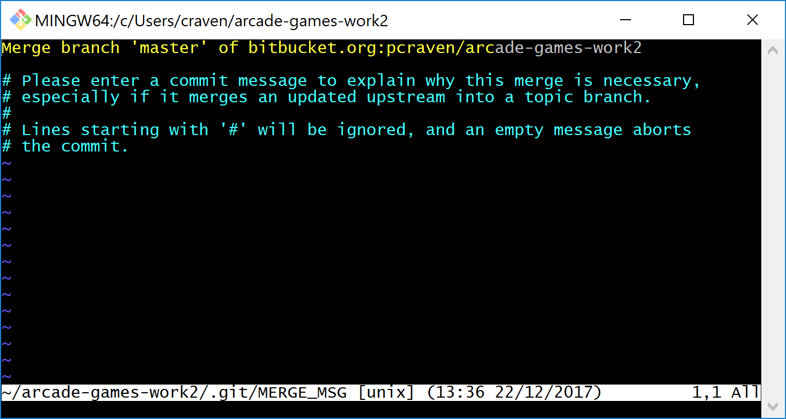

Distributed Version Control System Tutorial
===========================================

.. Note::

  Git Cheat Sheet

  https://services.github.com/on-demand/downloads/github-git-cheat-sheet.pdf

Git stores all the code in your project into a *repository*. Typically, there
will only be **one** repository per major project you create.

All the code that you have should go into a folder. From the prior section,
you should have a project folder that has your HTML files, and probably a
sub-folder with images.

We are going to show you how to create a repository with that folder,
push it out to a server, and then keep the changes between multiple people
in sync. To do this, we will use a program called ``git``.

The Terminal
------------

First, if you are on your own computer, install ``git``. (Skip this step if you
are on a lab computer.) The ``git`` program has a lot of dialog boxes that
pop up asking questions. The defaults are fine, just keep hitting "next" or
"ok." You can download the program from:

https://git-scm.com/downloads

Our repository commands will be typed in. There are graphical programs that
let you run ``git`` commands, however in my experience it is *harder* to learn
``git`` this way.

If you are on a Mac, open up the "Terminal" program. If you are on Windows,
open the command prompt.

When you are working on a command prompt, you are in something called a
"working directory." All your commands will operate on the current directory.
Sometimes, the terminal will print the directory you are in, but if it doesn't
you can type in ``pwd`` which is short for "Print Working Directory".

Change Directory
----------------

.. image:: cd_to_directory.png
    :width: 400px

Initialize Repository
---------------------

.. image:: git_init.png
    :width: 400px

Add Changes
-----------

Commit Changes
--------------

.. image:: git_commit.png
    :width: 400px

Git Log
-------

.. image:: git_log.png
    :width: 400px

Gitk
----

Git Status
----------

.. image:: git_status.png
    :width: 400px

Make sure you understand what each of these commands do.

::

    git init
    git add
    git commit
    git log
    git status

These are other commands we'll cover in a bit

::

    git remote
    git branch
    git merge
    git checkout
    git push
    git fetch
    git pull
    git clone

Getting Started with GitHub
^^^^^^^^^^^^^^^^^^^^^^^^^^^

After installing SourceTree, `create an account with GitHub`_. GitHub is where
we will store the code that we write. It is a very popular web site for code
management. Particularly open-source software.

Creating Your Project in GitHub
^^^^^^^^^^^^^^^^^^^^^^^^^^^^^^^

* One person in your team should create a project. Don't create a project for each
  person.
* Give your project a name. All lower case. Separate words with underscores.
  Do not use spaces. And don't *actually* call your project ``my_project_name``
  because that would be silly.
* Give a short one-sentence description of what your project is.
* Include a 'readme' in your project. If you don't do this your project will
  start as blank, and you'll get a really confusing screen.
* The other options can be left as default..

* After creating the project, invite the instructor (``pcraven`` if it is
  Dr. Craven) and your team mates. Do this by clicking Settings...Collaborators.
  Then it will ask for your password. Then start entering usernames.

* Each user will receive an e-mail confirming he or she would like to be part
  of the project. Click the confirmation link sent.

Pushing Code To GitHub For The First Time
^^^^^^^^^^^^^^^^^^^^^^^^^^^^^^^^^^^^^^^^^

.. image:: add_remote.png
    :width: 450px

Cloning Your GitHub Project on Your Computer
^^^^^^^^^^^^^^^^^^^^^^^^^^^^^^^^^^^^^^^^^^^^

.. image:: git_clone.png
    :width: 450px

Committing
^^^^^^^^^^

Review:

.. image:: git_commit.png
    :width: 400px

Pushing
^^^^^^^

Pulling
^^^^^^^

What If You Can't Push?
^^^^^^^^^^^^^^^^^^^^^^^

What happens if you can't push to the server? If you get an error like what's below?
(See highlighted lines.)

.. code-block:: text
  :emphasize-lines: 4,5

    $ git push
    To bitbucket.org:pcraven/arcade-games-work2.git
     ! [rejected]        master -> master (fetch first)
    error: failed to push some refs to 'git@bitbucket.org:pcraven/arcade-games-work2.git'
    hint: Updates were rejected because the remote contains work that you do
    hint: not have locally. This is usually caused by another repository pushing
    hint: to the same ref. You may want to first integrate the remote changes
    hint: (e.g., 'git pull ...') before pushing again.
    hint: See the 'Note about fast-forwards' in 'git push --help' for details.

Step 1: Make Sure You Have No Pending Changes
^^^^^^^^^^^^^^^^^^^^^^^^^^^^^^^^^^^^^^^^^^^^^

Run a ``git status`` and make sure you have nothing to commit.
It should look like this:

.. code-block:: text

    craven@DESKTOP-RAUFKMA MINGW64 ~/arcade-games-work2 (master)
    $ git status
    On branch master
    Your branch is up-to-date with 'origin/master'.
    nothing to commit, working tree clean

If you do hove code to commit, jump up to :ref:`commit` and then come back here.

.. _pull-changes:

Step 2: Pull Changes From The Server
^^^^^^^^^^^^^^^^^^^^^^^^^^^^^^^^^^^^

Pull changes from the server:

.. code-block:: text

    $ git pull

Normally, this will work fine and you'll be done. But if you have other computers
that you are coding on, the computer will automatically try to merge.

Step 2A: Merging
~~~~~~~~~~~~~~~~

If you get a screen like the image below, the computer automatically
merged your code bases. It now wants you to type in a comment for the
merge. We'll take the default comment.
Hold down the shift key and type ``ZZ``.
If that doesn't work, hit escape, and then try again.

(You are in an editor called **vim** and it is asking you for a comment about
merging the files. Unfortunately vim is really hard to learn. Shift-ZZ is the
command to save, and all we want to do is get out of it and move on.)

It should finish with something that looks like:

.. code-block:: text

    craven@DESKTOP-RAUFKMA MINGW64 ~/arcade-games-work2 (master)
    Merge made by the 'recursive' strategy.
     Lab 01 - First Program/lab_01.py | 3 ++-
     1 file changed, 2 insertions(+), 1 deletion(-)

If instead you get this:

.. code-block: text
   :emphasize-lines: 9

    $ git pull
    remote: Counting objects: 4, done.
    remote: Compressing objects: 100% (4/4), done.
    remote: Total 4 (delta 1), reused 0 (delta 0)
    Unpacking objects: 100% (4/4), done.
    From bitbucket.org:pcraven/arcade-games-work2
       aeb9cf3..6a8f398  master     -> origin/master
    Auto-merging Lab 01 - First Program/lab_01.py
    CONFLICT (content): Merge conflict in Lab 01 - First Program/lab_01.py
    Automatic merge failed; fix conflicts and then commit the result.

Then we edited the same file in the same spot. We have to tell
the computer if we want our changes, or the changes on the other
computer.

Step 2B: Resolving a Merge Conflict
~~~~~~~~~~~~~~~~~~~~~~~~~~~~~~~~~~~

Do a ``git status``. It should look something like this:

.. code-block:: text
    :emphasize-lines: 13

    $ git status
    On branch master
    Your branch and 'origin/master' have diverged,
    and have 1 and 1 different commits each, respectively.
      (use "git pull" to merge the remote branch into yours)
    You have unmerged paths.
      (fix conflicts and run "git commit")
      (use "git merge --abort" to abort the merge)

    Unmerged paths:
      (use "git add <file>..." to mark resolution)

            both modified:   Lab 01 - First Program/lab_01.py

    no changes added to commit (use "git add" and/or "git commit -a")

The key thing to look for is any file that says ``both modified``.

If you want **your** copy, type:

.. code-block:: text

    $ git checkout --ours "Lab 01 - First Program/lab_01.py"

If instead you want **their** copy (or the copy on the other computer)
type

.. code-block:: text

    $ git checkout --theirs "Lab 01 - First Program/lab_01.py"

Then when you are all done with all merges, type:

.. code-block:: text

    craven@DESKTOP-RAUFKMA MINGW64 ~/arcade-games-work2 (master|MERGING)
    $ git add *

    craven@DESKTOP-RAUFKMA MINGW64 ~/arcade-games-work2 (master|MERGING)
    $ git commit -m"Merged"
    [master e083f36] Merged

    craven@DESKTOP-RAUFKMA MINGW64 ~/arcade-games-work2 (master)
    $ git push
    Counting objects: 5, done.
    Delta compression using up to 8 threads.
    Compressing objects: 100% (5/5), done.
    Writing objects: 100% (5/5), 531 bytes | 0 bytes/s, done.
    Total 5 (delta 2), reused 0 (delta 0)
    To bitbucket.org:pcraven/arcade-games-work2.git
       6a8f398..e083f36  master -> master

Step 3: Try Pushing Again
^^^^^^^^^^^^^^^^^^^^^^^^^

.. code-block:: text

    $ git push
    Counting objects: 6, done.
    Delta compression using up to 8 threads.
    Compressing objects: 100% (4/4), done.
    Writing objects: 100% (6/6), 604 bytes | 0 bytes/s, done.
    Total 6 (delta 2), reused 0 (delta 0)
    To bitbucket.org:pcraven/arcade-games-work2.git
       d66b008..aeb9cf3  master -> master

Longer Git Command Reference
----------------------------

In my experience with 300 level group-project classes, these commands seem to
capture most of what students need to do.

+------------------------------------------------+-------------------------------------------------------------------------------------------------------------------------+
| Command                                        | Description                                                                                                             |
+================================================+=========================================================================================================================+
| ``git status``                                 | See what has changed                                                                                                    |
+------------------------------------------------+-------------------------------------------------------------------------------------------------------------------------+
| ``git fetch``                                  | Grab stuff from the server, but don't merge                                                                             |
+------------------------------------------------+-------------------------------------------------------------------------------------------------------------------------+
| ``git merge --no-commit --no-ff test_branch``  | Merge                                                                                                                   |
+------------------------------------------------+-------------------------------------------------------------------------------------------------------------------------+
| ``git merge --abort``                          | Abort a merge                                                                                                           |
+------------------------------------------------+-------------------------------------------------------------------------------------------------------------------------+
| ``git pull``                                   | Fetch and Merge                                                                                                         |
+------------------------------------------------+-------------------------------------------------------------------------------------------------------------------------+
| ``git add myfile.txt``                         | Add myfile.txt to be committed                                                                                          |
+------------------------------------------------+-------------------------------------------------------------------------------------------------------------------------+
| ``git add .``                                  | Add everything                                                                                                          |
+------------------------------------------------+-------------------------------------------------------------------------------------------------------------------------+
| ``grep -r "<< HEAD" *``                        | Search all files to see if there is merge error text. Do this before committing                                         |
+------------------------------------------------+-------------------------------------------------------------------------------------------------------------------------+
| ``git checkout --ours "myfile.txt"``           | Toss your changes in a merge, use theirs                                                                                |
+------------------------------------------------+-------------------------------------------------------------------------------------------------------------------------+
| ``git checkout --theirs "myfile.txt"``         | Toss their changes, use yours                                                                                           |
+------------------------------------------------+-------------------------------------------------------------------------------------------------------------------------+
| ``git checkout -- .``                          | Remove all your changes, go back to what was last committed. Untracked files are kept.                                  |
+------------------------------------------------+-------------------------------------------------------------------------------------------------------------------------+
| ``git -f clean``                               | Remove untracked files                                                                                                  |
+------------------------------------------------+-------------------------------------------------------------------------------------------------------------------------+
| ``git checkout 44fd``                          | Find the hash of a check-in, and you can go back to that check in. (Don't use 44fd, but replace with the has you want.) |
+------------------------------------------------+-------------------------------------------------------------------------------------------------------------------------+
| ``git checkout master``                        | Go back to most recent check in on the master branch.                                                                   |
+------------------------------------------------+-------------------------------------------------------------------------------------------------------------------------+
| ``git commit -m "My message"``                 | Commit your work. Use a descriptive message or the other people in the class will be irritated with you.                |
+------------------------------------------------+-------------------------------------------------------------------------------------------------------------------------+
| ``git push``                                   | Push commit up to the server.                                                                                           |
+------------------------------------------------+-------------------------------------------------------------------------------------------------------------------------+

.. _create an account with Atlassian: https://id.atlassian.com/signup?application=mac&continue=https%3A%2F%2Fmy.atlassian.com%2Fproducts%2Findex

.. _create an account with GitHub: https://github.com/

