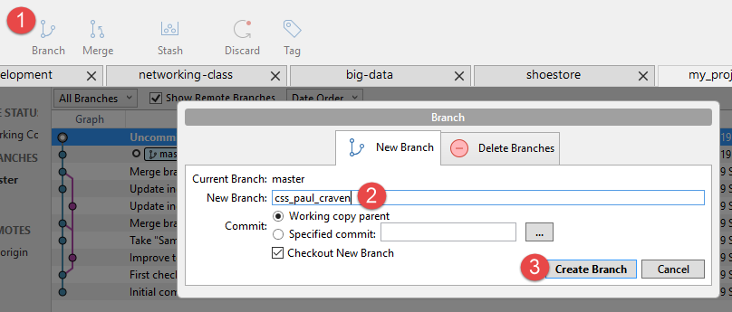
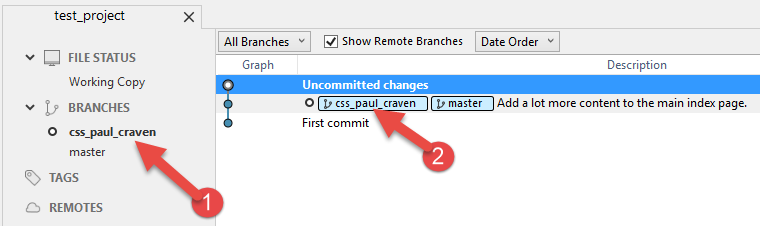
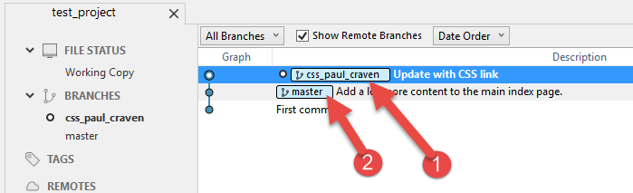
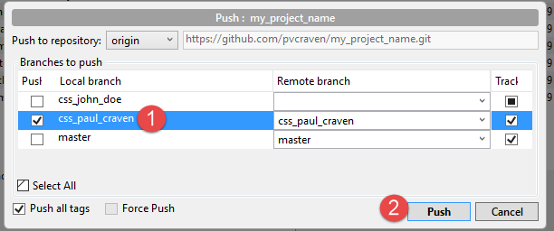
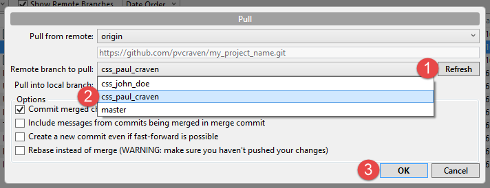
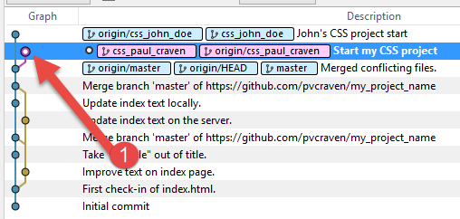

.. _branching-tutorial:

Branching Tutorial
------------------

Steps to successful branching.

* Make sure you have permission as a "collaborator" with the project.
* Make sure you have an up-to-date clone of the repository.
* Get started. Make a change to your files.
* Switch to SourceTree
* Select branch (step 1)
* Type in the name of your branch. For our first CSS assignment use
  ``css_firstname_lastname``. Obviously, replace first name and last name
  with your actual name. (step 2)
* Click "Create Branch" (step 3)

* At this point, you should be able to see that you have your branch selected
  (see point 1 below)
* You should also be able to see your branch name (see point 2)

* Commit your files. Look at the image below. You should be able to see the tag
  for your branch. (point 1 below) You should also see that the 'master' tag
  does *not* move forward with your code.
* Congratulations! You now have a branch. It may not look like a branch, but
  keep in mind that a tree trunk with only one branch coming out the top of
  it still looks an awful lot like one tree trunk. It will look like a branch
  in a soon.

* Push your files. When you push, select the new branch that you created
  (step 1) and then click push (step 2).

* You can now pull your branch, and even other people's branches. You may need
  to first hit "refresh" (step 1) to get the branches on the server. Then select
  the branch (step 2), then select "ok" (step 3).

* If you pull other branches, then your code will start looking like it has
  branches. You can switch between branches as well.
* You can see what version is current by looking for the hollowed out circle
  on your list of revisions. (step 1) Your branch of code may be on the left
  or the right. It doesn't really matter.

* As long as you don't have any uncommitted changes, you can swap between
  branches by double-clicking on a commit. SourceTree may just 'switch' the
  branches with a double-click. Or you may get another dialog box that
  pops up, where you need to select "check out existing" branch.
* Note: If you edit files on a revision without a branch label, you can lose
  the changes. They are there, but without a label they are hard to find.
