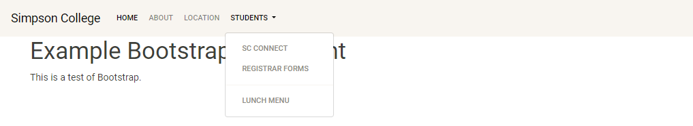
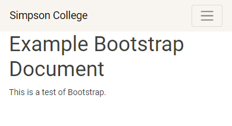

.. _bootstrap-tutorial:

Bootstrap Tutorial
------------------

`Bootstrap`_ is a CSS and JavaScript library that can help you build a great
looking website without having to create your styles from scratch.

There are many libraries like Bootstrap available. We can't cover them all. But
we can use Bootstrap to give you the idea of what these libraries can do.

The Bootstrap website is great, except I think we can make the "first web page"
even easier to understand.

Our first page will have a simple menu, and some text:

Bootstrap is great at being *responsive*. It will scale and easily work on
large wide-screen monitors, and small iPhone 4's.

We can see that if we narrow our screen, the menu goes away and is replaced by
a "hamburger" style pull-down menu.

Here is the code behind that template:

.. literalinclude:: example_01.html
    :linenos:
    :language: html

And a little bit of custom HTML:

.. literalinclude:: custom.css
    :linenos:
    :language: css

To lean more about how to use Bootstrap:

* Look at the
  `Bootstrap Examples <http://getbootstrap.com/getting-started/#examples-framework>`_
  to see what is possible.
* Then look at their
  `CSS Documentation <http://getbootstrap.com/css/>`_
  to know how to use it.
* Finally, look at their
  `grid system <http://getbootstrap.com/css/#grid>`_. It is a very important
  tool for layout.

.. _Bootstrap: http://getbootstrap.com/
