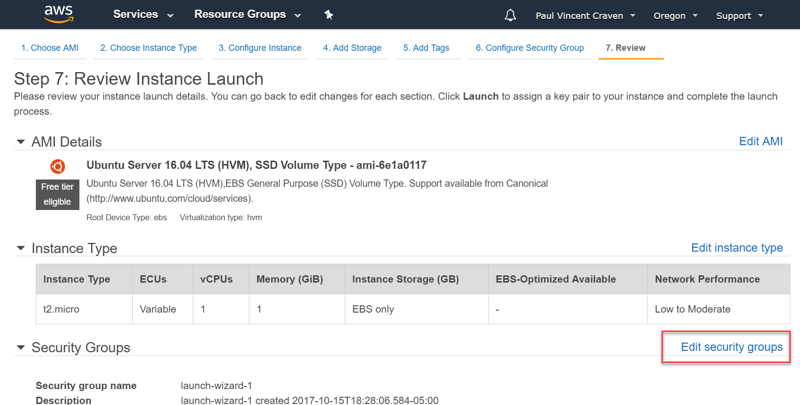

.. _aws_setup:

Amazon Web Services
===================

This chapter covers how to get a public web server up and running using
Amazon Web Services (AWS).

Create a Server Instance
------------------------

.. raw:: html

    <iframe width="560" height="315" src="https://www.youtube.com/embed/pqiDL0lxU0s" frameborder="0" allowfullscreen></iframe>

If you are being provide a server instance by your instructor, skip to the
`Setting Up The Server`_ section.

Sign up for a Amazon Web Services account, and access the AWS console at:

https://console.aws.amazon.com

Select EC2:

Launch a new instance.

.. attention::

    If you are restarting this tutorial, you probably want
    to shut down any other instances you are running. If you run more than one
    instance you will get charged money from Amazon.

We are going to create our own server. But the server will not be running Microsoft Windows
or MacOS. We are going to use a version of the Linux Operating System called Ubuntu.

Ubuntu is free. You can run it without a graphical user interface, which is great
for a small cheap server. And it isn't hard to administer remotely.

Select Ubuntu:

.. image:: select_ubuntu.png
    :width: 550px
    :align: center

Use a small, free machine:

.. image:: select_free_tier.png
    :width: 550px
    :align: center

The instance details defaults are ok, so click "Review and Launch":

We need security. Hit "Edit Security Groups":

Computers use numbered "ports" to sort web traffic. That way they can keep
web traffic separate from e-mail, file sharing, etc.

We want everyone to connect to our web server to get web pages. "HTTP"
controls normal un-encrypted web page requests. It runs on port 80.

HTTPS controls encrypted web traffic. It runs on port 443.

SSH allows us to "shell" over to the machine and type in commands. That runs on
port 22.

For proper security, we want anyone to connect to our server via HTTP and HTTPS.
We only want our own computer to connect via SSH, because that's what we use
to administrate our accounts.

Set up the security groups as shown. Your "My IP" will fill in automatically
with your IP address when the drop-down box is selected. You'll need to add a
SSH row for each computer IP you want to shell in from.

(If you've been through this step before, you can "Select an existing security group" and
not do this again.)

.. image:: setup_security.png
    :width: 600px
    :align: center

Hit "Launch" again:

Still isn't launching. We need a private/public key pair. We'll use this
instead of a password. It is more secure. Name your key pair. Download it.
Save it somewhere safe. You can't download it again, so if you lose that
file you lose access to your servers. You can use the same key/pair for
many servers if you want.

.. attention::

    Do not save your PEM key into the HTML folder or allow it to be
    checked into version control.

Seriously. Make sure you didn't save this in the same folder as all your web stuff.
Do not risk it being checked into version control. Go make sure. I'll wait.

Did you make sure?

.. danger::

    **Really, DO NOT ALLOW THIS FILE INTO VERSION CONTROL.**

If you do this, you are giving everyone access to all your stuff. Also,
version control keeps old versions. Deleting it won't remove the file.
And once it hits GitHub every evil person will have it. Seriously. People
have programs that scan all of GitHub for people that check in keys.
If you ever check in a key, you'll need to recreate your key and assume
everything accessible by that key has been compromised.

*Do* save the key somewhere safe. On a flash drive or network drive. If you
lose the key file, you can't access your machine and you'll have to start over.

Now will it launch? Because this will be the third time we've hit "Launch."

Yay! We've launched our server. Click the link shown (you'll have a different
id) to see your server's status.

The server is starting up. if you look under "Status Checks" column, you'll
see it start with "Initializing" and eventually say something like
"2/2 checks passed."

Setting Up The Server
---------------------

Getting to the Server
^^^^^^^^^^^^^^^^^^^^^

Copy the Public DNS address we get from Amazon, or that you got from your
instructor if he set up the server for you.

Use that address and the key to get a command shell on the new server.

Connecting With a Mac
~~~~~~~~~~~~~~~~~~~~~

To use the Terminal on the Mac, search for and run the "Terminal" program.
Find where your key is that you downloaded. Then type:

.. code-block:: text

    ssh -i my_key.pem ubuntu@myservername.com

You may get a question about the "authenticity" of the host. If so, just
type "yes". You'll only get that question once.

Connecting With Windows
~~~~~~~~~~~~~~~~~~~~~~~

.. raw:: html

    <iframe width="560" height="315" src="https://www.youtube.com/embed/suWI9jIXDMQ" frameborder="0" allowfullscreen></iframe>

Download and run the free version of `MobaXTerm <https://mobaxterm.mobatek.net/download.html>`_.

.. image:: moba_1.png
    :width: 600px
    :align: center

Enter in the info needed to get access. The user name will always be
"ubuntu", but your address and where you stored the key/pair will be different.

