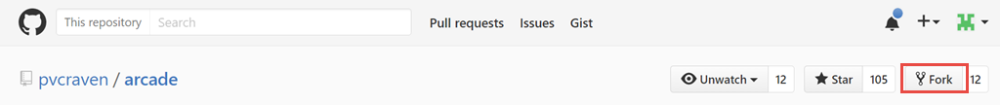
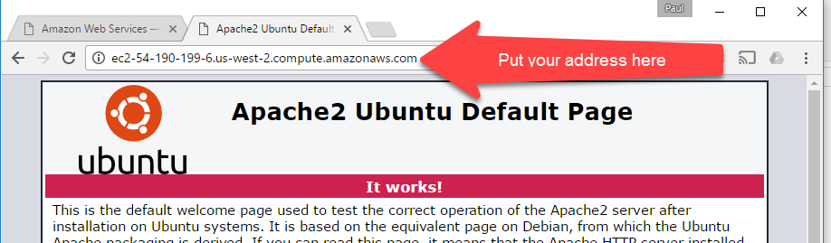
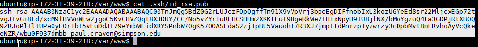
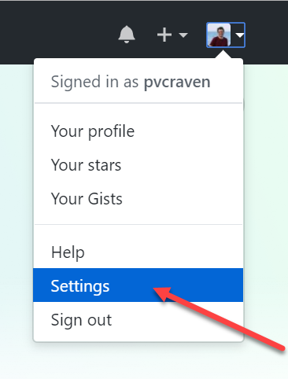
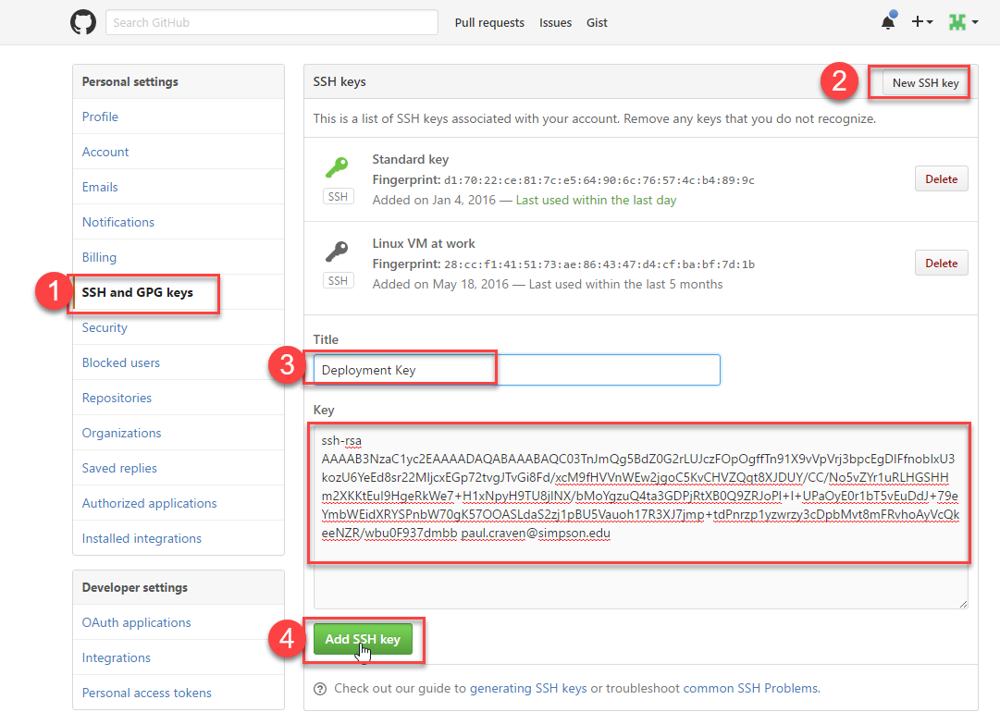
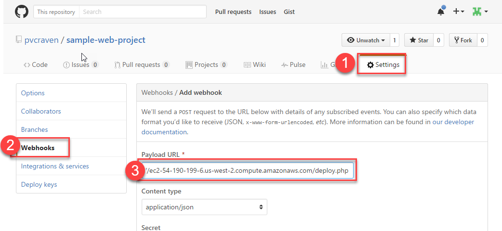

AWS Software Setup
------------------

Now we have our server up and running. As a review:

* We created our own server using Amazon's "EC2" cloud service. There are other
  companies that also do cloud computing, like Microsoft. Eventually we'll use
  the "S3" service from Amazon as well.
* Our server is running the "Ubuntu" operating system. Ubuntu is a name-brand
  version of a operating system called "Linux". Basically, Ubuntu is Linux with
  a bunch of stuff added on to it, making it easy to use.
* Linux is based off another operating system called UNIX. So is the operating
  system for the Mac. The commands we type at the terminal are all very similar
  between the types of operating systems. Windows isn't based on UNIX and is
  a bit different.

We also know our way around the command
prompt. Let's use this knowledge to set up our web server.

Adding the Deploy Script
^^^^^^^^^^^^^^^^^^^^^^^^

We'd like to have our server automatically grab the latest code from GitHub
each time we push new code up to the repository. That way we don't have to
log into our web server each time there is a change.

Do do this, we will create a "deploy script."

.. raw:: html

    <iframe width="560" height="315" src="https://www.youtube.com/embed/AYhqDJLufzg" frameborder="0" allowfullscreen></iframe>

* Start with a project that you already have worked on. Probably your last
  assignment.
* You will want your own copy of the project. (If the project is currently
  under your account, you can skip this step.) Go to the project and create a
  "fork":

* At this point, you have a copy of the project under your name.
  You will need to "clone" the new fork that you created. Clone it into a
  new folder on your computer. Remember, to clone your project, you'll use
  a command like the one below, except with your link. Not mine.

.. code-block:: bash

    cd Desktop
    git clone git@github.com:pvcraven/arcade.git

* If it says you already have a folder with that name, just rename the old
  folder and try again.
* Select the branch that you want to work on. It will default to
  the ``master`` branch if you don't specify one.
  Remember, to list the branches and check out the one you want:

.. code-block:: bash

    git branch -a
    git checkout name_of_my_branch

* We will assume you have a directory structure created something like the image
  below. If not, adjust it now. The most common issue I've run into would be
  people who have a ``public html`` folder instead of a ``public_html`` folder.
  No spaces!

.. image:: sample_directory_structure.png
    :width: 300px
    :align: center

* Create a new file in the public_html named ``deploy_script.php``.
* Paste into ``deploy_script.php`` the following code listing.
  This page, when accessed, will go to GitHub and update our website.

.. literalinclude:: deploy_script.php
    :linenos:
    :language: php

You don't need to know how the code above works, but if you are curious,
here is the explanation.

The command ``shell_exec`` will run a command at the
operating system level. That is, it will be like if we typed in a command
at the command prompt. But instead of us, it will be the web page that does
the command entry.

We can chain several of these commands together by separating
them with semi-colons.

The command uses ``git`` to pull the
changes, and then update the files with the changes. The ``2>&1`` redirects both
the standard output (stdout) and the error (stderr) to be captured into the
$output variable. If you aren't familiar with standard input and output
streams, check out the
`Wikipedia article <http://en.wikipedia.org/wiki/Standard_streams>`_ on
the subject.

We will eventually set GitHub up to call this web page when we push new code to
the repository. For now, just create the file and add it to GitHub.

.. attention::
    Make sure your are on the proper branch. Add the deploy.php file. Commit. Push.

Installing and Updating the Software
^^^^^^^^^^^^^^^^^^^^^^^^^^^^^^^^^^^^

.. raw:: html

    <iframe width="560" height="315" src="https://www.youtube.com/embed/y-CK4zzoBM0" frameborder="0" allowfullscreen></iframe>

Connect to your server via SSH using the Mac's Terminal program or the MobaXTerm program.

We need to update the software on the server, and install new software. Enter these commands.
You can copy/paste them if you like. Note that most terminal programs use
shift-insert to paste, and not ctrl-v.

.. attention::

    Copy the commands one line at a time.

.. code-block:: text

  sudo apt-get update

  # For the next two, if you are asked questions during the update/install, just hit 'enter' for the default
  sudo apt-get -y upgrade
  sudo apt-get -y install apache2 git php

The first line checks for software updates. The second line installs them.
The third line installs those four new programs that we will need for our webserver.

In detail, here's what the commands mean:

* Line 1:
    * ``sudo`` means "Substitute User Do". It allows us to run the next command
      as someone else. It defaults to the root (administrator). Since we are
      installing new software, we need to do it as the administrator.
    * ``apt-get`` is the software manager.
    * ``update`` is a apt-get directive that tells apt-get to go check for
      updated software. It doesn't update it, it just checks for updates.
* Line 2:
    * ``apt-get`` is the software manager.
    * ``-y`` tells apt-get that the answer is "yes" to any questions it asks.
    * upgrade downloads any updated software we found in the prior step.
      Normally it would list out all the software packages and ask, but we
      already told it yes with the -y.
* Line 3:
    * ``install`` directive for apt-get asks to install new software. There are
      four software packages listed. ``apache2`` is the web server, ``php`` is the
      application server, and ``git`` is our version control software.

.. note::

    Terms people often confuse:

    "git" is the software we use for version control.
    "GitHub" is the web site we use to store our git code.

    "Apache" (version 2) is our web server software. Not EC2 (which is the Amazon service to make machines) or
    AWS (which is all of Amazon's services.)

    "apt-get" is our software manager. MobaXTerm is software we use to use SSH and shell over to
    our server to type commands. MobaXTerm does nothing but allow you to type
    commands on that other server.

Check the Web Server
^^^^^^^^^^^^^^^^^^^^

Check to see if your web server is running by going to the DNS name of the
server. You should get a default page.

Installing an Encryption Key
----------------------------

.. raw:: html

    <iframe width="560" height="315" src="https://www.youtube.com/embed/Kj0-lA68skw" frameborder="0" allowfullscreen></iframe>

Next, we need a key/pair to handle the connection between our server and GitHub.
Use these commands on the terminal, updating the e-mail address to your own.
When it asks for a pass-phrase, just hit "enter."

In detail, here's how the commands break down:

* Line 1: ``cd`` is the "change directory" command. By the file system hierarchy
  default, all the web stuff on most Linux machines will be stored in ``/var/www``.
* Line 2: ``mkdir`` makes a directory. The ``.ssh`` directory is where a users
  public/private keys are stored. In the case of the apache process, the home
  directory is ``/var/www`` so we put the ``.ssh`` folder here.
* Line 3: ``chown`` changes the ownership of a file. Because we created .ssh as
  root, we need to change it to the owner of the Apache web server process which is
  ``www-data``. We are changing both the user and the group, so that is why
  there is a colon and the user name twice.
* Line 9: The ``sudo -u www-data`` tells the computer to run the next command as
  the www-data user. This is the user that Apache runs under. We want to create
  the key as the user Apache runs under, otherwise Apache won't be able to
  access it. The command ``ssh-keygen -t rsa -C "your.email@simpson.edu"``
  generates an RSA key/pair. By default they will be stored in the users ``.ssh``
  folder, which in this case is ``/var/.ssh``.
* Line 10: ``ssh-agent -s`` starts a background process that manages the keys.
* Line 11: The cat command prints the contents of a file to the screen. We will
  pass the contents of the id_rsa file to GitHub to finish the connection.

.. code-block:: bash
    :linenos:

    cd /var/www
    sudo mkdir .ssh
    sudo chown -R www-data:www-data .ssh

    # Stop! Enter this next line (below) by itself.
    # It will ask three questions. Hit 'enter' for
    # each one. Don't keep pasting the other lines
    # in for each question. You can update with your
    # e-mail but it isn't necessary.
    sudo -u www-data ssh-keygen -t rsa -C "your.email@my.simpson.edu"

    sudo -u www-data ssh-agent -s
    cat .ssh/id_rsa.pub

The last command will output your key to the screen. Highlight it. Copy it using
ctrl-insert instead of ctrl-c. Don't save this key in your version control either!

Go back to GitHub and add it as a deployment key. Select your profile icon in the upper right of the
screen and then select "settings":

Add in the key:

Clone the Repository
--------------------

Now we need to get the code set up. Enter the commands below. Replace
sample-web-project with the name of your GitHub project. Replace pvcraven with
your own GitHub id. After you enter line four it will give you a warning
about adding a key, answer "yes" to that warning.

.. attention::
    Don't blindly copy/paste. Don't use "sample-web-project", use the name of your project as it
    exists on the GitHub URL. There are **three** places you need to do so in the script
    below. Also, replace ``the_branch_i_want`` with the branch that you want to be shown.

::

  # Change to the directory (cd) that has our web files: /var/www
  cd /var/www

  # Update the next line with the name of your project, as shown in your
  # GitHub's URL.
  sudo mkdir sample-web-project
  sudo chown -R www-data:www-data sample-web-project

  # Update the next line with your GitHub id and GitHub project name.
  # You will likely be asked a yes/no question. Go ahead and say 'yes'
  sudo -u www-data git clone git@github.com:pvcraven/sample-web-project.git

  # If you are using any branch but "master", then select the branch below:
  cd sample-web-project
  sudo -u www-data git checkout the_branch_i_want

Point Apache Web Server to Our Files
------------------------------------

Apache saves all of its setup information in text files. Exactly where these
files are and what they are named is not exactly intuitive. With some Googling
you can find this. Or just read below:

.. code-block:: bash

  # Change to the directory with the configuration information
  cd /etc/apache2/sites-available

  # Use the 'nano' editor to edit this file
  sudo nano 000-default.conf

Alternatively, we can use Vim to edit the file instead of nano:

.. code-block:: bash

  # Use the 'vim' editor to edit this file
  sudo vim 000-default.conf

Update the file's ``DocumentRoot`` to point to the directory that holds your
web site. See the highlighted line below that you should edit:

.. attention::

    Don't use the mouse in nano. Use the arrow keys on your keyboard to move around.
    To exit out of the "nano" editor, hit "ctrl-x", hit "yes" to save, and then "enter"
    to save as the same file name.

.. code-block:: text
    :linenos:
    :emphasize-lines: 12

    <VirtualHost *:80>
            # The ServerName directive sets the request scheme, hostname and port that
            # the server uses to identify itself. This is used when creating
            # redirection URLs. In the context of virtual hosts, the ServerName
            # specifies what hostname must appear in the request's Host: header to
            # match this virtual host. For the default virtual host (this file) this
            # value is not decisive as it is used as a last resort host regardless.
            # However, you must set it for any further virtual host explicitly.
            #ServerName www.example.com

            ServerAdmin webmaster@localhost
            DocumentRoot /var/www/sample-web-project/public_html

            # Available loglevels: trace8, ..., trace1, debug, info, notice, warn,
            # error, crit, alert, emerg.
            # It is also possible to configure the loglevel for particular
            # modules, e.g.
            #LogLevel info ssl:warn

            ErrorLog ${APACHE_LOG_DIR}/error.log
            CustomLog ${APACHE_LOG_DIR}/access.log combined

            # For most configuration files from conf-available/, which are
            # enabled or disabled at a global level, it is possible to
            # include a line for only one particular virtual host. For example the
            # following line enables the CGI configuration for this host only
            # after it has been globally disabled with "a2disconf".
            #Include conf-available/serve-cgi-bin.conf
    </VirtualHost>

    # vim: syntax=apache ts=4 sw=4 sts=4 sr noet

To exit the nano editor hit "ctrl-x". Then after that, it will ask if you want
to save the file. Hit "y" for yes. Then it will ask you what file name.
Hit the "enter" key to just accept the same file name that you loaded.

To exit vim, type escape, followed by two upper case ``Z``'s to save and exit.
(Or type ``:wq``)

Restart the Web Server
----------------------

Great, now that you've edited the file, restart the web server. Make sure
you are no longer in the text editor, and at the command prompt. Type:

::

  sudo service apache2 restart

See if your web pages are showing up now.

If your web pages are **not** showing up, then you need check to make sure that
you have the correct directory specified.

Try typing:

::

    # Change to the /var/www directory:
    cd /var/www

    # List the files in the directory:
    ls

At that point, see if you spot a directory that should have your files. Then type:

::

    # Change to sample-web-project
    cd sample-web-project

    # List the files in the directory:
    ls

    # If there is a public_html or some other directory that has your files:
    cd public_html

    # Once you've found your files, Print the Working Directory with the pwd commmand:
    pwd

    # Copy this, and go back up and re-edit the Apache config file and
    # restart Apache again.

Does your website show up? Excellent! Copy the URL. This is part of your assignment.

Check Deployment Script
-----------------------

.. raw:: html

    <iframe width="560" height="315" src="https://www.youtube.com/embed/Iv2m2XwcFTw" frameborder="0" allowfullscreen></iframe>

Right now, if you update your website and push more code, your server
won't update. We want to update it automatically by "installing a webhook."

Installing a Webhook
--------------------

Next, let's create a "webhook." When you push new code to the
server, GitHub will automatically fetch a web page for you. So try this:

Once you add the hook, GitHub will automatically call that web page when you
push new code to the server. That web page will do an update, and your website
will have the most current code.

Test it out! Make a change to your web page, and push the change to GitHub.
In a few seconds, you should see your web server update with the change.

Even More Info
--------------
It is a great time saver to do automatic build, deployment, and even testing.
You are not limited to just websites, almost any application can be built and
deployed in this manner. Websites like www.appveyor.com specialize in
helping people create these setups.
