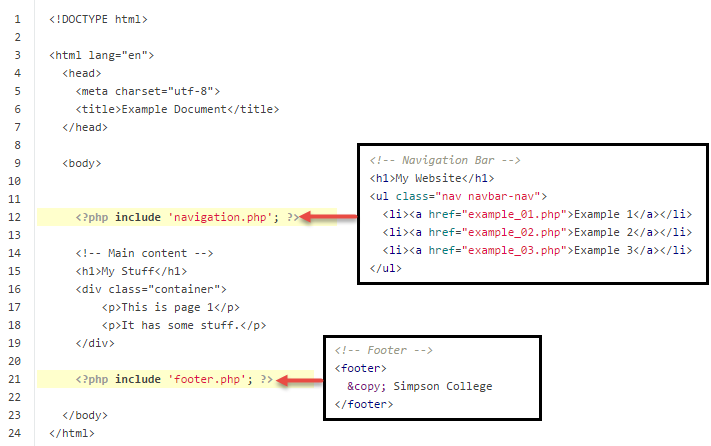
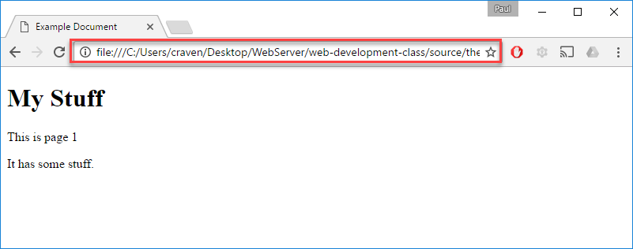
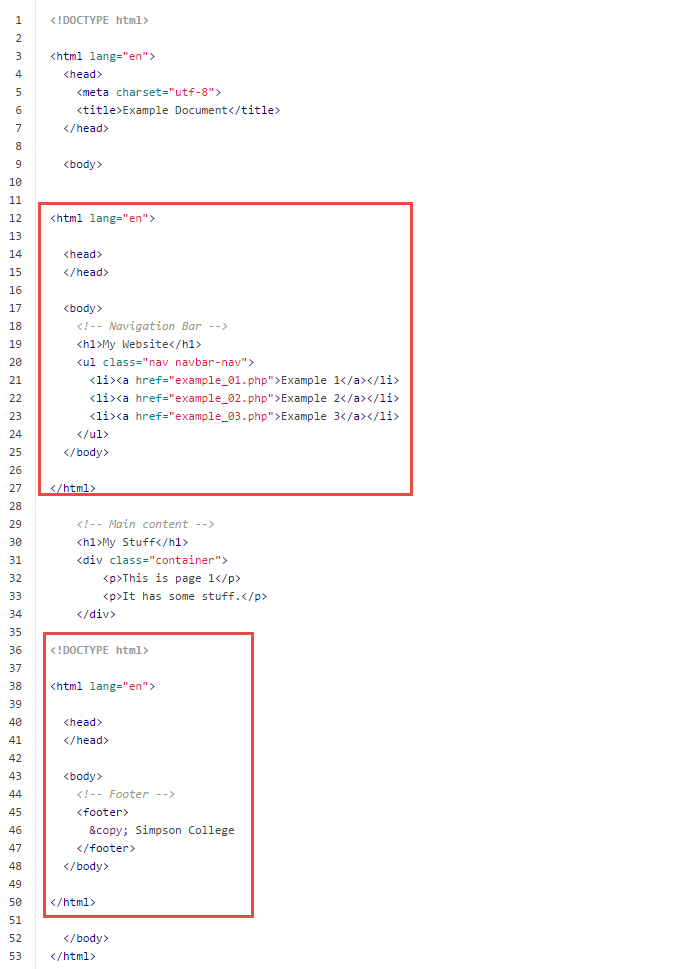
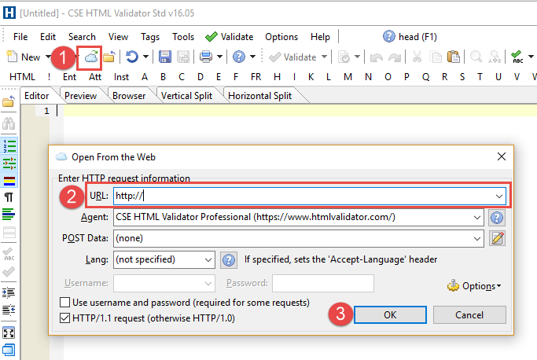

Application Servers
-------------------

All the web pages we've created so far are **static** web pages. They don't
change.

Interactive web pages require an **application server**. Application servers
can dynamically change and respond to requests. They work like this:

The application server can take an original html document and modify it
before it displays on the screen.

There are many types of application servers out there. Some of the most
popular:

* PHP
* Java Servlets / JSP
* .NET / ASP

Often, we change the file ending to show that they should be processed
by the application engine. We'll use PHP, and all PHP files end in
``.php`` instead of ``.html``.

Telling Time With PHP
^^^^^^^^^^^^^^^^^^^^^

Create this file in a directory that you can pull up via XAMPP.

.. literalinclude:: php_time_test.php
    :caption: php_time_test.php
    :linenos:
    :language: html

Once you've created it, pull it up via the web browser, and directly by dragging it onto your
web browser. Do a "view source." Notice how PHP changes the HTML.

You can read more about the `PHP Date function <http://php.net/manual/en/function.date.php>`_ here.

The Include Statement
^^^^^^^^^^^^^^^^^^^^^

We won't do *that* much with application servers during this semester.
However, I do want to introduce one main thing you can do with an application
server. Include other files.

Say you have a web page like this:

.. literalinclude:: example_no_php.php
    :linenos:
    :language: html

There are a lot of common elements on that page. The navigation and
the footer should not change from page to page. So if we had 20 pages
on our website, we'll have 20 copies of the navigation. And if it changes,
we have to change it in 20 spots. That's no good!

We can use a PHP ``include()`` statement. We will put all the navigation
information in a file called ``navigation.php`` and all the footer information
in a file called ``footer.php``.

.. literalinclude:: example_php.php
    :caption: example_01.php
    :linenos:
    :emphasize-lines: 12, 21
    :language: php

.. literalinclude:: navigation.php
    :caption: navigation.php
    :linenos:
    :language: html

.. literalinclude:: footer.php
    :caption: footer.php
    :linenos:
    :language: html

The result, the application server will basically to a cut/paste of the
``navigation.php`` and ``footer.php`` into the ``example_01.php`` file:

If you do a "view source" you will see the assembled HTML document, but not
the ``include()`` statement. The ``include()`` never gets send to the user.
The application server modifies the ``example_01.php`` before sending it
to the user.

While the page to the user looks the same, we now have just *one* place that
has our navigation bar and footer. This is a lot easier to manage.

Common Mistake
^^^^^^^^^^^^^^

A very common mistake is to try this, and then have nothing happen. Take a look
at the image below:

Why did my navigation and footer fail to show up? The reason can be seen in
the URL. The URL starts with ``file:///``. That means I loaded the file directly
from the disk. It never went through the web server. It never went through the
application server. Without the application server involved, there was no
piece of software to perform the ``include()``. In fact, you could do a
"view source" and see the include statement still sitting there, unprocessed.

Another Common Mistake
^^^^^^^^^^^^^^^^^^^^^^

Another common mistake is to run an HTML validation of the "part" pages.
Of course, the validation will fail because it isn't a complete page. So,
the developer fixes that by adding the other page parts:

.. literalinclude:: footer_wrong.php
    :caption: Bad example of a footer.php
    :linenos:
    :language: html

But what happens when you include this into the main file? You get something
like this:

There are mini-documents inside of documents! That's not valid at all!

If you really want to validate your documents (which you should), then you can
have CSE Validator fetch the web page from the web, rather than a file:

You can paste in your web address for a localhost reference, or your AWS server.

However! Realize while you *can* edit the file you download off the server,
it *won't* change the original source file you have for your project. Anything
you change will be lost. Make sure you edit your original source file, not
the result.

Better Directory Organization
^^^^^^^^^^^^^^^^^^^^^^^^^^^^^

The example above is *ok*, but not great. There are two issues:

* It is entirely possible for the user to go to ``http://simpson.edu/footer.php``
  and *just* see the footer. While that isn't bad, it isn't desired. Nor it is
  likely to be part of our testing plan. And what if loading just part of a
  document exposes a security risk?
* It is unorganized. We have page parts mixed in will full pages in the main
  directory. How do you know what's a "real" page and what is a pieces-part?

You can fix this by putting the page-parts into their own directory. Specifically,
one that isn't in ``public_html``. Because if it isn't in ``public_html`` the
user can't get directly to it. Here's a better directory structure

::

    my_project
        public_html
            example_01.php
            example_02.php
            example_03.php
        resources
            footer.php
            navigation.php

We are close to working, but not there yet. No longer can we do this::

    <?php include 'navigation.php'; ?>

Why? The ``include`` command assumes that ``navigation.php`` is in the *same*
directory we are. But that file no longer is. It is up a directory, and in the
``resources`` folder. How do we get there? Easy! See below::

    <?php include '../resources/navigation.php'; ?>

The ``..`` goes up a directory. Then we go into ``resources`` to fetch
our file!
