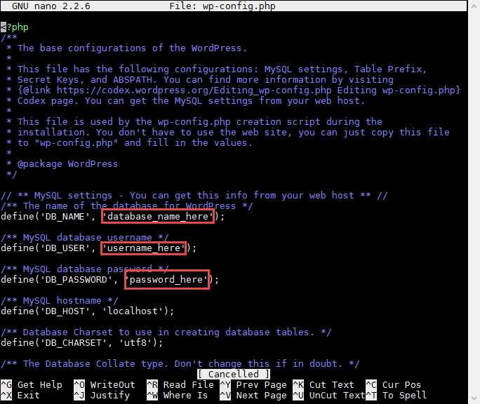
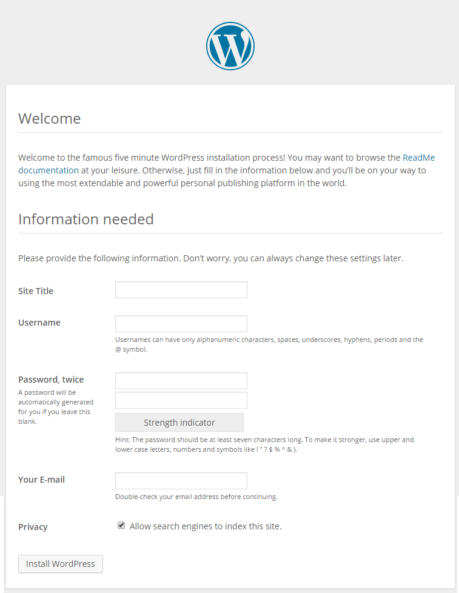
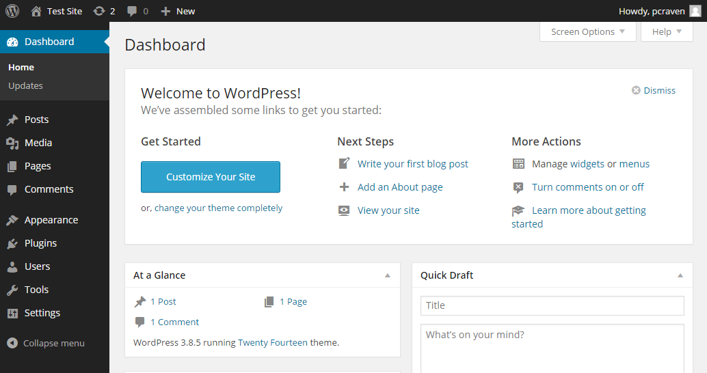
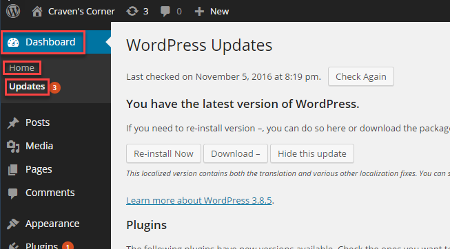

.. _InstallWordpress:

WordPress Installation
======================

Install
-------

While there is a apt-get package called "wordpress", the way Ubuntu installs
WordPress is terrible. I lost a lot of time trying to debug all the issues with
their install. So we'll just install WordPress manually. But we some of the
supporting software we'll use apt-get to install.

This install will have you create two passwords:

* Password for the WordPress database
* Password for the WordPress administrator

Create a document or file to keep track of these. **Don't** check this file
into GitHub!!!

First, use MobaXTerm to "shell" out to our Amazon server.

Next, we need to install WordPress and a database. The database will help
keep track of everything for us. Enter these commands one-by-one.

.. code-block:: bash
    :linenos:

    # Update the list of software we can get
    sudo apt-get update

    # Update to the most current versions of the software
    # If you get any questions, just take the default answer
    sudo apt-get -y upgrade

    # Install the database server
    sudo apt-get -y install mysql-server

Next, we need to configure a password for the and the security
for the **database server**.

Go through the following. Remember, when you type in passwords you won't
see anything on the screen, but the computer is listening.

.. attention::

    Wait! Use a good password. You are going to be working on systems that will
    have programs that automatically are trying to gain access to your system
    every minute. Literally.

    Don't use a common password. Leaks like the Adobe one of 150 million passwords
    show most people pick terrible passwords. Here is a
    `list of the 1000 most common passwords used at the Adobe site`_. Take a minute,
    read through those. Ever use one of these passwords?

    Normally, using "special characters" helps your password. For our purposes, special
    characters like ' and % and * and " will be a **HUGE** problem on the first two
    passwords. Just use numbers, and upper/lower case letters.

    If you haven't already, use a password program like KeePass_ to generate random
    passwords and store them. Again, for THIS assignment, don't use special characters
    for the first two passwords.

    Use an entire sentence as a password to protect that password database. I use KeePass, Google
    Drive, and an app on my phone so I can always get to these passwords and have them
    synchronized. Yes, I memorize a password with over 25 characters to it, but that is
    the _only_ password I have to remember.

.. _KeePass: https://keepass.info/
.. _list of the 1000 most common passwords used at the Adobe site: https://github.com/danielmiessler/SecLists/blob/master/Passwords/darkweb2017-top1000.txt

Next, install these software packages and restart the webserver::

    # Make sure PHP application serverhas the code that can connect to a database
    sudo apt-get -y install php libapache2-mod-php php-mysql

    # Restart the web server to apply the changes
    sudo service apache2 restart

This next part creates the database and user for WordPress.
You will see that there is a ``yourdbpassword``.
Make up a new password for ``yourdbpassword``, don't use ``yourdbpassword``.

.. code-block:: bash
    :linenos:

    # Create a database for WordPress.

    # Set the database so we can enter commands to it.
    sudo mysql -u root

    # Create a new user for your database called "wordpress-db"
    # You need to create a password for the wordpress user that will manage your
    # wordpress database. This is different than the 'root' user/password that was
    # the admin user for the whole database server.
    CREATE USER 'wordpress-db'@'localhost' IDENTIFIED BY 'yourdbpassword';

    # Create a new database, also called "wordpress-db"
    # IMPORTANT IMPORTANT IMPORTANT
    # This command and the next one contain back-ticks. Carefully note when
    # the tutorial calls for you to use ` or '. Also watch what prints out
    # and see if it prints an error.
    CREATE DATABASE `wordpress-db`;

    # Say that the wordpress user can do everything with the wordpress database
    GRANT ALL PRIVILEGES ON `wordpress-db`.* TO "wordpress-db"@"localhost";

    # Commit our changes
    FLUSH PRIVILEGES;

    # Leave
    exit

Now we need to download and unzip WordPress.

.. code-block:: bash
    :linenos:

    # --- Get WordPress
    # Switch to the home directory
    cd ~

    # Download WordPress from the Internet
    wget https://wordpress.org/latest.tar.gz

    # Unzip the file
    tar -xzf latest.tar.gz

Copy the sample configuration file and get it ready for editing::

    # Change to the WordPress folder we just unzipped
    cd wordpress/

    # Copy sample config file as a template for our real config file
    cp wp-config-sample.php wp-config.php

Next, we need to edit the configuration file:

.. code-block:: bash

    nano wp-config.php

(Or use ``vim``.)

Replace the default with the database name ``wordpress-db`` and the database
user, also ``wordpress-db``. Next, fill in the password ``yourdbpassword``.
This is the password for the WordPress database, **not** the password for the
database server.
Then save the file.

In the example below, instead of ``my_sample_project``, please replace that with the
directory of your actual project. If you didn't use ``public_html``, then you'll need
to adjust the path appropriately. Don't just blindly copy that line and hope it works.
Use ``cd`` and ``ls`` commands to make sure that ``wordpress`` goes into the correct
directory.

.. code-block:: bash
    :linenos:

    # Go up a directory
    cd ..

    # Move the WordPress directory to a directory that the web server sees.
    # WAIT! Make sure you have the right directory before doing this, or you'll
    # mess everything up. Try 'ls /var/www' and then keep going from there until
    # you find your public_html folder. Then use that path below instead of what
    # I have which is totally not what you want.
    sudo mv wordpress /var/www/my_sample_project/public_html/wordpress

    # Change ownership to the apache process and group (www-data)
    sudo chown -R www-data:www-data /var/www

Now, go to your webserver. Because we created a "wordpress" subdirectory, you'll
need to add that to your URL. It will look something like::

    http://XXXPUT_YOUR_SERVER_NAME_HEREXXX/wordpress/

.. attention::

    What is XXXPUT_YOUR_SERVER_NAME_HEREXXX? That's your servername. What you typed in to get to your web pages. That
    you got off the Amazon Web Services console. Usually looks like "ec2-34-211-33-140.us-west-2.compute.amazonaws.com".

    Also, this is NOT a command you type into your terminal. This is a URL link you put in your browser.

Then you should end up with a WordPress installation screen, which should be
rather straight-forward.

Make sure your password is a good password. There are automatic scripts that
run by hackers that will attempt to log into your WordPress site every single
hour it is up.

After that, you'll be taken to the WordPress dashboard that lets you administer,
add, and delete content.

Play around with WordPress at least enough that you can figure out how to put your
name on the main page. Our next assignment will involve putting more content
on the page. We just need enough here that you can turn in a URL that shows
you have WordPress up and running. But feel free to explore WordPress and learn.

Updating
--------

The WordPress software needs to be updated on a regular basis. Also, WordPress
has software plug-ins that need to be updated. You can update both rather easily
from the update screen:

.. _WordPress: https://en.wikipedia.org/wiki/WordPress
.. _Content Management System: https://en.wikipedia.org/wiki/Content_management_system

Resetting The Database Password
-------------------------------

If you can't log in with ``mysql -u root -p`` because you keep getting an error that your password
is bad, you'll need to reset it.

To reset the password you need to start the MySQL database in 'safe' mode. Unfortunately our distribution of
Linux doesn't let us do that easily, because MySQL expects a directory to exist in same mode that doesn't exist
by default with AWS's Ubuntu distribution. So we need to create it, stop the database and start it in safe mode:

.. code-block:: bash
    :linenos:

    sudo service mysql stop
    sudo mkdir /var/run/mysqld
    sudo chown mysql:mysql /var/run/mysqld
    sudo mysqld_safe --skip-grant-tables &
    # Hit <enter> to get a command prompt again

Now, go into the database and reset the password:

.. code-block:: bash
    :linenos:

    sudo mysql -u root mysql

    use mysql;
    update user set authentication_string=password('MYNEWPASSWORD3') where user='root';
    flush privileges;
    quit;

Now we have to stop MySQL to get it out of safe mode, and restart it in normal mode. We should be able to do this:

.. code-block:: bash

    sudo service mysql stop

But that doesn't work. I tried a lot of options and couldn't get a "clean" shutdown. We need to kill the process.
To list all the running processes, type the following:

.. code-block:: bash

    ps -ef

You should find some processes that look like this, that have the keyword "mysqld" in them:

.. code-block:: bash

    root     14406 11814  0 18:57 pts/1    00:00:00 sudo mysqld_safe --skip-grant-tables --port=3306
    root     14407 14406  0 18:57 pts/1    00:00:00 /bin/sh /usr/bin/mysqld_safe --skip-grant-tables --port=3306
    mysql    14783 14407  0 18:57 pts/1    00:00:00 /usr/sbin/mysqld --basedir=/usr --datadir=/var/lib/mysql --pl

See the first numbers 14406, 14407, 14783? You'll have different numbers. Use those numbers with the ``kill`` command
to terminate the processes. We'll do it as the root user, and we'll add a ``-9`` that tells it to kill the process immediately:

.. code-block:: bash
    :linenos:

    sudo kill -9 14406 14407 14783

Now start mysql again:

.. code-block:: bash
    :linenos:

    sudo service mysql start

You should be able to now log in with ``mysql -u root -p`` and continue the tutorial.

If that doesn't work, you can try reinstalling mysql from scratch:

https://askubuntu.com/questions/640899/how-do-i-uninstall-mysql-completely

Resetting The Wordpress Database User Password
----------------------------------------------

If you try to get to WordPress and get "Error establishing a database connection", then there is something not
matching between
what the database expects, and what is in your configuration file.

First, change to the directory that has your WordPress. You'll need to adjust the command below because you'll have a
different directory name:

.. code-block:: bash

    cd /var/www/my_sample_project/public_html/wordpress

Then, edit the file:

.. code-block:: bash

    sudo nano wp-config.php

Make sure that the user name and database name are ``'wordpress-db'``, including the quotes.

Make sure your password is correct, and has single quotes around it. Make sure it doesn't have special characters.
Adjust the password if needed.

Save (Ctrl-x, y for yes, and 'enter' to accept the file name). Then see if you can connect. If you can't, then
do the following:

.. code-block:: bash
    :linenos:

    # Set the database so we can enter commands to it.
    mysql -u root -p

    # Ok, at this point it should ask you to enter the database password, so
    # do that.
    yourdbserverpassword

    # Create a new user for your database called "wordpress-db"
    # You need to create a password for the wordpress user that will manage your
    # wordpress database. This is different than the 'root' user/password that was
    # the admin user for the whole database server.
    CREATE USER 'wordpress-db'@'localhost' IDENTIFIED BY 'yourdbpassword';

If you get an error that says something like:

.. code-block:: bash

    ERROR 1396 (HY000): Operation CREATE USER failed for 'wordpress-db'@'localhost'

That means the user exists. Great. So to change the password do the following:

.. code-block:: sql

    ALTER USER 'wordpress-db'@'localhost' IDENTIFIED BY 'yourdbpassword';

Then type:

.. code-block:: bash

    quit;

Now try accessing your page again, and hopefully the error is gone.