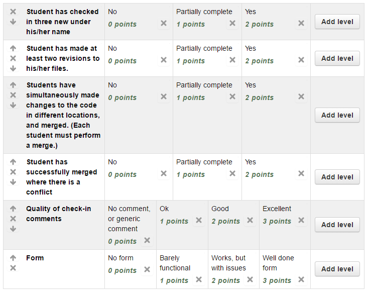

Assignment 2 - DVCS
===================

Turn in Assignment 2
^^^^^^^^^^^^^^^^^^^^

* Each person should be checking in at least three ``.html`` files. (From assignment one.)
* At least one image should be added in by someone. (From assignment one.)
* You should have a proper directory layout. (From assignment one.)
* Each person should make at least two revisions to his/her own files.
* Each person should do a "merge" where files have changed on the server.
* Each person should do at least one merge where there are file conflicts.
* Each commit should have a descriptive comment.
* Read the tutorial on forms: http://www.w3schools.com/html/html_forms.asp
* One person will create a login form and check it in.
* The other person will create a sign-up form.
* If you have three people, dream up a third form.
* Paste the GitHub URL for the website and submit Assignment 2 on Scholar.

