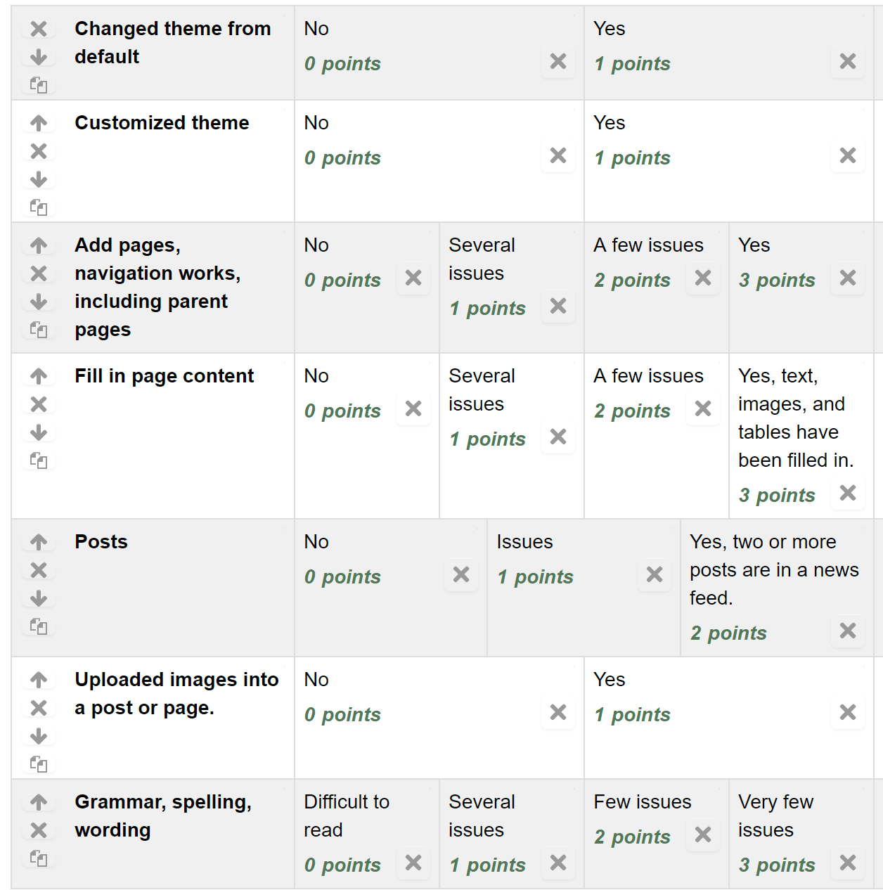

Assignment 10 - WordPress Site
==============================

* First step, get into the dashboard of your website.
  You can usually get to the dashboard by adding
  ``/wordpress/wp-admin/`` to the end of your URL.

* Select a theme, other than the default theme.

    * Select Appearance...themes from the dashboard.
    * Then select "Add Theme"to browse what is out there.
    * Click "Install"
    * Click "Activate"

* Customize

    * Customize your theme. (Appearance...customize)
      The theme may ask for additional plug-ins to be installed.

* Add pages

    * Add pages. Do this by by clicking "Pages" and then "Add New". For your
      new website, create a new page for each page in your old website. Or
      at least four of them. You can also create a new website from scratch
      if you want. EXCEPT don't create one for index.html.
    * Just put in the title for now.
    * Visit your site, confirm the pages are showing up in the navigation bar.
    * Try adding at least new page (or reorganize a page that exists) and give it a
      "parent" page. You can do this on the right side while editing a page.
    * Verify you now have a drop-down menu with the pages. (This doesn't work with all
      themes.)

* Fill in page content

    * Figure out how to use the page editor, how to upload media, and recreate
      the pages from your original website.
    * Note that there is a toolbar. The last item gives you more options. You
      can also click a "text" tab and edit the HTML directly.

* Create at least two posts

    * Create at least two posts and have them as part of a news feed.
    * Work at creating categories.

* Turn in:

    * URL/link to your website
    * Detail what you did with selecting a theme
    * Summarize theme customization you did.
    * Briefly summarize the pages that you created.
    * Briefly point out the posts that you created.
    * Tell me where you uploaded at least one image to a post or page

The write-up is important. Please don't give me just a sentence or two. "A" work usually involves at least 3/4
of a page showing me how you hit all the points of the rubric.

If you have time, play around with WordPress and figure out more about what you can do.
Working with a CMS is a very useful skill.

..

    ADD THIS AS AN EXAMPLE OF A GOOD WRITE UP

    ALSO EXPAND RUBRIC TO INCLUDE A SPOT FOR A TABLE

    EXPAND RUBRIC FOR AMOUNT OF CONTENT
    EXPAND RUBRIC FOR AMOUNT OF CUSTOMIZATION OF THEME

    1.    WordPress URL:

    http://ec2-13-59-221-249.us-east-2.compute.amazonaws.com/wordpress/

    2.    What did I do while selecting a theme?

    When I was selecting my theme through WordPress, I knew that I wanted something was simple and straightforward to
    use, but would also allow me to add my own touches of detail. Since I was creating a photography website, I knew
    that I need a site that would allow the pictures to stand out and the Fotografie theme did just that for me.

    3.    Summary of theme customizations I did:

    While customizing the Fotografie theme, I wanted to include just a touch of color other than black and white.
    I did this by adding a header color that was a tannish-pink, and added that detail to the background color as
    well so the two would tie together nicely.

    The default of the Fotografie theme had a preset image in the header, so I removed that in order to have the
    business’s title be what users’ eyes would be drawn to at the top of the page.

    In the Widgets tab, I messed around the theme’s footers. I changed information that was the default in order
    for it to match names, addresses, and other pieces of data that could be found throughout other pages on the site.

    4.    Summary on the pages I created:

    When I was creating pages, I knew that I wanted it to mirror the past sites that had been developed in our class.
    I created the following pages:

    Home/Welcome
    About
    Classes
    Internships
    History
    Contact
    Hours
    Login
    Sign Up

    Something that I changed in the new site was rather than give the Classes and Internship pages their own tab in
    the navigation bar, I gave them both a parent page which was the About page. This hid the two pages, and put them
    into a drop-down menu when you would hover over the About tab.

    5.    Post I created:

    The posts that I created for the site could be found immediately as you access the Local Photography site. They
    appeared in order of what was created most recently. For my posts, I wanted them to notify site-goers of deals and
    sales that were going on at Local Photography. For each post, I created a unique name that would draw attention,
    and then wrote a small description of what the sale entailed. This would allow for users to get an idea of what was
    going on quickly, rather than having them to sit down and read a page of information to figure out what was going on.

    6.    Where did I upload a picture on a post/page?

    I made sure to include the original site pictures in a majority of the same places that they were found on the
    previously created sites. The only images I removed were ones that were repeated throughout the site. The only
    new image that was added to the website was one that I created for one of the posts.

    You can find images on the following pages:

    News
    Welcome
    Classes
    History
    Hours
