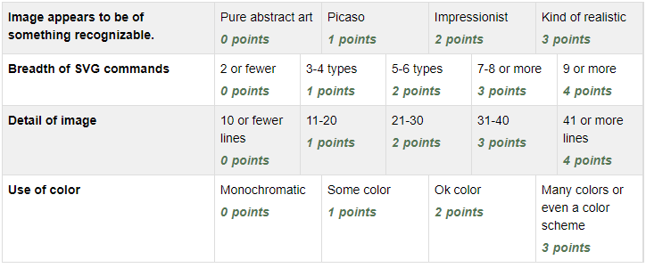

Assignment 11 - SVG
===================

Create an a web page with an embedded SVG drawing. The drawing must be:

* Generated by hand. Do not use Illustraitor or Inkscape or similar.
* A cohesive image. Abstract circles and rectangles won't score well. A house
  is better.
* Use multiple types of SVG drawing commands.
  See `SVG Intro at W3Schools <https://www.w3schools.com/graphics/svg_intro.asp>`_/
* Be detailed. A ten-line drawing won't go far in the detail.
* Use color.

