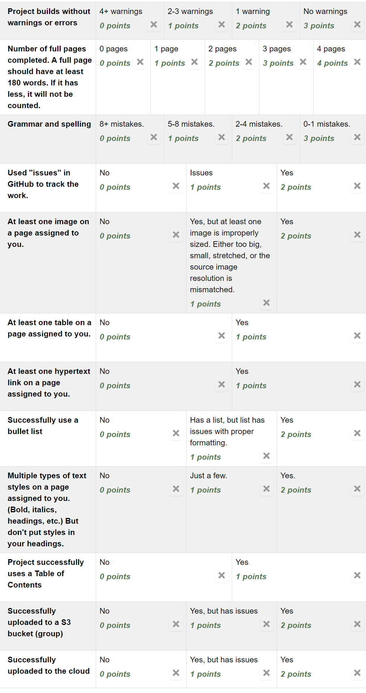

Assignment 12 - Static Content Generators
=========================================

This will be a group project. However, grades will be individual.

Getting together as a group
---------------------------

First you should get together and meet.

* Introduce yourself. Also state what pronoun you prefer. Don't make it a joke.
* Do another round where everyone states the other person's name.
* Get confident enough to
  say "hi" to each group member when you see them. Remember - taking the time
  to know and use a person's name is a sign of respect.
* Pause. Go around your group and list three things about yourself that you are
  good at. It can be technical skill, or something completely different.
  Share with the
  rest of the group. Remember what those three things are with the other people.
* Break into conversation. In this conversation,
  ask follow-up questions about the things the other people talked about.
  Remember - every person's
  favorite subject is himself/herself. Show you are interested enough in the
  other people to remember what they are good at.
  With four people, work at keeping the discussion 25% about you, and 75%
  about the other people. People tend to tilt towards talking only about themselves
  or not talking about other people at all. Find the balance.
* Pause. Go around and list one or two things related to this class you'd like
  to get better at.
  Like HTML coding, or the ability to write for the web, or working as a group,
  or trying to remember when the lab is open. Share with the rest of the group.
  Pay attention to what other people would like to learn, and see if you can help
  them out.

Figure out your topic
---------------------

* Did you do the first part? If you didn't, go back and do that. I'll wait.
* Choose a topic for the website. I'd suggest some kind of informational website
  that can be divided into parts. For example:

  * Best hockey players in Canada
  * World War II
  * Kings and Queens of Russia
  * Most popular music artists
  * Most popular YouTubers
  * Popular sitcoms
  * Harry Potter
  * Star Wars
  * Important scientific figures in history
  * Influential painters in the 20th century
  * Walk-through for a popular video game
  * Video game consoles
  * Overview of popular sports
  * Movie reviews
  * Profiles of different US States

  You can choose a business, a hobby, a historical event or place, etc. This
  will be publicly available on the web, at least temporarily, so don't post
  a subject where you will get people mad about you.
  Don't make this a joke,
  treat it as something you'd be willing to show a prospective employer.
* Double-check to make sure that everyone is ok with the topic. Don't create
  a page on knitting patterns when one of your group doesn't have an opinion if
  stitch markers should be used or not.
* Each of you will need to create four pages on the website. Each page must have
  at least 200
  words. You'll need to include section headings, images, tables, and links.
  See if that seems feasible with
  your topic.
* Get approval of the topic from the professor.
* With a shared Google Docs or similar, outline the website and what will be on it.

Collaborate
-----------

* Go back to the Google doc, choose at least four pages for each person to create.
* Select one person to start the project.
* Create a template for your project by `following the tutorial <https://web-development-class.readthedocs.io/en/latest/09_static/sphinx/sphinx.html>`_
* Put the template in GitHub.
* Add each person to the project in GitHub.
* Make sure each person has cloned the project on their computer.
* Make sure each person can build the project.
* Use GitHub's issue manager. Create an issue for each page, and assign it
  to each person.
* Choose (different) pages for each person to review and proof-read. Proof-read
  from different authors. It isn't unusual for to have someone that doesn't turn in
  anything, so make sure you have different authors to proof-read or you'll have
  problems with that part of the assignment.

Make The Web Pages
------------------

Create web pages that have:

* Headings. Take a look at the outline generated when you create a document.
  Each page should have one, and only one, level one heading. A page that doesn't
  have any headings might not show up. A page with multiple top-level headings
  will have each top-level heading show up like they are different pages. Be
  very deliberate about your heading choices.
* Images. Properly sized images. Do not squish a 4000 x 3000 pixel photo you took
  into a 400x300 spot. Change the image. You'll make a faster web page and save
  everyone money on bandwidth. Also, keep aspect ratios. Don't specify both
  width and height at a different ratio that stretches the image. I just specify
  width only and let the browser pick the right height.
* Tables
* Links outside the document
* Links inside the document (references)
* A table of contents (don't put one on each page)
* Paragraphs. Don't give me a wall of text.
* Cite any images that you use that aren't your own.
* Multiple types of styles (Normally, don't change the style in a heading.)
* Name your pages and directories according to their content. This helps their
  ranking in Google, as well as helping you keep things straight.
  So, for example, ``xbox_360.rst`` is a much better name for a page about the
  XBox 360 than a page named ``page4.rst``.
* When you've deployed to S3 and CloudFront, check and make sure your images
  work and your links. Amazon cares about the case of your file names, and if
  you've ignored my advice at making everything lower case, it may haunt you
  here.

Citations
^^^^^^^^^

To cite an image, use `footnotes <http://www.sphinx-doc.org/en/master/usage/restructuredtext/basics.html#footnotes>`_.

   Inez Milholland [#f1]_

The rest of your page would go here. Then finally at the end, have the footnotes:

.. [#f1] "`Inez Milholland <http://vcencyclopedia.vassar.edu/alumni/inez-milholland.html>`_". Vassar College Encyclopedia. 2006. Retrieved 2012-07-21.

Cite the *original* source. If you cite something like Google or Amazon, I'll not
give any points. If you list a URL as a citation, same thing.

Teamwork
--------

If no one else is taking a lead in the project, don't hesitate to step up and do
it yourself. If someone else is leading, step up and lead your own part of the
project.

It is not unusual for team members to fail and hold up their end of the project.
This is a great time to practice your ability to encourage others to engage.
Send people a reminder outside of class. But don't be a jerk about it, as we
never really know what is going on with someone else's life. Help pull someone
up. Never push someone down.

Get as much work done outside of class as you can. It is disrespectful to your
teammates if they come to class with a draft of their work, and you are busy
trying to just get started writing it.

Turn In
-------

Clearly label and turn in the following links.

By saying "Cloud/S3/Github URL" I mean that I prefer the cloud URL. If you
can't get that working give me the S3 URL. If you can't get that working, get
me the GitHub URL.

* Link to the GitHub project page.
  This should be the same for every person in the group.
* Link to each GitHub page that you created.
  Do not link pages that show someone else checking in this page.
  Please link to the source file, not the commit.
* GitHub URLs of GitHub issues you worked on.
* Cloud/S3/or GitHub URL of your page with a working image
* Cloud/S3/or GitHub URL of your page with a table
* Cloud/S3/or GitHub URL of your page with a link
* Cloud/S3/or GitHub URL of your page with a bullet list
* Cloud/S3/or GitHub URL of your page with a multiple styles
* Link to your group's S3 bucket website
* Link to your group's Cloud page

Rubric
------

Important End of Term Reminder
==============================

After grades are posted for this class, remember to:

* Stop your EC2 web server. You can terminate it (make it go away) or just
  stop it.
* Remove your S3 bucket.
* Remove your CloudFront link.

Or, just terminate your account once everything is graded. Please don't terminate
it before I grade your projects.

This will help make sure that you don't get any unexpected fees charged to your
credit card.
