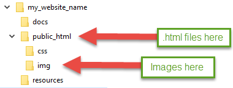

Assignment 1 - Basic HTML
=========================

Project Overview
----------------

We will be working on building a website for a fictitious organization
throughout the semester. We will learn how to work on a website in groups.
This is the start of that website.

How to Work in Pairs
--------------------

A popular trend in programming is
`pair programming <https://en.wikipedia.org/wiki/Pair_programming>`_.
If done correctly, pair programming can:

* Improve code quality
* Improve job satisfaction
* Give programmers more opportunities to learn
* Build-in cross training so programmers can change jobs easier
* Build team dynamics

It is also possible to make pair programming a *bad* experience. Particularly
if the observer pulls out his or her phone. Therefore, if someone pulls
out their phone they will be asked to leave, and counted as absent.

I will assign the pairs. It is my plan to keep switching pairs, so you'll
get to work with several people in class.

When pair programming, you have a "driver" who is at the keyboard. You also
have a "navigator" or "observer." I like the work "navigator" better.
The "navigator" should be the one directing the coding. For example, if you
are driving, you have one person telling the driver to go left or right.
The driver worries about not hitting anyone.

Schedule
--------
* This is the first year we are doing web development as two semesters. I may
  need to fine-tune the schedule. Please listen for any schedule changes given
  in class.
* One person will "drive" and type on the computer for half the time.
  One person will direct. Each person should work to finish three pages. It is
  expected that some time will be spent outside of class to finish those pages.
  Do the hard parts first, and save the easy parts for outside of class.
* Thursday, spend about 15 minutes picking the topic, and figuring what pages
  you will build.
* Also on Thursday, split the rest of the time. One person navigates, one person
  drives. Switch places
* There may be ONE group of three. If you are in this group, please divide the time
  in thirds. Each person is still responsible for three pages.
* Later we will cover how to turn in the assignment.

If you are gone any of these days you will get half credit. If your phone is
out, or you are on an unrelated website, you'll be counted as gone and asked
to leave for the day.

Website Subject
---------------

Pick a subject out of this list. I am open to ideas that are not on the list,
but please see me first. The projects will be passed between groups, so keep
the subjects to ones that any student could work on.

* Selling BBQ sauce
* Local mountain bike club
* Local garden club
* Local business that teaches photography
* Local Italian restaurant
* Web page for a band that gets gigs, but isn't famous
* Website with recipes for families that want to eat healthy
* Cute/funny cat photos or videos (you will need to take them yourself)
* Information on the best mobile phone
* Local business that sells shoes
* Bed and breakfast
* DIY website
* Crafting website
* Info page for a fictitious city
* Page for a person running for state senate/congress/whatever
* Put your project idea up on the board. No duplicate project ideas.

All web pages must have text. Please create real, actual, content.
Text must be original and not copied.
Images should be original as well, with a few exceptions. If you want
an exception, please see me for information on how to cite and link it.

Required Components
-------------------

* Every page should have:

  * HTML comment at the top with the person who is primarily responsible for the
    page. This will be the page where you are the 'navigator.' The driver does
    the typing and will not be primarily responsible for that page.
    Each person should have at least three pages they are responsible for,
    and will be graded on.
  * Web site title and graphic. Put in its own ``
``. Or you can use the ``<header>``
    tag instead.
  * Web site footer. Put in its own ``
``. Or use the ``<footer>`` tag. What might
    go in the footer? Anything that goes at the bottom of the page. For example,
    the footer might have copyright information or contact information. See other
    pages for ideas.
  * Page names: All pages should end in ``.html``. Page names should be all lower
    case. Page names should not have spaces. You can use underscores instead.
  * Unordered list of all pages in the web site, that link to the web pages.
    The link will be the page name. For example: ``<a href="about.html">About</a>``
    Links must be relative. See the example out of the tutorial for how the list
    should look. It should be inside a ``<nav>`` tag just like the example.

* Two Required pages

  * Main index page. The file name must be ``index.html``
  * About page. This might have things like who created the website, or
    info about your band, or your city, or company.

* Optional pages. Must have at least four.

  * News page
  * Items for sale page
  * Hours, directions
  * Page with video. Videos should be original. Please don't use other
    people's videos. You can post on YouTube, Vimeo, etc. and link the video
    in.
  * Pages with info on a subject

* Required placeholder pages. See below. Just put in a title on these two pages
  for now. We will show how to create forms later.

  * Login
  * Sign up, or some other 'enter information' page

* Required HTML elements

  * HEAD section on all pages
  * At least one table. You don't need a table in all the pages, but you need
    a table on at least one page. The table may look "squished." We'll show
    how to style the table later.
  * Linked in images. You may not copy the image off the web. Sketch something
    in MS Paint, or Inkscape. Or take your own photo. It doesn't have to look good.
  * HTML entities. Toss at least one somewhere on your six pages.
  * Headings. Those <h1...6> tags.
  * Paragraphs
  * Tags must be lower case
  * Run a validation check on the HTML for each page. Make sure it is free of issues.
  * Check for spelling and grammar. It counts as part of the grade.

Directory Structure
-------------------

For more information about directories and links with the web, see the
:ref:`Directories` page.

For this assignment, create directories and set up your folders like this:

Turn in Assignment 1
^^^^^^^^^^^^^^^^^^^^

To turn in assignment 1, copy the GitHub address for your project into the submission
form on Scholar for assignment 1. This will require you to complete Assignment 2.

* Make sure you submit your files, and your files only.
* Make sure you submit any images that go with your files.
* Make sure to add descriptive comments when submitting. (You can't edit them
  later, so make sure you get them right the first time.)
* Make sure your files have a comment with your name in them at the top.
* Make sure HTML Validator returns all the files as free from errors or warnings.
* File names should be all lower case.
* File names should not have any spaces. Use underscores instead.
* The menu should be in an unordered list, and should appear on every page.
* The footer should look something like this:

.. code-block:: html

  <footer>
    Copyright 2016 by Pat
  </footer>
