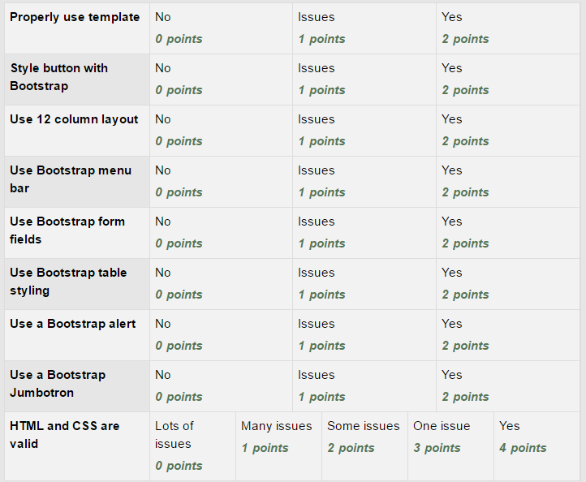

Assignment 4 - Bootstrap
========================

Getting set up:
* Open the project you were assigned.
* Go back before you started adding CSS. Do this by double-clicking on the project at that check-in.
* Create a new branch of your project called ``bootstrap_firstname_lastname``.

Do the following:

* "Properly use template" Use the template in our Bootstrap tutorial to adapt
  all pages on the project to use Bootstrap. You will need to copy/paste out
  of the template into the pages to make sure that Bootstrap has been applied.
  **Also** make sure that the menu bar "hide" text on your page.
* "Style buttons with Bootstrap" Style all the buttons (there has to be at
  least one) with Bootstrap. Leave no button unstyled.
* "Use 12 column layout" Pick at least page, and make it into a responsive multi-column
  layout using Bootstrap. Use the full power of the 12 column layout to get
  full points.
* "Use Bootstrap menu bar" Put a Bootstrap menu bar on all your pages.
* "Use a Bootstrap alert" Put at least one Bootstrap alert somewhere on your page.
* "Use a Bootstrap Jumbotron" Properly use a Jumbotron at least once. Don't make
  the mistake of putting the whole page into the Jumbotron, just part of it.
* "HTML and CSS are valid" Use HTML Validator to find and fix all errors.

**Note:** A very common mistake is to not use the 
, or to
not have the footer in that container. You should not have text running to the
edge of the screen.

Also make sure you don't have blocks of text on a colored background. That is
too hard to read.

