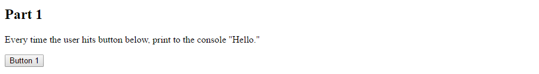
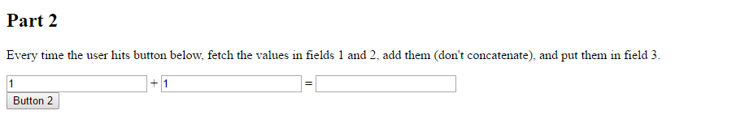
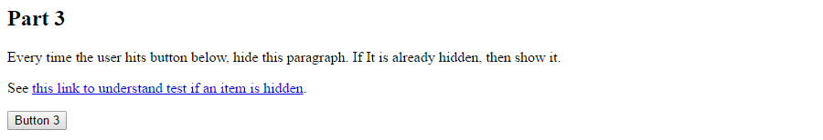
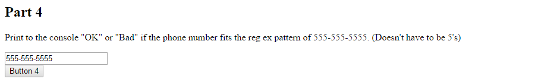
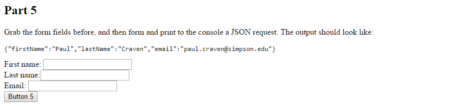

Assignment 2 - First JavaScript Assignment
=========================================

Take the HTML code at the end of this assignment, and then write a JavaScript
file to complete the five parts. Please use jQuery where appropriate.

Four points for each part.

Part 1
------
Write an application that will print out "Hello" to the console every time
the user hits the button.

Part 2
------

For part two, use jQuery to pull the values of the first two fields, convert
them to numbers, and add them. Then put the result in the third field.

Part 3
------

Toggle the paragraph to be hidden and not hidden.

Part 4
------

User regular expressions to validate the following field:

Part 5
------

Create a JSON string out of the following form fields:

.. literalinclude:: javascript_assignment.html
    :linenos:
    :language: html
