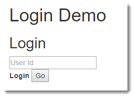
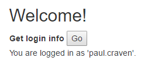

Assignment 10 - Login Lab
=========================

1.  Start with the Session demo page. See :ref:`session_demo_html`.
2.  Instead of naming the file ``session_demo.html``, use ``login.html`` as
    the name.
3.  Create a JavaScript page. See :ref:`session_demo_js` as it can be a good
    starting template for our page.
    But instead of ``session_demo.js`` call it ``login.js``. Make sure you update
    the HTML document from step 1 to import this file.
4.  Create a ``GetLoginServlet`` class in Java. Pattern it off the
    :ref:`GetSessionServlet`.
5.  Map a ``get_login_servlet`` in ``web.xml`` to the class you just created.
6.  Create a ``LoginServlet`` class in Java. Use the code out of
    :ref:`SetSessionServlet` to start.
7.  Create ``login_servlet`` in ``web.xml`` and map it to the
    ``SetLoginServlet`` class you just created.
8.  Update the JavaScript file to use these new names. Use ``login`` instead
    of ``setSessionJava`` and ``getLogin`` instead of ``getSessionJava``. Update
    button names to something that matches as well.
9.  After all this copying and renaming, get things up and running so you can
    set session variables like the demo.
10.  Don't allow the user to select the session key. Delete the field from the
     HTML. Rename the field so it is ``loginId`` rather than ``sessionValue``.
     Update the JavaScript to just send the login id. Update the servlet to just
     take the login id.
     Always use ``loginId`` in your Java file as the session key.
     Test to make sure it works.

11. "Rebrand" the "Clear session" section so that it instead looks like a "Logout".

12. "Rebrand" the Get Session section so that it shows who you are logged in as.
    If you are logged in.
    Update the servlet too. You can simplify it a lot by just doing something
    like ``String loginId = (String)session.getAttribute("loginId");``

13. Automatically call the 'get session' part on page load
14. Automatically call the 'get session' part when the user logs in.
15. Automatically call the 'get session' part when the user logs out.
16. Hide the logout section if the user isn't logged in.
