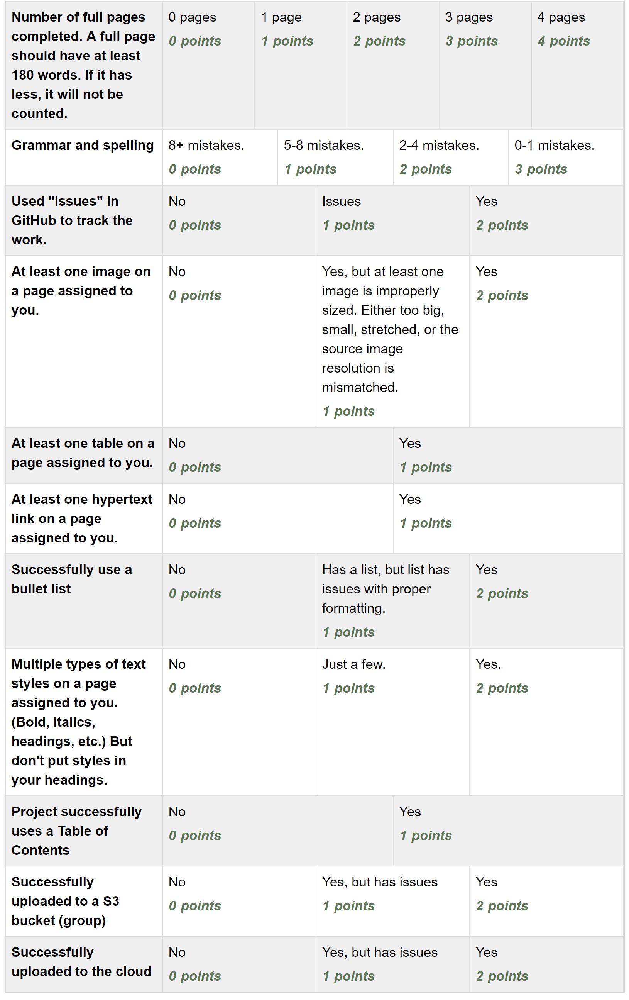

Assignment 11 - Static Content Generators
=========================================

This will be a group project. Grades will be individual.

Getting together as a group
---------------------------

First you should get together and meet.

* Introduce yourself.
* Make sure that you know everyone else's name. Get confident enough to
  say "hi" to each group member when you see them. Remember - taking the time
  to know a person's name is a sign of respect.
* Pause. List three things about yourself that you are good at. Share with the
  rest of the group. Remember what those three things are with the other people.
  Later on, ask follow-up questions about these things. Remember - every person's
  favorite subject is himself/herself. Show you are interested enough in the
  other people to remember what they are good at.
* Pause. List one or two things related to this class you'd like to get better at.
  Like HTML coding, or the ability to write for the web, or working as a group,
  or trying to remember when the lab is open. Share with the rest of the group.
  Pay attention to what other people would like to learn, and see if you can help
  them out.

Figure out your topic
---------------------

* Did you do the first part? If you didn't, go back and do that. I'll wait.
* Choose a topic for the website. I'd suggest some kind of informational website.
  You can choose a business, a hobby, a historical event or place, etc. This
  will go on the web, at least temporarily, so I suggest making it fictional
  or about a subject that won't care if you post information about it.
  Like an information page on Catherine the Great.
* Double-check to make sure that everyone is ok with the topic. Don't create
  a page on knitting patterns when one of your group doesn't have an opinion if
  stitch markers should be used or not.
* Get approval of the topic from the professor.
* Map out the website and what will be on it.

Collaborate:

* Choose pages for each person to create.
* Assign pages in GitHub.
* Choose (different) pages for each person to review and proof-read.

Create web pages that have:

* Headings
* Images. Properly size image. Do not squish a 4000 x 3000 pixel photo you took
  into a 400x300 spot. Change the image. You'll make a faster web page and save
  everyone money on bandwidth. Also, keep aspect ratios. Don't specify both
  width and height at a different ratio that stretches the image. I just specify
  width only and let the browser pick the right height.
* Tables
* Links
* Table of Contents
* Multiple types of styles (Normally, don't change the style in a heading.)

Check for case issues. If you link baseball.jpg but name the image Baseball.jpg
then it will work on your computer, but fail when deployed.

Turn in a the following links. Please clearly label each link
and follow the order below:

* Link to the GitHub project page.
  This should be the same for every person in the group.
* Link to each GitHub page that you created.
  Do not link pages that show someone else checking in this page.
  Clearly label which page shows you demonstrating the use headings, images,
  tables, and links.
* Link to the final website via S3
* Link to the final website via CloudFront

Rubric
------

Important End of Term Reminder
==============================

After grades are posted for this class, remember to:

* Stop your EC2 web server. You can terminate it (make it go away) or just
  stop it.
* Remove your S3 bucket.
* Remove your CloudFront link.

This will help make sure that you don't get any unexpected fees charged to your
credit card.

