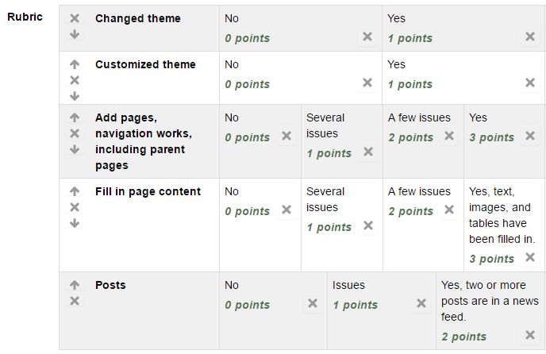

Assignment 10 - WordPress Site
==============================

* Edit your website. You can usually get to the dashboad by adding
  ``/wordpress/wp-admin/`` to the end of your URL.
* Select a theme, other than the default theme.
    * Select Appearance...themes from the dashboard.
    * Then select "Add Theme"to browse what is out there.
    * Click "Install"
    * Click "Activate"
* Customize
    * Customize your theme. (Appearance...customize)
      The theme may ask for additional plug-ins to be installed.
* Add pages
    * Add pages. Do this by by clicking "Pages" and then "Add New". For your
      new website, create a new page for each page in your old website. EXCEPT
      don't create one for index.html.
    * Just put in the title for now.
    * Visit your site, confirm the pages are showing up in the navigation bar.
    * Add at least new page (or reorganize a page that exists) and give it a
      "parent" page. You can do this on the right side while editing a page.
    * Verify you now have a drop-down menu with the pages.
* Fill in page content
    * Figure out how to use the page editor, how to upload media, and recreate
      the pages from your original website.
    * Note that there is a toolbar. The last item gives you more options. You
      can also click a "text" tab and edit the HTML directly.
* Create at least two posts
    * Create at least two posts and have them as part of a news feed.

If you have time, play around with WordPress and figure out what you can do.

