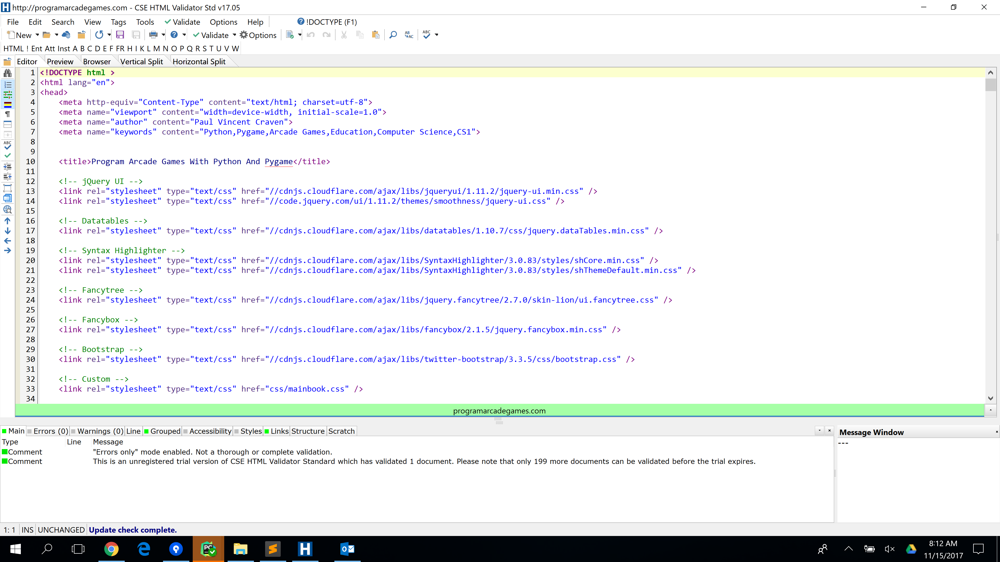
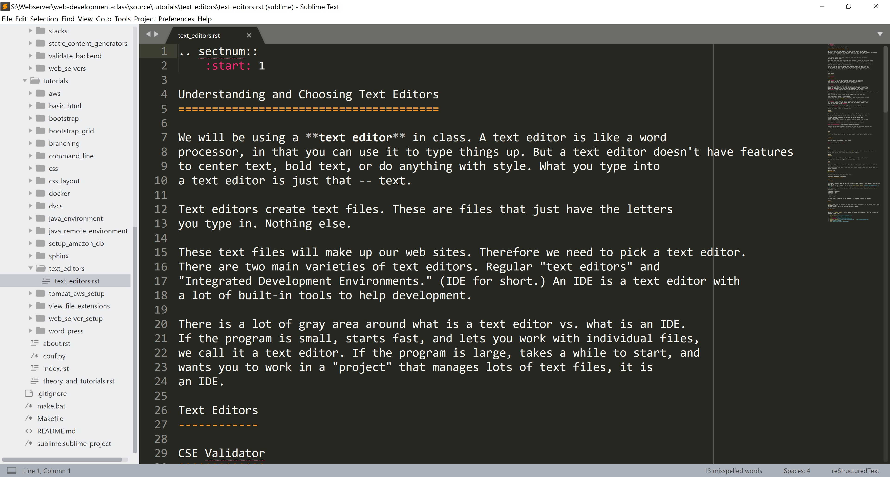
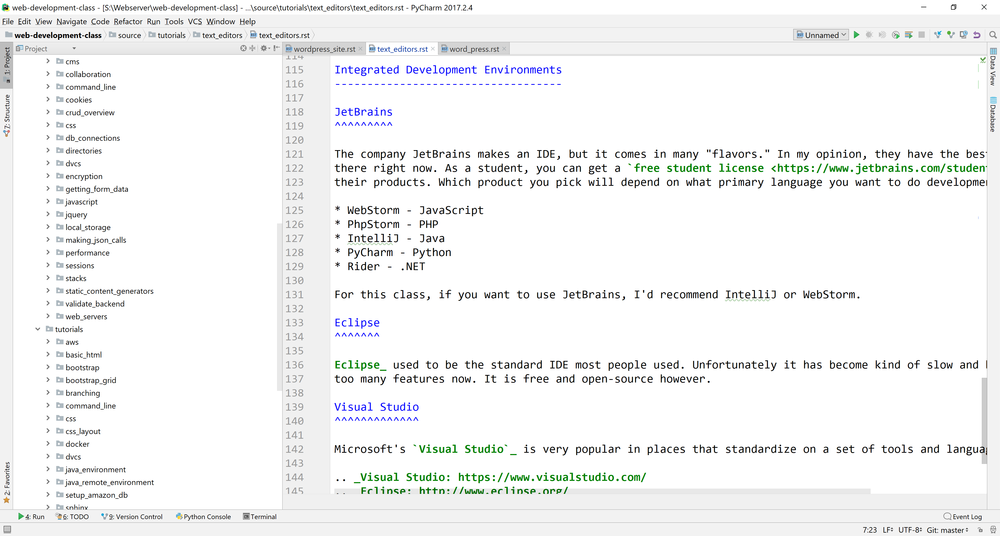

.. _text_editors:

Text Editors
============

We will be using a **text editor** in class.
A text editor is like a word processor, but with no options for styling text.
There's no ability center, bold, change font size, or anything else.
What you type into a text editor is just that -- text. The files it saves are
**text files** that just have the letters you type in.

These text files will make up our web sites. Therefore we need to pick a text editor.
There are two main varieties of text editors. Regular text editors and
**Integrated Development Environments (IDE)** An IDE is a text editor with
a lot of built-in tools to help development.

There is a lot of gray area around what is a text editor vs. what is an IDE.
If the program is small, starts fast, and lets you work with individual files,
we call it a text editor. If the program is large, takes a while to start, and
wants you to work in a "project" that manages lots of text files, it is
an IDE.

The TLDR: We need a text editor. I'm recommending a free program called Sublime,
or a pay-for program called CSS HTML Validator.

Text Editors
------------

These are some of the most popular text-editors in use for web development.

CSE Validator
^^^^^^^^^^^^^

`CSE Validator`_ is one of my favorite tools. While it is a decent
text editor, it isn't a great one. The key feature that makes it
stand out that it can check your websites for mistakes.

CSE Validator makes it easy to "validate"
a web page. Web pages can look fine, but have a lot of errors in the code
written to make them work. Just like you can write an English sentence that
people can understand, but might have many grammatical and spelling errors.
CSE Validator helps find the errors in the web code that you write.

It can even check not just one page, but an entire website at once. You hit a button, and it tells you all
your HTML and CSS errors. I have learned a great deal from this tool.

There are several versions of the software
ranging from free to about $350. I personally think the Pro version is worth
the cost. There is an `academic discount`_ if you are a student.

CSE Validator isn't quite as good at editing text as some other options. So
if I do much writing, I will usually open files in different program. Then
test the file later in CSE Validator.

We have CSE Validator in the lab. I'll expect you to "validate" your
websites before turning them in. This will make sure you get all the
points for writing valid HTML and CSS code.

Sublime
^^^^^^^

This is my favorite text editor. You can try it out for free, but to get rid
of the nag-screens you need to pay money. The money is totally worth it.

The most expensive investment is to learn how to use Sublime well.
Sublime can be used
without spending time learning its features, but each feature can save time.

There are many tutorials out there. Here is one to get your started:

https://leveluptutorials.com/tutorials/sublime-text-tutorials

Spending an hour doing tutorials on Sublime can save you many hours down the road.
Learning how to use multiple cursors can make life much better.

Sublime is currently the 'stylish' choice that will earn you respect amongst
your programming peers.

Atom
^^^^

`Atom`_ is a text editor that is a lot like Sublime. It is slower, but it is free.

Notepad++
^^^^^^^^^

A lot of people like Notepad++ as an editor:

https://notepad-plus-plus.org/

It is free, and also a safe no-brainer choice. Think of it as the Wal-Mart
or Target in text-editors.

Vim
^^^

If you want a real challenge, learn to use `Vim`_. It is built-in to most Linux
computers and is great if you want to edit text on a remote computer.

Notepad
^^^^^^^

Windows comes with a built-in editor called Notepad. It is terrible. But
it comes with Windows, so I guess it has that going for it.

IDLE
^^^^

IDLE comes with a computer language called Python. If you take a Python course
you might be familiar with IDLE. IDLE is a terrible text editor, and there is
no reason to use it when there are so many free options available.

Microsoft Word
^^^^^^^^^^^^^^

No, don't use this to edit text files. Ever.

Integrated Development Environments
-----------------------------------

Large, complex websites often require a lot of additional software, tools,
and procedures to help development. Using an IDE can help access all of these
in one environment. Here are some of the most popular IDEs for web development.

JetBrains
^^^^^^^^^

The company JetBrains makes an IDE, but it comes in many "flavors." In my
opinion, they have the best IDE out there right now. As a student, you can get
a `free student license <https://www.jetbrains.com/student/>`_ for all
their products. Which product you pick will depend on what primary language you
want to do development in:

* WebStorm - JavaScript
* PhpStorm - PHP
* IntelliJ - Java
* PyCharm - Python
* Rider - .NET

For this class, if you want to use JetBrains, I'd recommend IntelliJ or WebStorm.

Visual Studio
^^^^^^^^^^^^^

Microsoft's `Visual Studio`_ is very popular in places that standardize on a set
of tools and languages called .NET. It is quite popular, and for good reason.
Microsoft spends a lot of resources making it one of the best tools out there.

Eclipse
^^^^^^^

Eclipse_ used to be the standard IDE most people used. Unfortunately it has
become kind of slow and bloated with too many features now. It is free and
open-source however.

.. _Visual Studio: https://www.visualstudio.com/
.. _Eclipse: http://www.eclipse.org/
.. _CSE Validator: https://www.htmlvalidator.com/
.. _academic discount: https://www.htmlvalidator.com/buy/academic/
.. _Atom: https://atom.io/
.. _Vim: http://www.vim.org/download.php
