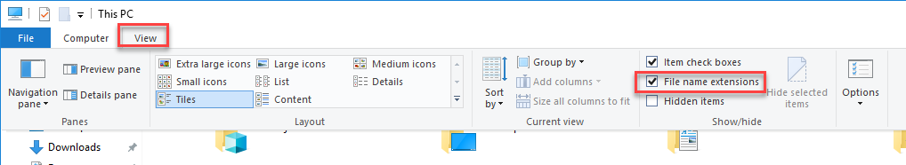

.. _view_file_extensions:

Enable Display of File Extensions
=================================

This section is only needed if you are running on Windows.

It is a great idea to change your Window's configuration to show file extensions.
A file usually has a name like Book ``report.docx`` where the ``.docx`` tells the
computer it is a Microsoft Word compatible document. By default Windows
hides the ``.docx`` extension if there is a program installed to handle it.
If you are programming, this hiding part of the file name can be annoying.

.. raw:: html

  <iframe width="560" height="315" src="https://www.youtube.com/embed/LukHWurpjAc" frameborder="0" allowfullscreen></iframe>

For Windows 10, bring up a file explorer by hitting the Windows-E key.
Then click the "view" tab and make sure “File name extensions” has been checked.

