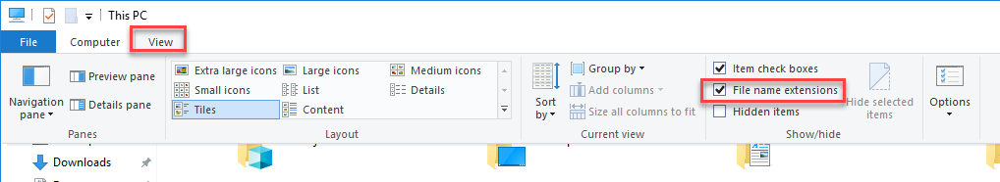

Viewing File Extensions
=======================

It is a great idea to change your windows configuration to show file extensions.
A file usually has a name like Book ``report.docx`` where the ``.docx`` tells the
computer it is a Microsoft Word compatible document. By default Windows
hides the ``.docx`` extension if there is a program installed to handle it.
If you are programming, this hiding part of the file name can be annoying.

.. raw:: html

  <iframe width="560" height="315" src="https://www.youtube.com/embed/LukHWurpjAc" frameborder="0" allowfullscreen></iframe>

For Windows 7, to show file extensions,
open up your computer's control panel. Find the selection for "Folder Options.""
Click the "View" tab, and then unselect the option for "Hide extensions for
known file types.""

For Windows 8 and 10, bring up a file explorer by hitting the Windows-E key.
Then click the "view" tab and make sure “File name extensions” has been checked.

