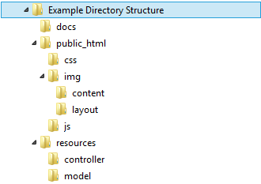

.. _Directories:

Managing Directories
--------------------

Relative Directories
^^^^^^^^^^^^^^^^^^^^

Only the smallest websites will put all of the files required into one folder.
It is best to organize files into different folders.
If files are in different folders, we able to link between the
folders.

The simplest links are between HTML files in the same directory. Here is an
example of linking between two files in the same directory:

.. literalinclude:: ../../../_static/directories/v1/page1.html
   :language: html
   :linenos:
   :caption: page1.html

.. literalinclude:: ../../../_static/directories/v1/page2.html
   :language: html
   :linenos:
   :caption: page2.html

Try it out: `Example 1 <../../../../_static/directories/v1/page1.html>`_

This next example adds a new page, named ``page3.html``
in a new subdirectory, named ``subdir``. Note that the links in
``page1.html`` go down into the subdir, and ``page3.html``
has a link that goes up one directory. This is done by using ``../``
in front of the file name. The two dots tell the comptuer to go "up" one
directory.

.. literalinclude:: ../../../_static/directories/v2/page1.html
   :language: html
   :linenos:
   :caption: page1.html

.. literalinclude:: ../../../_static/directories/v2/page2.html
   :language: html
   :linenos:
   :caption: page2.html

.. literalinclude:: ../../../_static/directories/v2/subdir/page3.html
   :language: html
   :linenos:
   :caption: subdir/page3.html

Try it out: `Example 2 <../../../_static/directories/v2/page1.html>`_

The next example shows how to extend the same concept to link into
nested directories:

.. literalinclude:: ../../../_static/directories/v3/page1.html
   :language: html
   :linenos:
   :caption: page1.html

.. literalinclude:: ../../../_static/directories/v3/subdir/page3.html
   :language: html
   :linenos:
   :caption: subdir/page3.html

.. literalinclude:: ../../../_static/directories/v3/subdir/supersub/page4.html
   :language: html
   :linenos:
   :caption: subdir/supersub/page4.html

Try it out: `Example 3 <../../../_static/directories/v3/page1.html>`_

Absolute vs. Relative References
^^^^^^^^^^^^^^^^^^^^^^^^^^^^^^^^

URLs may be *absolute* or *relative*.
The URLs shown so far have all been relative URLs.
Relative URLs give directions from where the user is at, to where the user would
like to go.
If possible, it is best to use relative URLs.
The main advantage of relative URLs it is
possible to move the files into a different directory, or even a different
website and still have the links work.
Absolute URLs will not take into account where the user is at currently, and
always link to the same place. This is the right thing to do when linking to
other websites, or other major sections of a website. It is a bad idea when
creating links between pages of a website, because any moving of directories
will cause every link in the website to need updating.

The next example shows two kinds of absolute URLs. The first gives an absolute
path. Any path that begins with a ``/`` is an absolute path. It is possible to take
an absolute path, and change the name of the website and still have the path work.
The second also specifies the website name. It is not possible to update the website
name and not have to also update the link.

.. literalinclude:: ../../../_static/directories/v4/page1.html
   :language: html
   :linenos:
   :caption: page1.html

Try it out: `Example 4 <../../../_static/directories/v4/page1.html>`_

Remember, if a website links to a directory but not a file, the web server will
look for an index file, such as ``index.html`` or ``index.php``.

If an index file does not exist, the web server will look to see if it can
create a directory listing of all the files in the directory.
It is usually a bad idea for security reasons to allow this to happen on a
production web server.

Later, we will talk about how to set up web servers. I will mention now, in case
you are curious, that the Apache web server stores its configuration in a text
file named ``httpd.conf``. In this file there is a `configuration setting`_ to
turn this directory listing feature off.

Common Mistakes
^^^^^^^^^^^^^^^

**Mistake 1:** Sometimes new developers grab URLs from their browsers, and use them as links.
There are a few cases where that can go badly. For example, if the link in
your browser says:

``file:///C:/Users/Paul/Documents/myfile.html``

This is NOT a link you want to use. The ``file:`` means it is a link to a file on
your local computer. Notice there is no ``http:`` in front. It goes through no
webserver. If a person is crusing your website, and clicks on a link formatted
like that, it says go to the user's computer (not your website) and open a file
on the user's computer in the directory ``Users/Paul/Documents`` named ``myfile.html``.
That's not going to work!

The bug is frustrating because the website will appear to work correctly on the
developer's computer, but no one else's.

Avoid this mistake by realizing any link starting with ``file:`` will fail.

**Mistake 2:** Again, a developer might grab a URL from their browser. The URL
might look like:

``http://localhost/mysite/myfile.html``

In this case we don't have ``file:`` in front. But we do have ``localhost``. This
``localhost`` is a special computer name that means *my computer*. So if you go
to ``localhost``, you will try to grab web pages on your comptuter. If *I* go
to ``localhost`` I'll grab files off *my* computer. Any link that starts
with ``http://localhost/`` will not work properly for other people.

We will talk more about links later when we set up servers, but hopefully this
will keep you from making common mistakes before we get to our detailed discussion
later.

Sample Directory Structure
^^^^^^^^^^^^^^^^^^^^^^^^^^

Here is a sample directory structure that a real website might use:

* ``docs`` This directory contains documents about your website
  for other developers. It isn't seen by the public.
* ``public_html``: This directory is where you'll point your
  production webserver to serve files from. (This is typically done with a
  VirtualHost_ in the ``httpd.conf`` file. When we talk about setting up a web
  server we'll discuss that more.)
* ``css`` All your custom style sheets go here.
* ``img`` Images go here. It is nice to separate images that are
  part of the look/feel of your website vs. images that are part of the
  content.
* ``js`` All your custom JavaScript files go here.
* ``resources`` These can be "parts" of a web page that you'll include
  from the ``public_html`` pages, that you don't want users directly
  accessing. We'll talk about that more in a later chapter.

Security
^^^^^^^^

In terms of security, directories and files pose two main challenges:
First: Don't put any file in the publicly accessible directories that
is not OK for users to access. Do not assume a user won't "guess" the filename
or type it in directly.
Second: `Directory traversal`_ is
a common attack vector for hackers. When you write code, make sure that users can't
specify their own directories. Particularly, don't let them traverse up the
directory tree. Since we haven't done any PHP coding yet, we won't discuss this
in detail yet.

.. _configuration setting: https://wiki.apache.org/httpd/DirectoryListings
.. _VirtualHost: http://httpd.apache.org/docs/2.4/vhosts/examples.html
.. _Directory traversal: http://en.wikipedia.org/wiki/Directory_traversal_attack
