.. _dvcs_tutorial:

Distributed Version Control System Tutorial
===========================================

Learning version control, and Git, is one of the hardest parts of this
class. It confuses even experienced programmers. So DON'T PANIC!
Ask questions when you get stuck. It is normal even for those with
years of experience.

.. image:: https://imgs.xkcd.com/comics/git_2x.png

.. Note::

  Git Cheat Sheet

  https://services.github.com/on-demand/downloads/github-git-cheat-sheet.pdf

Git stores all the code in your project into a *repository*. Typically, there
will only be **one** repository per major project you create.

All the code that you have should go into a folder. From the prior section,
you should have a project folder that has your HTML files, and probably a
sub-folder with images.

We are going to show you how to create a repository with that folder,
push it out to a server, and then keep the changes between multiple people
in sync. To do this, we will use a program called ``git``.

Quick Reference
---------------

Commit and Upload
^^^^^^^^^^^^^^^^^

Do this whenever you are done with a session of programming:

1. Open "command prompt" on Windows, or "terminal" on MacOS.
2. Type ``cd mydirectoryname`` where the name of the directory will be the same as the name of your repository on
   BitBucket. You can usually type in the first few letters and hit <tab> to fill in the rest of the directory name.
3. Type ``git pull`` to get all the latest changes.
4. Do your changes.
5. Type ``git add *``
6. Type ``git commit -m "Work on lab 1"`` Update the comment between the quotes
   to whatever you did.
7. Type ``git push``

If you get an error while pushing, see :ref:`cant-push`

Installing Git
--------------

First, if you are on your own computer, install ``git``. (Skip this step if you
are on a lab computer.)

**Windows Installation:**
You can download the program from https://git-scm.com/downloads

The ``git`` program has a lot of dialog boxes that
pop up asking questions. The defaults are fine, just keep hitting "next" or
"ok."

** Mac Installation:**
If you are on a Mac, open up the "Terminal" program, which is in
your Applications folder, and from there, inside the Utilities folder.
Once open, type ``git`` at the command prompt and if the Mac doesn't have
it installed, it will ask if you'd like to install it.

Creating And Committing To The Repository
-----------------------------------------

Our repository commands will be typed in. There are graphical programs that
let you run ``git`` commands, however in my experience it is *harder* to learn
``git`` this way.

The Terminal
^^^^^^^^^^^^

If you are on a Mac, open up the "Terminal" program. If you are on Windows,
open the "command prompt".

Directory
^^^^^^^^^

When you are working on a command prompt, you are in something called a
"working directory." All your commands will operate on the current directory.
On Windows, the command prompt will print the directory you are in.

To get the full directory you are in on the Mac, type
``pwd`` which is short for "Print Working Directory".

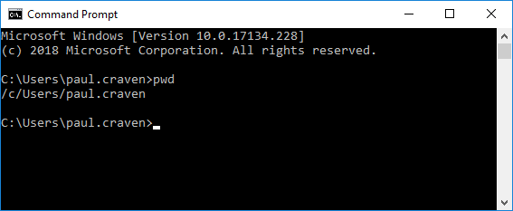

You can see the files that are in the folder by typing in ``dir`` on Windows and
``ls`` on the Mac.

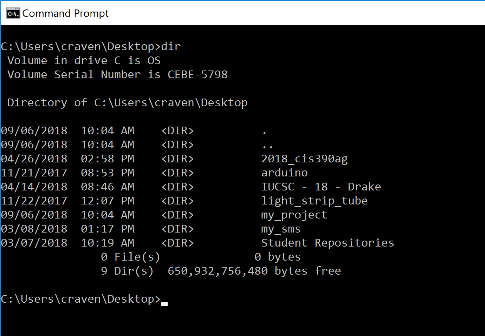

Change Directory
^^^^^^^^^^^^^^^^

We need to change our working directory to the same directory that has the
project.

If you are on a Windows machine, and you have your work on a flash drive or some
other drive, you can switch to that drive by typing the drive letter and
a colon. For example: ``e:``. If your work is on the ``c:`` drive, or you are
on a Mac, you can skip this.

If your work is on the desktop, type ``cd Desktop``. Then type ``dir`` to see
if you can see your project folder. Then type something like ``cd my_project``.

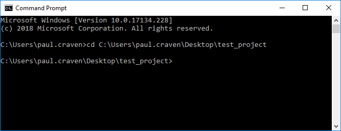

If you need to go *up* a directory, type ``cd ..``.

If you can't figure out exactly what directory you need, you can copy
the path from the file explorer window. Just right click on the path
and hit copy:

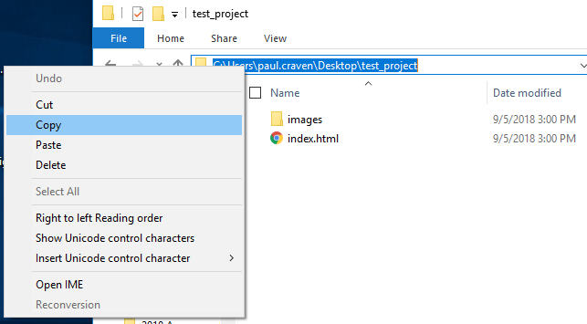

Tips For Fast Typing
^^^^^^^^^^^^^^^^^^^^

When typing in file names, you can usually type the first few letters and then
hit the <tab> key. If you typed in enough letters, the computer will fill in the
rest for you.

You can hit the "up" arrow to get commands you previously typed in.

Initialize Repository
^^^^^^^^^^^^^^^^^^^^^

Once you are in your project folder, you should be able do type ``dir`` (or ``ls`` on the Mac)
and see your ``public_html`` folder.

We need to create our repository. You'll only do this **once** for this project, and only
by **one** person on your team. Otherwise you'll have multiple projects and that will
just be confusing.

To create the repository type ``git init``:

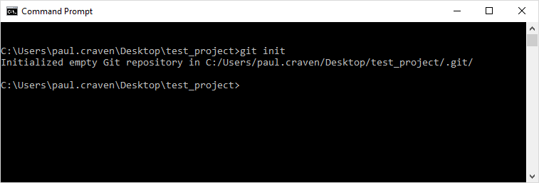

Add Changes
^^^^^^^^^^^

Now that you've created the repository, we need to add all your files to it.
You can add them individually by ``git add <filename>``. For example ``git add index.html``.
But if you want *every* file. (And we do.) You can use the asterisk as
a wild-card character. So type ``git add *``:

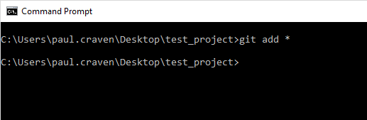

.. _commit:

Commit Changes
^^^^^^^^^^^^^^

Now that we've added the files to the repository, we need to commit them.
This will freeze the changes and let us go back in time if needed.

We need the ``git commit`` command. You also need to include a message
that describes what you did. These messages are important, particularly
when you work with other people.

You can add the message by the ``-m`` parameter. The message must go in
quotes. For example, ``git commit -m "First check-in of project."``

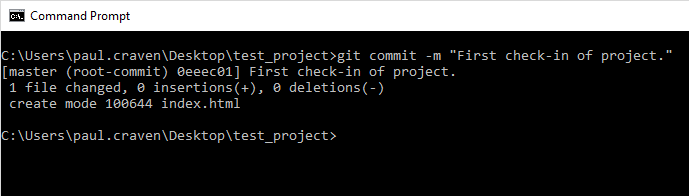

There are two things that commonly go wrong at this point. If you forgot
the message, you might get a window that looks something like:

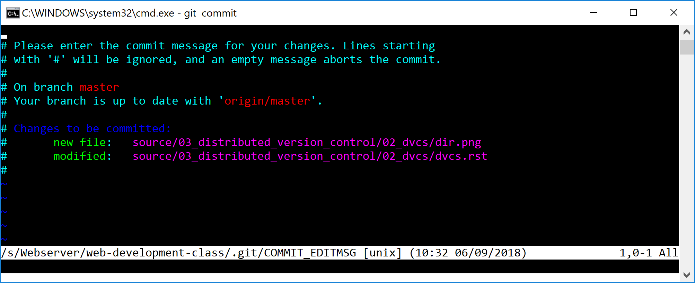

This is "vi", a text editor that you can use to enter your comments that
you forgot. But vi is hard to learn. So we just want to exit out and try
again. To exit, hit the "Escape" key. Then hold down shift, and type ``ZZ``.
Then, just do your commit again, but add the message.

The first time you commit, you might get an error like:

.. code-block:: text

    19:00:28: *** Please tell me who you are.

    Run

      git config --global user.email "you@example.com"
      git config --global user.name "Your Name"

If this is the case, you need to run these two commands, and then
do your commit again. In my case, I would do:

.. code-block:: text

      git config --global user.email "paul.craven@simpson.edu"
      git config --global user.name "Paul Craven"

But you need to use your name and e-mail. Don't use mine.

Make good commit messages. But yes, everyone has been here:

.. image:: https://imgs.xkcd.com/comics/git_commit_2x.png

Git Log
^^^^^^^

The ``git log`` command will list all the recent commits:

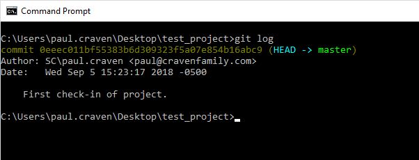

Gitk
^^^^

The ``gitk`` commmand opens a window that has a nice graphical
UI showing what is happening with the repository.

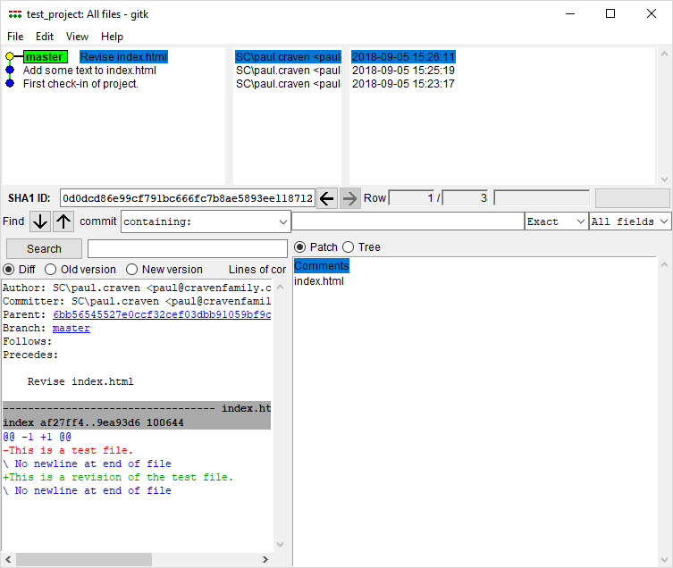

Git Status
^^^^^^^^^^

You can see what files changed since the last commit with
``git status``.

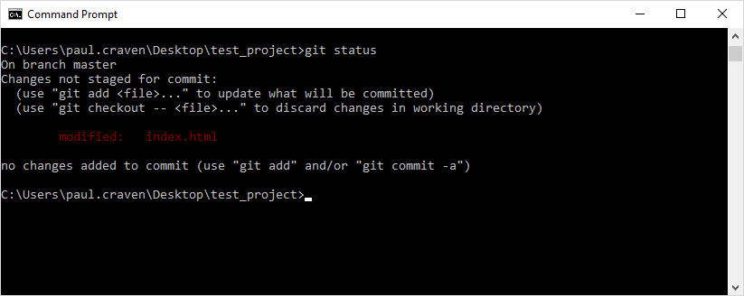

Make sure you understand what each of these commands do.

::

    git init
    git add
    git commit
    git log
    git status

These are other commands we'll cover in a bit

::

    git remote
    git branch
    git merge
    git checkout
    git push
    git fetch
    git pull
    git clone

Using GitHub To Sync Code
-------------------------

Right now, our repository only exists on our computer. We are going to
use the website "GitHub" as a central place to store our changes.

When you have new changes to share, you will "push" the changes to
GitHub. When you want to get changes other people have made, you'll
"pull" those changes.

Getting Started with GitHub
^^^^^^^^^^^^^^^^^^^^^^^^^^^

First, `create an account with GitHub`_.
It is a very popular web site for code
management. Particularly open-source software, where people
share code with each other.
In fact, if you are applying for jobs,
some companies will ask your GitHub account name
to see what kind of work you do.

Creating Your Project in GitHub
^^^^^^^^^^^^^^^^^^^^^^^^^^^^^^^

* One person in your team should create a project. Don't create a project for each
  person.
* Give your project a name. All lower case. Separate words with underscores.
  Do not use spaces. And don't *actually* call your project ``my_project_name``
  because that would be silly.
* Give a short one-sentence description of what your project is.
* Do NOT include a 'readme' in your project.
* The other options can be left as default.

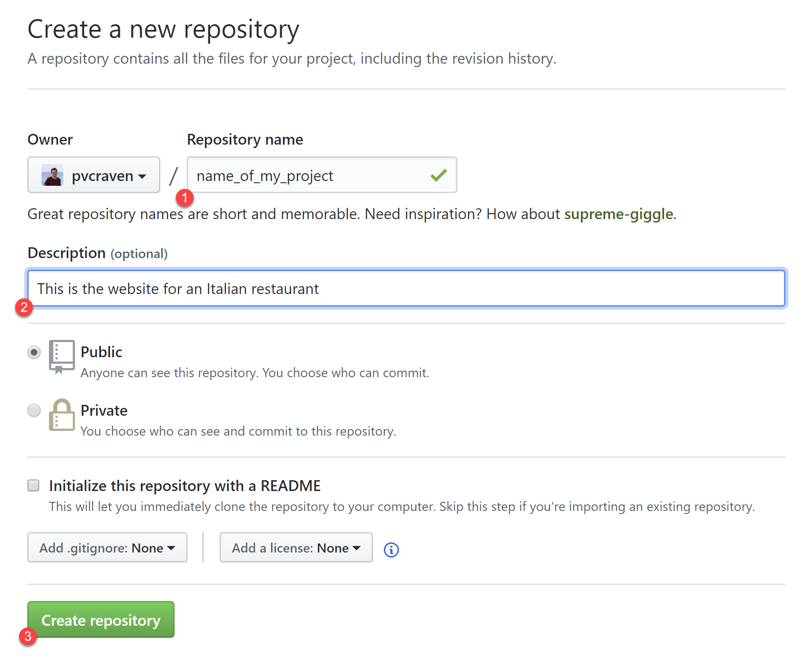

* After creating the project, invite the instructor (``pvcraven`` if it is
  Dr. Craven) and your team mates. Do this by clicking Settings...Collaborators.
  Then it will ask for your password. Then start entering usernames.

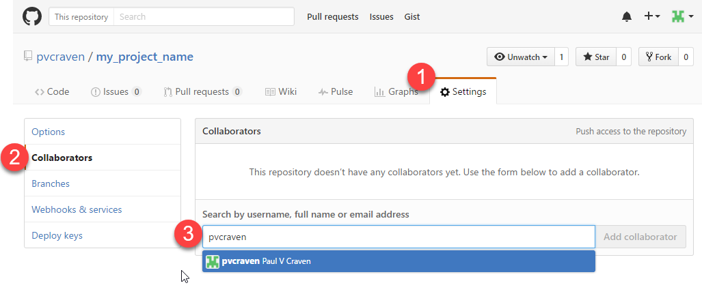

* Each user will receive an e-mail confirming he or she would like to be part
  of the project. Click the confirmation link sent.

Pushing Code To GitHub For The First Time
^^^^^^^^^^^^^^^^^^^^^^^^^^^^^^^^^^^^^^^^^

Now we need to tell the computer where the server is that we can push the
code. Thankfully Github makes this easy by giving us the exact commands
we need. Make sure you have "https" selected, then copy the two commands
into the command prompt, one-by-one:

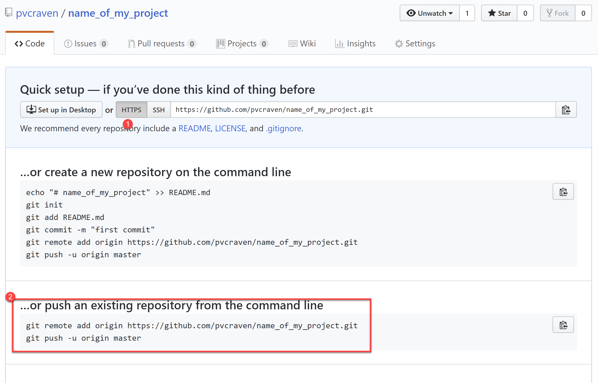

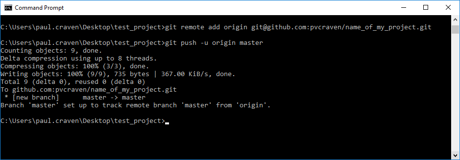

Cloning Your GitHub Project on Your Computer
^^^^^^^^^^^^^^^^^^^^^^^^^^^^^^^^^^^^^^^^^^^^

Ok, we have one person on your team that has a copy of the project, and
synced to GitHub. We want *everyone* on the team to have a copy.

We want to take the project we already have, and create a *clone* of it
on each other team member's computer.

First, go to Github, and click "code", and then "Clone or download". Then
copy the text in the field:

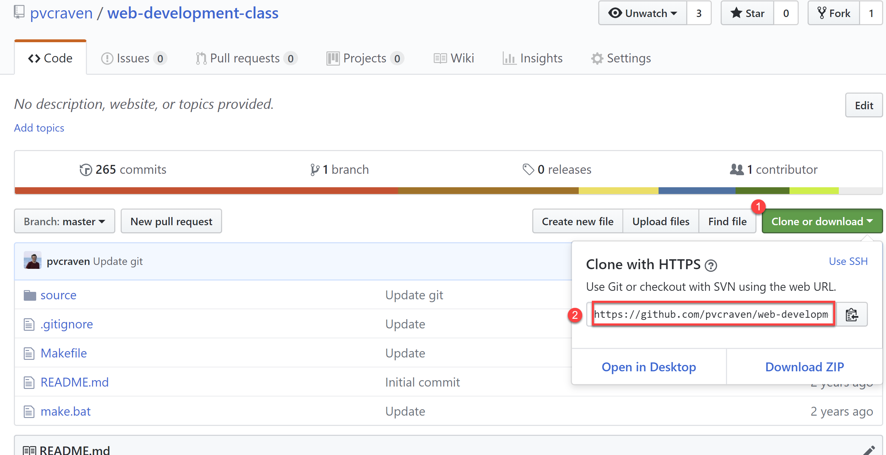

Next, open a command prompt. If you are on Windows,
I suggest switching to the desktop
and put your files there with a ``cd Desktop``.

Then, type ``git clone`` and paste the text you copied from the website
to clone:

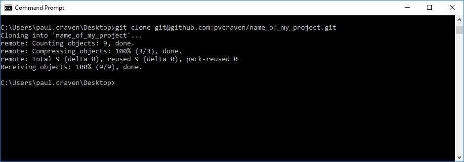

Great! Now you can open the website and make changes.

Adding and Committing
^^^^^^^^^^^^^^^^^^^^^

When you are done making changes, commit by typeing:

* ``git add *``
* ``git commit -m "My comment goes here."``

Review:

Pushing
^^^^^^^

To get your changes onto the server, type ``git push``:

Pulling
^^^^^^^

To pull changes, type ``git pull``:

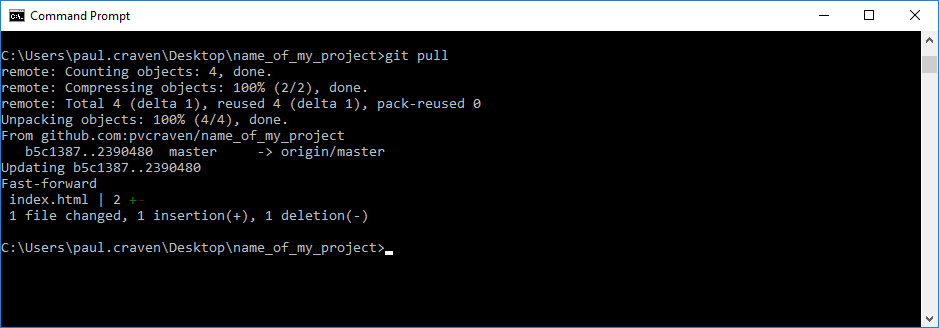

.. _cant-push:

What If You Can't Push?
^^^^^^^^^^^^^^^^^^^^^^^

What happens if you can't push to the server? If you get an error like what's below?
(See highlighted lines.)

.. code-block:: text
  :emphasize-lines: 4,5

    $ git push
    To bitbucket.org:pcraven/arcade-games-work2.git
     ! [rejected]        master -> master (fetch first)
    error: failed to push some refs to 'git@bitbucket.org:pcraven/arcade-games-work2.git'
    hint: Updates were rejected because the remote contains work that you do
    hint: not have locally. This is usually caused by another repository pushing
    hint: to the same ref. You may want to first integrate the remote changes
    hint: (e.g., 'git pull ...') before pushing again.
    hint: See the 'Note about fast-forwards' in 'git push --help' for details.

Step 1: Make Sure You Have No Pending Changes
^^^^^^^^^^^^^^^^^^^^^^^^^^^^^^^^^^^^^^^^^^^^^

Run a ``git status`` and make sure you have nothing to commit.
It should look like this:

.. code-block:: text

    craven@DESKTOP-RAUFKMA MINGW64 ~/arcade-games-work2 (master)
    $ git status
    On branch master
    Your branch is up-to-date with 'origin/master'.
    nothing to commit, working tree clean

If you do hove code to commit, jump up to :ref:`commit` and then come back here.

.. _pull-changes:

Step 2: Pull Changes From The Server
^^^^^^^^^^^^^^^^^^^^^^^^^^^^^^^^^^^^

Pull changes from the server:

.. code-block:: text

    $ git pull

Normally, this will work fine and you'll be done. But if you have other computers
that you are coding on, the computer will automatically try to merge.

.. _git_merging:

Step 2A: Merging
~~~~~~~~~~~~~~~~

If you get a screen like the image below, the computer automatically
merged your code bases. It now wants you to type in a comment for the
merge. We'll take the default comment.
Hold down the shift key and type ``ZZ``.
If that doesn't work, hit escape, and then try again.

(You are in an editor called **vim** and it is asking you for a comment about
merging the files. Unfortunately vim is really hard to learn. Shift-ZZ is the
command to save, and all we want to do is get out of it and move on.)

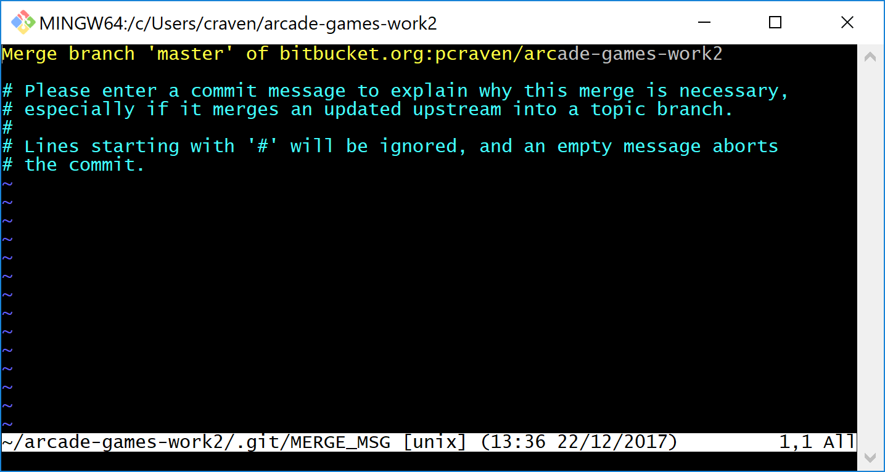

It should finish with something that looks like:

.. code-block:: text

    craven@DESKTOP-RAUFKMA MINGW64 ~/arcade-games-work2 (master)
    Merge made by the 'recursive' strategy.
     Lab 01 - First Program/lab_01.py | 3 ++-
     1 file changed, 2 insertions(+), 1 deletion(-)

If instead you get this:

.. code-block: text
   :emphasize-lines: 9

    $ git pull
    remote: Counting objects: 4, done.
    remote: Compressing objects: 100% (4/4), done.
    remote: Total 4 (delta 1), reused 0 (delta 0)
    Unpacking objects: 100% (4/4), done.
    From bitbucket.org:pcraven/arcade-games-work2
       aeb9cf3..6a8f398  master     -> origin/master
    Auto-merging Lab 01 - First Program/lab_01.py
    CONFLICT (content): Merge conflict in Lab 01 - First Program/lab_01.py
    Automatic merge failed; fix conflicts and then commit the result.

Then we edited the same file in the same spot. We have to tell
the computer if we want our changes, or the changes on the other
computer.

Step 2B: Resolving a Merge Conflict
~~~~~~~~~~~~~~~~~~~~~~~~~~~~~~~~~~~

Do a ``git status``. It should look something like this:

.. code-block:: text
    :emphasize-lines: 13

    $ git status
    On branch master
    Your branch and 'origin/master' have diverged,
    and have 1 and 1 different commits each, respectively.
      (use "git pull" to merge the remote branch into yours)
    You have unmerged paths.
      (fix conflicts and run "git commit")
      (use "git merge --abort" to abort the merge)

    Unmerged paths:
      (use "git add <file>..." to mark resolution)

            both modified:   Lab 01 - First Program/lab_01.py

    no changes added to commit (use "git add" and/or "git commit -a")

The key thing to look for is any file that says ``both modified``.

If you want **your** copy, type:

.. code-block:: text

    $ git checkout --ours "Lab 01 - First Program/lab_01.py"

If instead you want **their** copy (or the copy on the other computer)
type

.. code-block:: text

    $ git checkout --theirs "Lab 01 - First Program/lab_01.py"

Then when you are all done with all merges, type:

.. code-block:: text

    craven@DESKTOP-RAUFKMA MINGW64 ~/arcade-games-work2 (master|MERGING)
    $ git add *

    craven@DESKTOP-RAUFKMA MINGW64 ~/arcade-games-work2 (master|MERGING)
    $ git commit -m"Merged"
    [master e083f36] Merged

    craven@DESKTOP-RAUFKMA MINGW64 ~/arcade-games-work2 (master)
    $ git push
    Counting objects: 5, done.
    Delta compression using up to 8 threads.
    Compressing objects: 100% (5/5), done.
    Writing objects: 100% (5/5), 531 bytes | 0 bytes/s, done.
    Total 5 (delta 2), reused 0 (delta 0)
    To bitbucket.org:pcraven/arcade-games-work2.git
       6a8f398..e083f36  master -> master

Step 3: Try Pushing Again
^^^^^^^^^^^^^^^^^^^^^^^^^

.. code-block:: text

    $ git push
    Counting objects: 6, done.
    Delta compression using up to 8 threads.
    Compressing objects: 100% (4/4), done.
    Writing objects: 100% (6/6), 604 bytes | 0 bytes/s, done.
    Total 6 (delta 2), reused 0 (delta 0)
    To bitbucket.org:pcraven/arcade-games-work2.git
       d66b008..aeb9cf3  master -> master

Longer Git Command Reference
----------------------------

In my experience with 300 level group-project classes, these commands seem to
capture most of what students need to do.

+------------------------------------------------+-------------------------------------------------------------------------------------------------------------------------+
| Command                                        | Description                                                                                                             |
+================================================+=========================================================================================================================+
| ``git status``                                 | See what has changed                                                                                                    |
+------------------------------------------------+-------------------------------------------------------------------------------------------------------------------------+
| ``git fetch``                                  | Grab stuff from the server, but don't merge                                                                             |
+------------------------------------------------+-------------------------------------------------------------------------------------------------------------------------+
| ``git merge --no-commit --no-ff test_branch``  | Merge                                                                                                                   |
+------------------------------------------------+-------------------------------------------------------------------------------------------------------------------------+
| ``git merge --abort``                          | Abort a merge                                                                                                           |
+------------------------------------------------+-------------------------------------------------------------------------------------------------------------------------+
| ``git pull``                                   | Fetch and Merge                                                                                                         |
+------------------------------------------------+-------------------------------------------------------------------------------------------------------------------------+
| ``git add myfile.txt``                         | Add myfile.txt to be committed                                                                                          |
+------------------------------------------------+-------------------------------------------------------------------------------------------------------------------------+
| ``git add .``                                  | Add everything                                                                                                          |
+------------------------------------------------+-------------------------------------------------------------------------------------------------------------------------+
| ``grep -r "<< HEAD" *``                        | Search all files to see if there is merge error text. Do this before committing                                         |
+------------------------------------------------+-------------------------------------------------------------------------------------------------------------------------+
| ``git checkout --ours "myfile.txt"``           | Toss your changes in a merge, use theirs. Add your change when done.                                                    |
+------------------------------------------------+-------------------------------------------------------------------------------------------------------------------------+
| ``git checkout --theirs "myfile.txt"``         | Toss their changes, use yours.  Add your change when done.                                                              |
+------------------------------------------------+-------------------------------------------------------------------------------------------------------------------------+
| ``git checkout -- .``                          | Remove all your changes, go back to what was last committed. Untracked files are kept.                                  |
+------------------------------------------------+-------------------------------------------------------------------------------------------------------------------------+
| ``git -f clean``                               | Remove untracked files                                                                                                  |
+------------------------------------------------+-------------------------------------------------------------------------------------------------------------------------+
| ``git checkout 44fd``                          | Find the hash of a check-in, and you can go back to that check in. (Don't use 44fd, but replace with the has you want.) |
+------------------------------------------------+-------------------------------------------------------------------------------------------------------------------------+
| ``git checkout master``                        | Go back to most recent check in on the master branch.                                                                   |
+------------------------------------------------+-------------------------------------------------------------------------------------------------------------------------+
| ``git commit -m "My message"``                 | Commit your work. Use a descriptive message or the other people in the class will be irritated with you.                |
+------------------------------------------------+-------------------------------------------------------------------------------------------------------------------------+
| ``git push``                                   | Push commit up to the server.                                                                                           |
+------------------------------------------------+-------------------------------------------------------------------------------------------------------------------------+

.. _create an account with Atlassian: https://id.atlassian.com/signup?application=mac&continue=https%3A%2F%2Fmy.atlassian.com%2Fproducts%2Findex

.. _create an account with GitHub: https://github.com/

