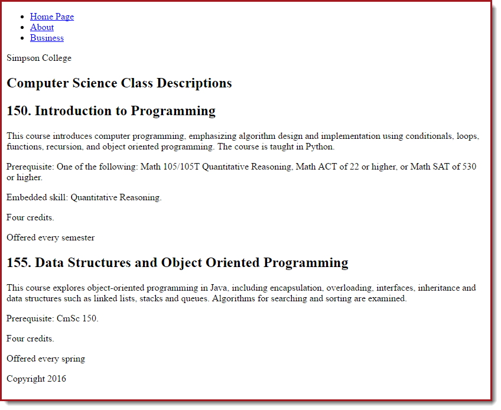
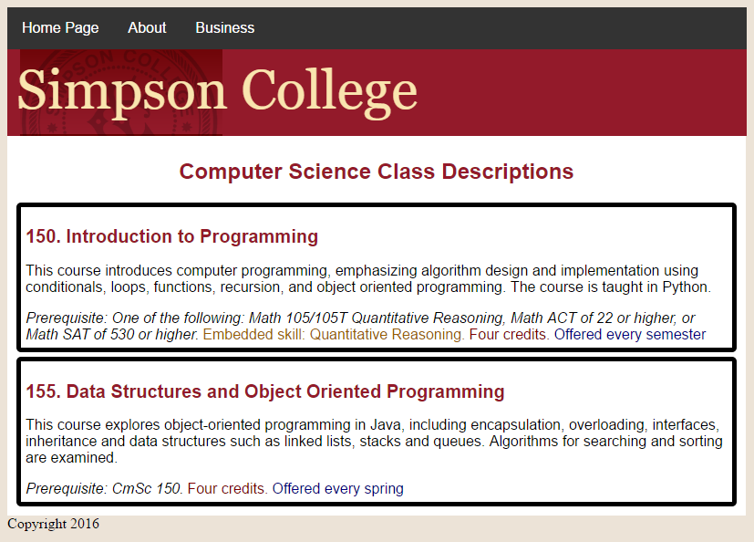

.. _css_tutorial:

CSS Example
------------

Assuming you've already read about :ref:`cascading_style_sheets_about`, this is an
example that shows how use CSS to style a document.

Starting  HTML
^^^^^^^^^^^^^^

Let's start with a basic HTML document that has no CSS and no style information.
We'll include a line to an :ref:`external-css` that we will eventually fill in with
style information. Note that the filename we specified is ``css-test.css``. You might
want a different file name for your project.

.. literalinclude:: css_test.html
    :linenos:
    :language: html
    :emphasize-lines: 9

If you open this document in a web browser, before we add the CSS,  it looks like this:

.. _example-css:

Example CSS
^^^^^^^^^^^

First, let's just make sure our external style sheet is working. Create a new file called ``css_test.css`` in  the
same directory as the HTML document. We'll select the ``<body>`` tag and make the background color red. That should
make it very obvious if it works or not.

.. code-block:: css

   body {
       background-color: red;
   }

If it doesn't work, make sure the ``<link>`` tag in your html is correct, the file name matches, and they are in
the same directory. Ask the instructor for help if needed.

A red background looks terrible, so let's just update it to an off-white color:

.. code-block:: css

   body {
       background-color: #ece3d7;
   }

We can change fonts as well. This changes the font of every paragraph.
See `W3Schools section on specifying fonts <https://www.w3schools.com/css/css_font.asp>`_.

.. code-block:: css

    p {
        font-family: arial, sans-serif;
    }

A bit more work and we can specify font size, color, and alignment of our ``<h1>`` headings:

.. code-block:: css

    h1 {
      font-size: 24px;
      font-family: arial,sans-serif;
      color: rgb(147, 26, 42);
      text-align: center;
    }

Here's a longer example your instructor will step through. Don't forget you can use
`W3Schools CSS Reference <https://www.w3schools.com/css/>`_ to look up additional info on any of these attributes.

.. literalinclude:: css_test.css
    :linenos:
    :language: css

Here's the result:

We will go through this example in class.
Outside of class, go through this tutorial:

http://www.w3schools.com/css/default.asp

Don't check in any updates to your website with CSS, we'll do that later.
