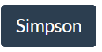

.. _bootstrap-tutorial:

Bootstrap Tutorial
------------------

`Bootstrap`_ is a CSS and JavaScript library that can help you build a great
looking website without having to create your styles from scratch.

There are many libraries like Bootstrap available. We can't cover them all. But
we can use Bootstrap to give you the idea of what these libraries can do.

Let's get started with a simple web document.

.. literalinclude:: example_00.html
    :linenos:
    :language: html

Bootstrap Setup
^^^^^^^^^^^^^^^

To enable Bootstrap functionality in our page, we have a few steps:

#. Tell the browser that we are "responsive" to changing size browsers, phones, tablets, etc.
#. Import the Bootstrap CSS.
#. (Optional) Select a theme.
#. Load "JavaScript" so functional things like pull-down menus work.

For the first three, we need to modify our HTML head to include these tags:

.. code-block:: html
  :linenos:

  <head>
    <meta charset="utf-8">
    <title>Example Bootstrap Document</title>

    <!-- This says our CSS is compatible with phones, and phones
         don't need to scale it strangely. -->
    <meta name="viewport" content="width=device-width, initial-scale=1">

    <!-- Bootstrap CSS -->
    <link href="https://cdn.jsdelivr.net/npm/bootstrap@5.1.1/dist/css/bootstrap.min.css"
          rel="stylesheet"
          integrity="sha384-F3w7mX95PdgyTmZZMECAngseQB83DfGTowi0iMjiWaeVhAn4FJkqJByhZMI3AhiU"
          crossorigin="anonymous">

    <!-- Optional theme add-on -->
    <link rel="stylesheet"
          href="https://cdn.jsdelivr.net/npm/bootswatch@4.5.2/dist/darkly/bootstrap.min.css" integrity="sha384-nNK9n28pDUDDgIiIqZ/MiyO3F4/9vsMtReZK39klb/MtkZI3/LtjSjlmyVPS3KdN"
          crossorigin="anonymous">

    <!-- If you don't like how sandstone looks, go here and see other themes
         that are available:
         https://bootswatch.com/

         You can replace the 'optional theme' with links from the page below
         to get that theme:
         https://www.bootstrapcdn.com/bootswatch/
    -->
    <link rel="stylesheet"
          href="https://cdn.jsdelivr.net/npm/bootswatch@4.5.2/dist/flatly/bootstrap.min.css" integrity="sha384-qF/QmIAj5ZaYFAeQcrQ6bfVMAh4zZlrGwTPY7T/M+iTTLJqJBJjwwnsE5Y0mV7QK"
          crossorigin="anonymous">
  </head>

For the last one, we need to add the following line just before the close of the body tag:

.. code-block:: html

    

Where did I get this info? Bootstrap has great docs, and this is from the
`getting started guide <https://getbootstrap.com/docs/5.1/getting-started/introduction/>`_.

At this point, you might notice some slight changes to your document. Mainly font changes.

You should also get introduced to the idea of using a CDN, what the "integrity" and "crossorigin" mean.
Your instructor will explain.

Bootstrap Menu
^^^^^^^^^^^^^^

The Bootstrap website is great. For our purposes, here's an example document to
get started with.

Our first page will have a simple menu, and some text:

Bootstrap is great at being *responsive*. It will scale and easily work on
large wide-screen monitors, and small iPhone 4's.

We can see that if we narrow our screen, the menu goes away and is replaced by
a "hamburger" style pull-down menu.

.. image:: example_01_narrow.png
    :width: 260px
    :alt: First Web Page

For more info about the navbar, see:
https://getbootstrap.com/docs/5.1/components/navbar/

Here is the code behind that menu bar:

.. code-block:: html
    :linenos:

    <header>
      <nav class="navbar navbar-expand-sm navbar-light bg-light">
        

          <!-- Brand/site name -->
          <a class="navbar-brand" href="#">Simpson College</a>
          <!-- Hamburger icon -->
          <button class="navbar-toggler"
                  type="button"
                  data-bs-toggle="collapse"
                  data-bs-target="#navbarSupportedContent"
                  aria-controls="navbarSupportedContent"
                  aria-expanded="false"
                  aria-label="Toggle navigation">
            
          </button>
          <!-- Div to hide stuff if we have hamburger -->
          

            <!-- Nav bar item list -->
            <ul class="navbar-nav me-auto mb-2 mb-sm-0">
              <li class="nav-item">
                <!-- This is the style for the 'active' page -->
                <a class="nav-link active" aria-current="page" href="#">Home</a>
              </li>

              <li class="nav-item">
                <a class="nav-link" href="about.html">About</a>
              </li>

              <li class="nav-item">
                <a class="nav-link" href="location.html">Location</a>
              </li>
            </ul>
          

        

      </nav>
    </header>

The Container
^^^^^^^^^^^^^

Your content will run all the way to the edge of the screen. It will extend too wide
on large monitors. It will look awful.

To get around this, put all the content in a ``
`` with the class "container":

.. code-block:: html

   

     Most of your content below the header goes here.
   

Now it will look better:

Buttons
^^^^^^^

Buttons are great!

You can create buttons with Bootstrap:

.. code-block:: html

   <button type="button" class="btn btn-primary">Click me!</button>

Buttons are used in forms. But you aren't limited to using these as button tags! They
can be links:

.. code-block:: html

   <a type="button" class="btn btn-primary" href="https://simpson.edu">Simpson</a>

There are many styles of buttons. See: https://getbootstrap.com/docs/4.0/components/buttons/

Tables
^^^^^^

Say you have a boring table you want to make look better:

.. image:: table

Simply adding the ``table`` class to the table tab will make it look better:

.. code-block:: html

   <table class="table">

There's a lot more you can do to style tables and make them look great:
https://getbootstrap.com/docs/5.0/content/tables/

Bootstrap Alert
^^^^^^^^^^^^^^^

Want to grab someone's attention? Use a
`Bootstrap Alert <https://getbootstrap.com/docs/5.0/components/alerts/>`_.

Check the linked docs for different styles.

.. code-block:: html

   

     Use an alert!
   

Cards
^^^^^

You can create cool looking cards with images and text below.

.. code-block:: html

  

    
    

      <h5 class="card-title">Card title</h5>
      
Some quick example text to build on the card title and make up the bulk of the card's content.

    

  

For more info, see:

https://getbootstrap.com/docs/5.1/components/card/

.. _bootstrap-template:

Full Bootstrap Example
^^^^^^^^^^^^^^^^^^^^^^

This is a full example with working code from above.

.. literalinclude:: example_01.html
    :linenos:
    :language: html

.. _Bootstrap: http://getbootstrap.com/
