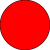
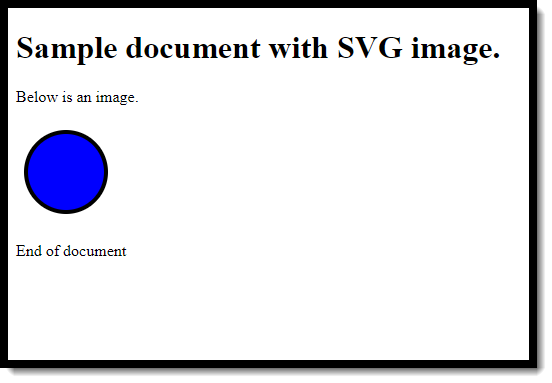

.. _svg-intro:

Scalable Vector Graphics Introduction
=====================================

Scalable Vector Graphics save graphics differently than image formats like ``.jpg`` or ``.gif``.
The SVG format is not good for photos, but it is great for graphic art.
SVG stores graphics not by individual dots, but by the commands used to create
the image. This allows us to recreate the image with any resolution.

For a more complete reference on SVG than these examples, see:

* `W3Schools SVG Tutorial <https://www.w3schools.com/graphics/svg_intro.asp>`_

Advanced users might want to check out:

* `SVG Pocket Guide <http://svgpocketguide.com/book/#section-2>`_
* `SVG On The Web <https://svgontheweb.com/>`_

SVG images can be stored in their own file, or they can be "embedded" in the HTML file.
An SVG file can be generated by programs like
Adobe Illustrator or Inkscape. The files are just text files that look like:

.. literalinclude:: my_svg_drawing.svg
    :linenos:
    :caption: my_svg_drawing.svg
    :language: html

(Although, if you create a file with Illustrator it will look much more complex.)

You can include the SVG file as an image in your HTML:
````



There's really nothing different about including them as a PNG, JPG, or GIF.

One thing to keep in mind when working with SVG images, the (0, 0) coordinate
is in the upper left. As y gets bigger, the coordinates go down. This is opposite
to what you learned in math.

Embedding SVG in HTML
---------------------

You can also embed svg straight into an HTML document, like this:

.. literalinclude:: embedded_svg.html
    :linenos:
    :caption: embedded_svg.svg
    :language: html

Which will look like:



Save the document and try it out. Also play around with the numbers to see
what they do.

Go back and forth between the stand alone SVG file, and the embedded HTML
SVG to see the differences. Typically, I'd recommend using a stand-alone
SVG file instead of embedding the SVG into HTML.

Creating Circles
----------------

Here is an example of drawing multiple circles.

Notice:

* The document is not wide enough and cuts off the right-most circle
* A fill of "None" just fives the outline
* No ``stroke`` or ``stroke-width`` removes the outline around the shape

.. code-block:: html

    <svg width="170" height="100">
      <circle cx="50" cy="50" r="40" stroke="black" stroke-width="4" fill="blue" />
      <circle cx="150" cy="50" r="40" fill="green" />
      <circle cx="100" cy="50" r="40" stroke="black" stroke-width="4" fill="None" />
    </svg>

.. raw:: html

    <svg width="170" height="100">
      <circle cx="50" cy="50" r="40" stroke="black" stroke-width="4" fill="blue" />
      <circle cx="150" cy="50" r="40" fill="green" />
      <circle cx="100" cy="50" r="40" stroke="black" stroke-width="4" fill="None" />
    </svg>

Another way to specify shape properties is with the by using the ``style`` parameter.
The code below produces the same exact thing we had before. Note the format is just
like CSS styles.

.. code-block:: html

    <svg width="170" height="100">
      <circle cx="50" cy="50" r="40" style="stroke:black;stroke-width:4;fill:blue" />
      <circle cx="150" cy="50" r="40" style="fill:green" />
      <circle cx="100" cy="50" r="40" style="stroke:black;stroke-width:4;fill:None" />
    </svg>

.. raw:: html

    <svg width="170" height="100">
      <circle cx="50" cy="50" r="40" style="stroke:black;stroke-width:4;fill:blue" />
      <circle cx="150" cy="50" r="40" style="fill:green" />
      <circle cx="100" cy="50" r="40" style="stroke:black;stroke-width:4;fill:None" />
    </svg>

Rectangles
----------

You specify rectangles by the upper left corner (not the center) and a width and
height.

Note that the second rectangle has ``opacity:0.5`` which makes it semi-transparent.

.. code-block:: html

    <svg width="400" height="180">
      <rect x="10" y="10"
            width="300" height="100"
            style="fill:rgb(0,0,255);stroke-width:3;stroke:rgb(0,0,0)" />
      <rect x="50" y="20" rx="20" ry="20"
            width="150" height="150"
            style="fill:red;stroke:black;stroke-width:5;opacity:0.5" />
    </svg>

.. raw:: html

    <svg width="400" height="180">
      <rect x="10" y="10" width="300" height="100" style="fill:rgb(0,0,255);stroke-width:3;stroke:rgb(0,0,0)" />
      <rect x="50" y="20" rx="20" ry="20" width="150" height="150" style="fill:red;stroke:black;stroke-width:5;opacity:0.5" />
    </svg>

Ellipses
--------

You can also make an ellipse by specifying a center point, and a radius in
both the x and y direction.

.. code-block:: html

    <svg width="230" height="200">
      <ellipse cx="120" cy="70" rx="100" ry="50" style="fill:yellow;stroke:black;stroke-width:5" />
      <ellipse cx="90" cy="50" rx="7" ry="15" style="fill:None;stroke:black;stroke-width:2" />
      <ellipse cx="150" cy="50" rx="7" ry="15" style="fill:None;stroke:black;stroke-width:2" />
    </svg>

.. raw:: html

    <svg width="230" height="200">
      <ellipse cx="120" cy="70" rx="100" ry="50" style="fill:yellow;stroke:black;stroke-width:5" />
      <ellipse cx="90" cy="50" rx="7" ry="15" style="fill:None;stroke:black;stroke-width:2" />
      <ellipse cx="150" cy="50" rx="7" ry="15" style="fill:None;stroke:black;stroke-width:2" />
    </svg>

Lines
-----

Lines are pretty straight forward:

.. code-block:: html

    <svg height="150" width="150">
      <line x1="50" y1="0" x2="50" y2="150" style="stroke:rgb(255,0,0);stroke-width:2" />
      <line x1="100" y1="0" x2="100" y2="150" style="stroke:rgb(641,64,244);stroke-width:2" />
      <line x1="0" y1="50" x2="150" y2="50" style="stroke:rgb(0,255,0);stroke-width:2" />
      <line x1="0" y1="100" x2="150" y2="100" style="stroke:rgb(0,0,255);stroke-width:2" />
    </svg>

.. raw:: html

    <svg height="150" width="150">
      <line x1="50" y1="0" x2="50" y2="150" style="stroke:rgb(255,0,0);stroke-width:2" />
      <line x1="100" y1="0" x2="100" y2="150" style="stroke:rgb(641,64,244);stroke-width:2" />
      <line x1="0" y1="50" x2="150" y2="50" style="stroke:rgb(0,255,0);stroke-width:2" />
      <line x1="0" y1="100" x2="150" y2="100" style="stroke:rgb(0,0,255);stroke-width:2" />
    </svg>


Polygons
--------

Polygons are easy to get the idea of, but difficult to figure out all the points
that you want.

.. code-block:: html

    <svg height="110" width="500">
      <polygon points="20,20 40,40 20,60 80,60 60,40 80,20" style="fill:gray;stroke:black;stroke-width:2" />
    </svg>

.. raw:: html

    <svg height="110" width="500">
      <polygon points="20,20 40,40 20,60 80,60 60,40 80,20" style="fill:gray;stroke:black;stroke-width:2" />
    </svg>

Text
----

Text isn't too hard. But if you want to apply some style to it, you need to define
the stype at the start of your SVG image. Below, see how I used a CSS style
declaration to select the Simpson font. Then I made both a line and drew the
text.

.. code-block:: html

    <svg height="70" width="350">
      <style>
        .my_style { font: bold 30px "Century Schoolbook", Serif; }
      </style>
      <line x1="0" y1="37" x2="260" y2="37" style="stroke:#f7af00;stroke-width:4" />
      <text x="0" y="35" fill="#9f0129" class="my_style">Simpson College</text>
    </svg>

.. raw:: html

    <svg height="70" width="350">
      <style>
        .my_style { font: bold 30px "Century Schoolbook", Serif; }
      </style>
      <line x1="0" y1="37" x2="260" y2="37" style="stroke:#f7af00;stroke-width:4" />
      <text x="0" y="35" fill="#9f0129" class="my_style">Simpson College</text>
    </svg>

Using Styles on Shapes
----------------------

The cool thing is that I can use styles like that not just for text, but for shapes.
Have a bunch of lines that are all the same style? Define a style and then you don't need
to repeat the information over and over again!

.. code-block:: html

    <svg height="150" width="150">
      <style>
         .my-line { stroke:rgb(255,0,0); stroke-width:2}
      </style>
      <line x1="50" y1="0" x2="50" y2="150" class="my-line" />
      <line x1="100" y1="0" x2="100" y2="150" class="my-line" />
      <line x1="0" y1="50" x2="150" y2="50" class="my-line" />
      <line x1="0" y1="100" x2="150" y2="100" class="my-line" />
    </svg>

.. raw:: html

    <svg height="150" width="150">
      <style>
         .my-line { stroke:rgb(255,0,0); stroke-width:2}
      </style>
      <line x1="50" y1="0" x2="50" y2="150" class="my-line" />
      <line x1="100" y1="0" x2="100" y2="150" class="my-line" />
      <line x1="0" y1="50" x2="150" y2="50" class="my-line" />
      <line x1="0" y1="100" x2="150" y2="100" class="my-line" />
    </svg>

Transforms and Groups
---------------------

Putting a ``<g>`` tag around your shape allows us to great a **group**.
We can then take that group use a **transform** on it. This is a bit
complex. Here, I'm rotating 10 degrees. But the next two numbers are the center-point
of that rotation. If my box has an upper left of 80, 80,  and dimensions of 100, 50
then we need to calculate the center point:

* 80 + (100 / 2) = 130
* 80 + (50 / 2) = 105

.. code-block:: html

    <svg width="200" height="200">
      <rect x="80" y="80" width="100" height="50" style="fill:rgb(0,0,255);stroke-width:3;stroke:rgb(0,0,0)" />

      <g transform="rotate(10 130 105)">
        <rect x="80" y="80" width="100" height="50" style="fill:rgb(0,0,255);stroke-width:3;stroke:rgb(0,0,0)" />
      </g>
    </svg>

.. raw:: html

    <svg width="200" height="200">
      <rect x="80" y="80" width="100" height="50" style="fill:rgb(0,0,255);stroke-width:3;stroke:rgb(0,0,0)" />

      <g transform="rotate(10 130 105)">
        <rect x="80" y="80" width="100" height="50" style="fill:rgb(0,0,255);stroke-width:3;stroke:rgb(0,0,0)" />
      </g>
    </svg>

There's a lot more you can do with groups. If you are an advanced user and want to read more, look here:

https://frontendbabel.info/articles/svg-grouping-and-reusing-elements/

Gradients
---------

.. code-block:: html

    <svg height="150" width="400">
      <defs>
        <linearGradient id="grad2" x1="0%" y1="0%" x2="0%" y2="100%">
          <stop offset="0%" style="stop-color:rgb(255,0,0);stop-opacity:1" />
          <stop offset="100%" style="stop-color:rgb(255,255,0);stop-opacity:1" />
        </linearGradient>
      </defs>
      <ellipse cx="200" cy="70" rx="85" ry="55" fill="url(#grad2)" />
    </svg>

.. raw:: html

    <svg height="150" width="400">
      <defs>
        <linearGradient id="grad2" x1="0%" y1="0%" x2="0%" y2="100%">
          <stop offset="0%" style="stop-color:rgb(255,0,0);stop-opacity:1" />
          <stop offset="100%" style="stop-color:rgb(255,255,0);stop-opacity:1" />
        </linearGradient>
      </defs>
      <ellipse cx="200" cy="70" rx="85" ry="55" fill="url(#grad2)" />
    </svg>

Conclusion
----------

This should get you started. Don't forget to visit
`W3Schools SVG Tutorial <https://www.w3schools.com/graphics/svg_intro.asp>`_.
