.. _web_server_setup:

XAMPP Web Server Setup
----------------------

Installing XAMPP
^^^^^^^^^^^^^^^^

We are going to use a software program called "XAMPP". XAMPP is a bundle of free software that contains
the Apache Web Server, and some other applications. The name comes from:

* X - Cross platform (Works on Windows, Mac and Linux)
* A - Apache (Web server)
* M - MariaDB (Database, they used to use MySQL)
* P - PHP (Back-end server language)
* P - Perl (Back-end server language)

Download XAMPP from here:

https://www.apachefriends.org/index.html

It can take a while to download. I often got downloads that failed silently,
leaving me with a program that didn't run. You should download about 110 Megabytes.

Run the installer. You might get the screen below. If so hit "More info."

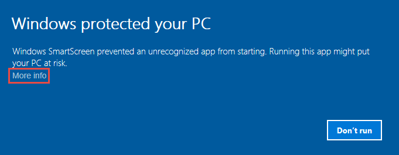

Once you click that, you can run it anyway.

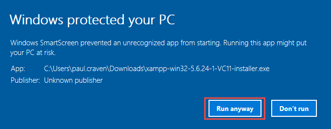

Next, you may get the following warning:

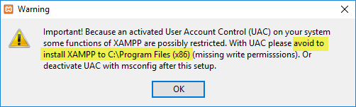

By default, XAMPP will not try to install in the "Program Files" directory. Don't
force it to, or else you'll end up with all kinds of problems that are hard to
debug.

Next, the default list of software is OK. Just hit "Next >"

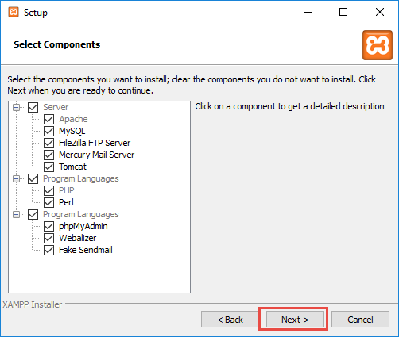

Keep the default directory. If you want to change it, don't put in in
"Program Files" or "Program Files (x86)"

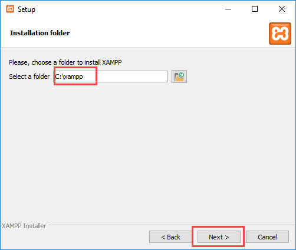

We don't need to learn more about Bitnami right now. Uncheck and hit "Next >"

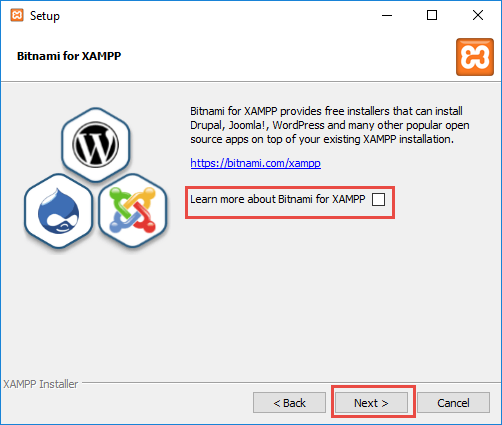

When you start XAMPP, you'll get a control panel like this. Hit "Config"

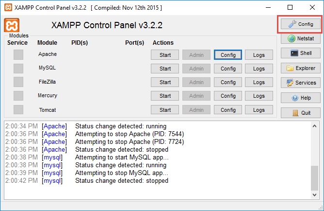

Select your favorite text editor. In the image below,
I've selected Sublime. Then have Apache and
MySQL auto-start. This will save you clicks later. Then click "Save".

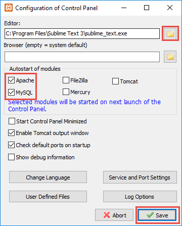

Next, we need to tell Apache what directory all our web files are saved in.
Back at the control panel, hit the "Config" button for Apache.

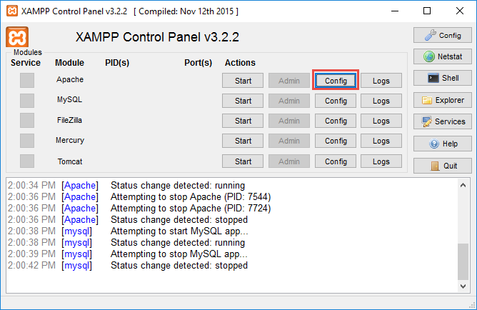

There are two spots where you need to change the directory. Find where you
save your web projects, and paste that folder path into httpd.conf.

**Note:** You are changing this for everyone on the computer. If you keep
the same computer, you can save yourself having to reset this path.

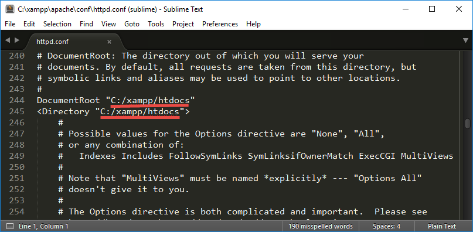

Go ahead and start Apache and MySQL:

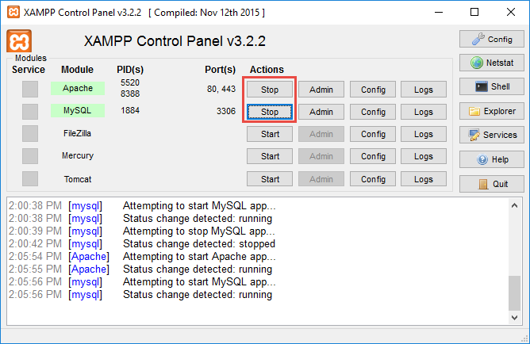

Excellent! We have a web server going.

Quick Primer on Web Addresses
^^^^^^^^^^^^^^^^^^^^^^^^^^^^^

Computers on the Internet have unique "IP addresses" that identify who they are.
The addresses are in the form of four numbers, each from 0 to 255. For example,
simpson.edu is "198.206.243.15".

But no reasonable person can remember that. So we have "domain names." There
is a "Domain Name Service" that maps names like simpson.edu to an IP address.

(There is a lot more to this, we'll cover it soon.)

But we don't have a domain name, and I don't know what my address is. How can
I quickly go to my web server?

There is a special domain name called "localhost". It is the English equivalent
to the pronoun "me" or "I".

In your web browser, type "localhost", and you should be able to browse through your web
projects:

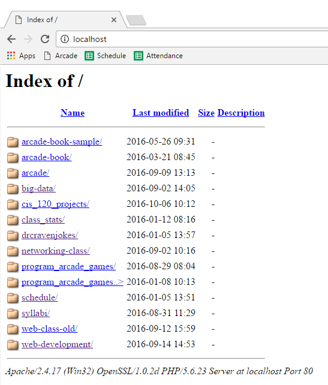

On a "production" setup, you would not lead people to this page with all
your projects. You would instead direct users straight to the web site.

With some more work setting up servers, you can have one server manage
multiple web sites. Such as I have a web server that manages both
"http://programarcadegames.com" and "http://stats.support". Same web server,
but it just pulls files from different directories depending on what site the
user asks for.

What if you want the person next to you to see your web pages? You can do that.
First we need to find the "IP address" of your computer.

Do the following:

* Type Window-R (Hit the Window key on the keyboard like a shift, and then hit
  "R" for "Run".)
* Type in ``cmd`` which is the short name of the "Command Prompt" program.
* At the command prompt, type ``ipconfig``

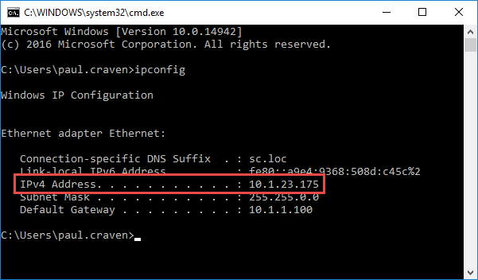

There's your web address. Now have another person type in the web address on
their browser bar, and they should see your web server.

Outside of your local network, you probably can't have anyone see your new
web server. This is because of a thing called "Network Address Translation"
and also company or school firewalls.
