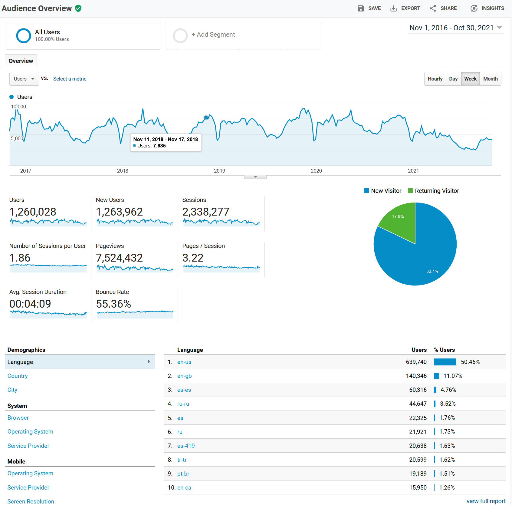
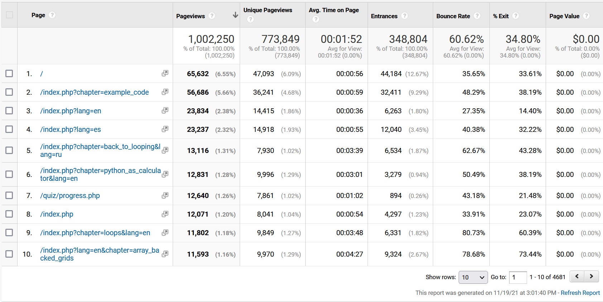
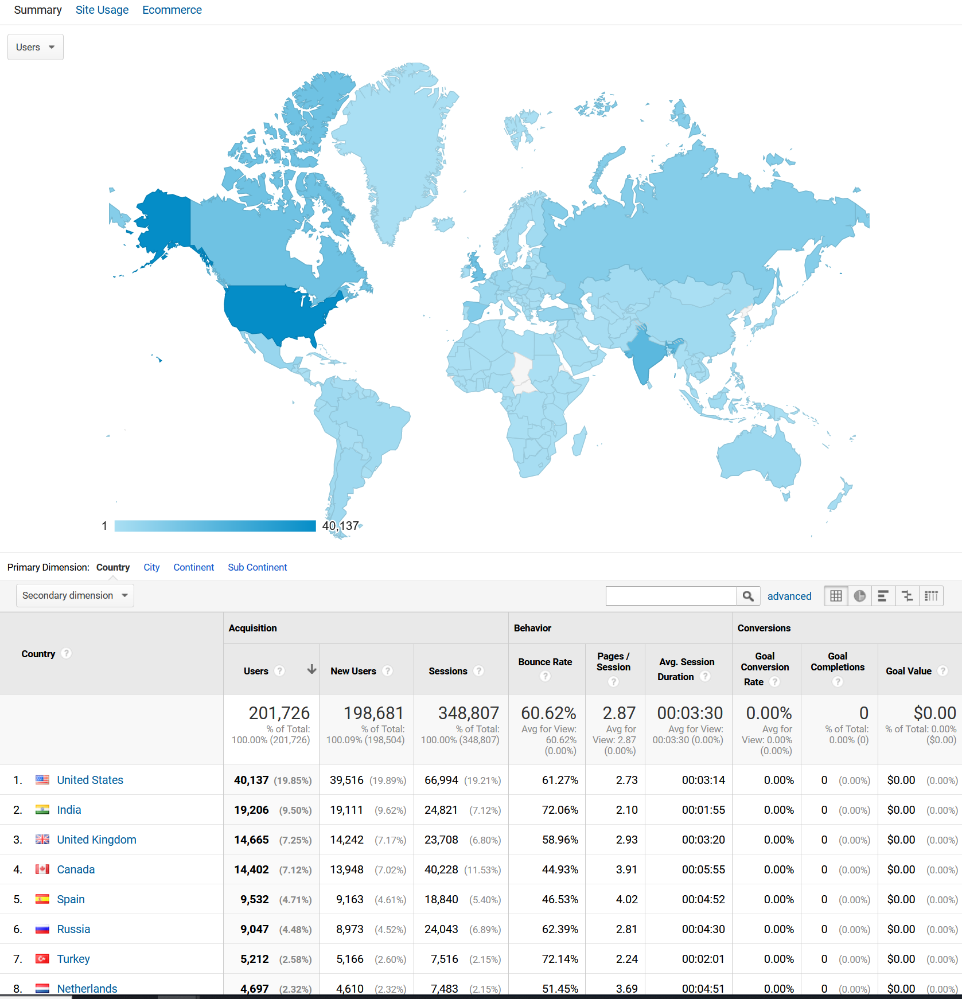
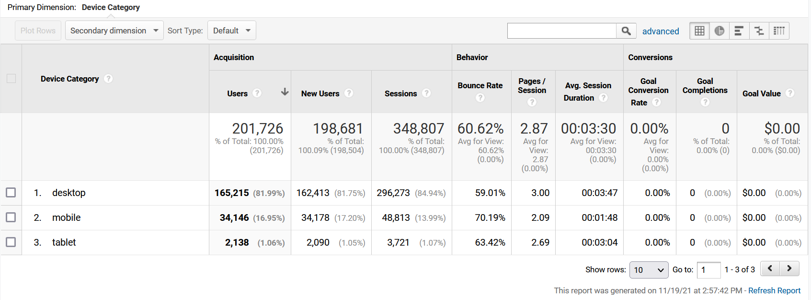
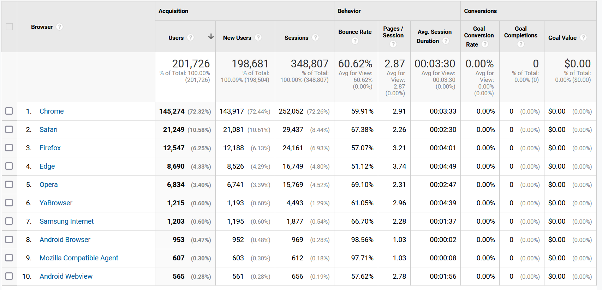
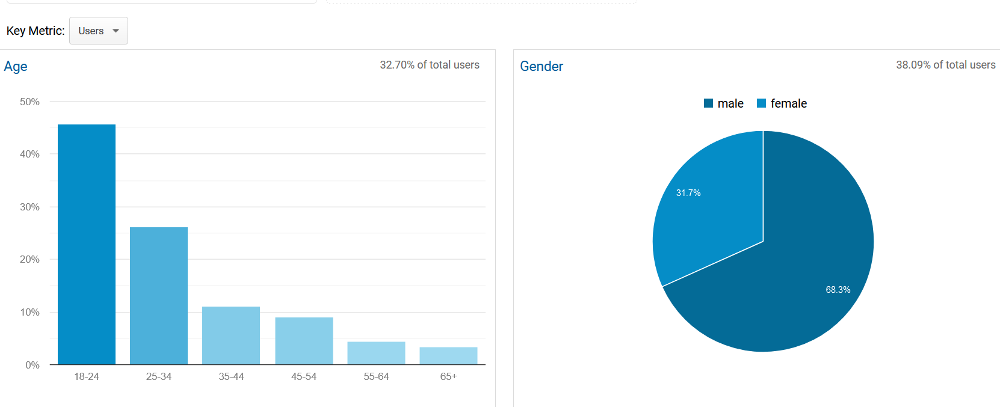
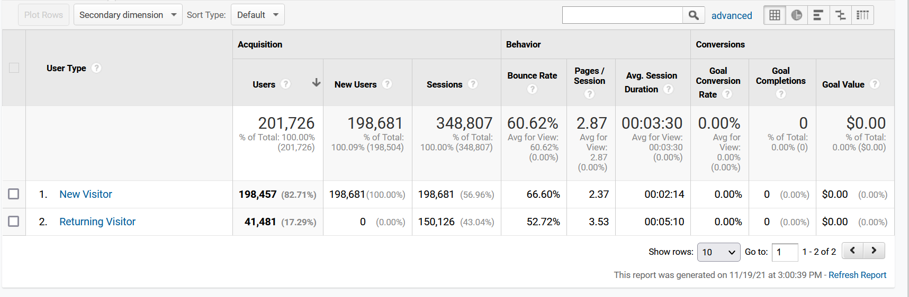
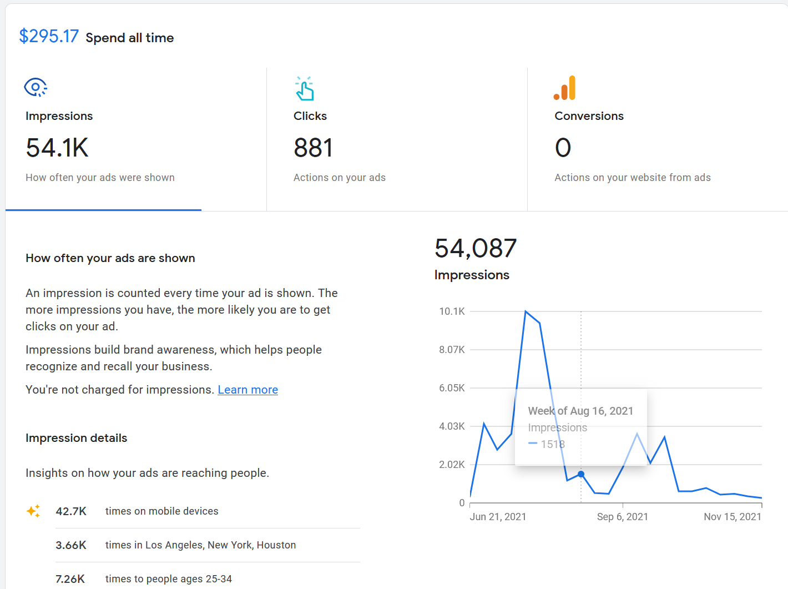

Google Analytics
================

Google makes a "free" service to help you analyze traffic on your site.
If you include code that downloads a Google tracker on all your websites,
they'll give you stats on who comes to your website.

First, sign up for Google Analytics:

https://analytics.google.com/analytics/web

Next, you ad a tracker like this to every HTML page you have.
It goes just before the close ``</body>`` tag.

.. code-block:: html

    <!-- Global site tag (gtag.js) - Google Analytics -->
    
    

Because you load this script every time you pull a page on your website,
Google can keep and track analytics. You get this "free".

What does Google get out of this? They know the users that went to your
websites. And because almost every website uses their analytics, they
can track that user from one website to another. This allows for more
targeted ads. And a scary amount of profiling.

Overview Page
-------------

Most Popular Pages
------------------

Geographic Region
-----------------

This isn't exact, but based on your connection, websites can get
a rough idea of where you are.

Type of Device
--------------

Type of Browser
---------------

Demographics
------------

Based on your browsing history, Google guesses how old you are and your gender.

New / Returning visitors
------------------------

Google Ads
----------

