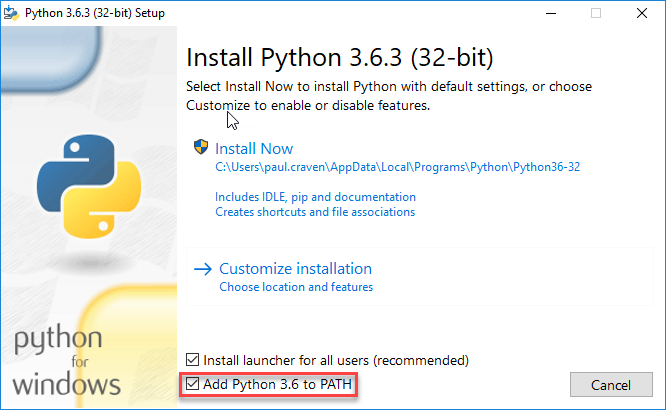
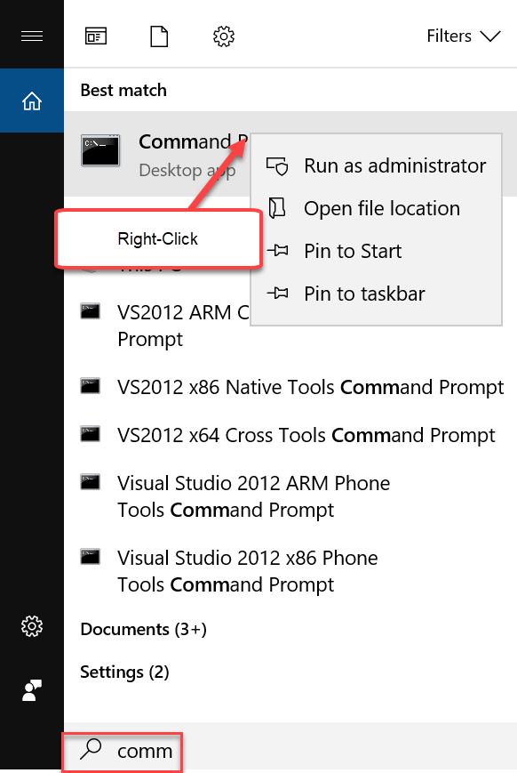
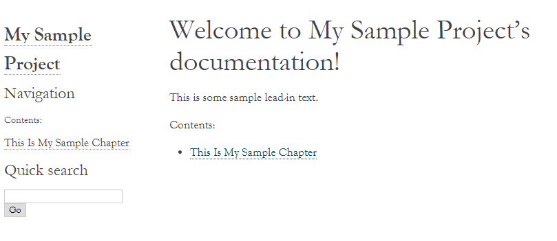
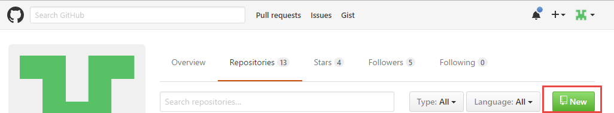
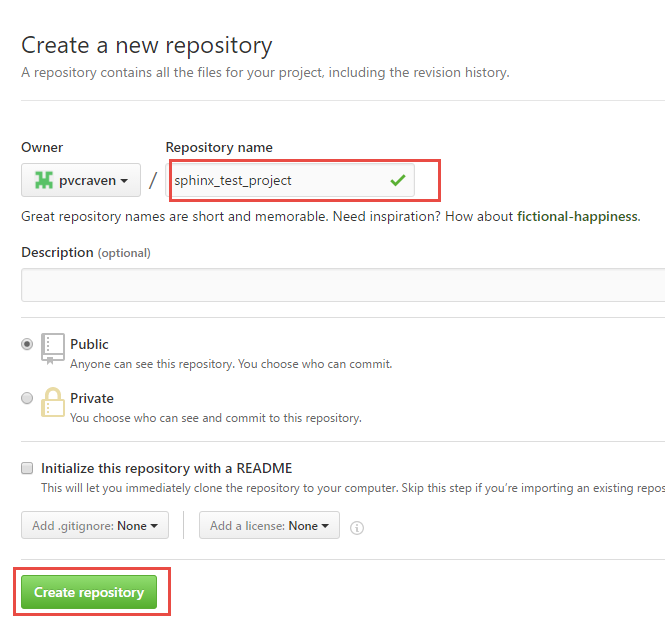
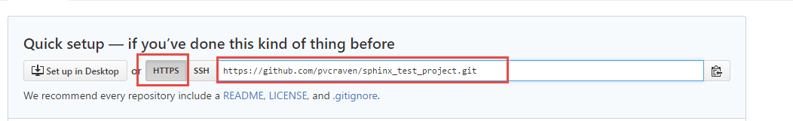

.. _sphinx_tutorial:

Sphinx Tutorial
===============

`Sphinx <http://www.sphinx-doc.org/>`_ is a static content generator. This tutorial covers how to
get Sphinx up and running.

Here is a link to the template:

https://github.com/pvcraven/sphinx_template

.. _install_python_and_sphinx:

Install Python and Sphinx
-------------------------

The lab computers have everything installed, so they are ready to go. If you are
using a lab computer you can skip to the next step.

If you want to build the site on your personal computer, you'll need to
install Python and Sphinx.

Sphinx relies on the computer language *Python*. You don't need to understand
Python to use the tool. But it does need to be installed on the computer first.

First, you'll need to install Python. Download Python from:

https://www.python.org/downloads/

Installation on Windows
-----------------------

When you do the installation, if you are on Windows
make sure to select "Add Python to PATH":

To install Sphinx, run the "Command Prompt" on your Windows computer.
You'll need to run it as an administrator:

Then type in the following command:

.. code-block:: text

    pip install sphinx sphinx_rtd_theme

You'll see something like this, plus a lot more:

.. code-block:: text

    C:\Users\paul.craven>pip install sphinx
    Collecting sphinx
      Downloading Sphinx-1.4.9-py2.py3-none-any.whl (1.6MB)
        100% |################################| 1.6MB 675kB/s

Did it work? Great! Now we are ready to start our site.

Did it not work? Drop by and we can trouble-shoot it.

Installation on Mac
-------------------

If you are on the Mac, after running through the Python installer, open
up a Terminal window. Type:

.. code-block:: text

    pip3 install sphinx sphinx_rtd_theme

Create the Initial Project
--------------------------

First, create a new directory inside of where your web server has its files.
I suggest creating it on your desktop.

Then, open a command prompt and navigate to that directory. Remember to use
the ``cd`` command to change directories. Make sure you are in this new directory
you've created before you continue. Otherwise you'll have a mess.

.. danger::

    Make sure you switch to the new directory!

Then, type in ``sphinx-quickstart``. You'll be led through a list of questions
to start your project. Unfortunately the current version is bugged on Windows
and rather than outputting the questions in fancy colors you just see a bunch
of strange characters on your monitor. Just ignore those, and answer the questions
as I've shown below. Note that most of the questions I just take the default and
hit "enter."

.. code-block:: text

    C:\Web Server\sphinx_test_project>sphinx-quickstart
    Welcome to the Sphinx 1.8.1 quickstart utility.

    Please enter values for the following settings (just press Enter to
    accept a default value, if one is given in brackets).

    Selected root path: .

    You have two options for placing the build directory for Sphinx output.
    Either, you use a directory "_build" within the root path, or you separate
    "source" and "build" directories within the root path.
    > Separate source and build directories (y/n) [n]: y

    The project name will occur in several places in the built documentation.
    > Project name: My Test Project
    > Author name(s): Paul Craven
    > Project release []:

    If the documents are to be written in a language other than English,
    you can select a language here by its language code. Sphinx will then
    translate text that it generates into that language.

    For a list of supported codes, see
    http://sphinx-doc.org/config.html#confval-language.
    > Project language [en]:

    Creating file .\source\conf.py.
    Creating file .\source\index.rst.
    Creating file .\Makefile.
    Creating file .\make.bat.

    Finished: An initial directory structure has been created.

Great! Now we have an initial file setup.

Building the project
--------------------

When you are at the command prompt, type ``make html``.

.. code-block:: text

    C:\Users\craven\sample_sphinx_project>make html
    Running Sphinx v1.6.3
    making output directory...
    loading pickled environment... not yet created
    building [mo]: targets for 0 po files that are out of date
    building [html]: targets for 1 source files that are out of date
    updating environment: 1 added, 0 changed, 0 removed
    reading sources... [100%] index
    looking for now-outdated files... none found
    pickling environment... done
    checking consistency... done
    preparing documents... done
    writing output... [100%] index
    generating indices... genindex
    writing additional pages... search
    copying static files... done
    copying extra files... done
    dumping search index in English (code: en) ... done
    dumping object inventory... done
    build succeeded.

    Build finished. The HTML pages are in build\html.

    C:\Users\craven\sample_sphinx_project>

Sphinx will then generate
your website in the ``build/html`` folder. You can go there with your web browser
and load up the main page.

While you can grab the ``index.html`` file and put in your browser to view,
it is a better habit to go through the web server by putting in ``localhost`` on
your address bar.

You will modify the files in the ``source`` directory, and then run ``make html``
on the command prompt. Finally you'll see the results in the ``build`` directory.

Adding Content
--------------

In your source directory, you should have a ``index.rst`` folder that looks like
this:

.. code:: rst

    .. My Sample Project documentation master file, created by
       sphinx-quickstart on Mon Nov 27 13:58:37 2017.
       You can adapt this file completely to your liking, but it should at least
       contain the root `toctree` directive.

    Welcome to My Sample Project's documentation!
    =============================================

    .. toctree::
       :maxdepth: 2
       :caption: Contents:

    Indices and tables
    ==================

    * :ref:`genindex`
    * :ref:`modindex`
    * :ref:`search`

The first part is just a comment. And I don't every use the "Indices and tables."
So let's trim those and simplify the file:

.. code-block:: text

    Welcome to My Sample Project's documentation!
    =============================================

    .. toctree::
       :maxdepth: 2
       :caption: Contents:

Let's add to our file:

.. code-block:: text

    Welcome to My Sample Project's documentation!
    =============================================

    This is some sample lead-in text.

    .. toctree::
       :maxdepth: 2
       :caption: Contents:

       sample_chapter/index

I've added a bit of lead-in text.

The Table of Contents Tree (toctree) should be a list of files that you want
to include. I typically make one file per page, and put each page in its own
directory. That makes it easy to keep the images and code samples for a page
together.

I've also told Sphinx to look in the ``sample_chapter`` directory for a file called
``index.rst``. Let's create that file and directory now. (Make sure you don't accidentally
create something like ``index.rst.txt`` if you still are hiding file extensions.) Put this in the file:

.. code-block:: rst

    This Is My Sample Chapter
    =========================

    Ok, here's my sample chapter.

Rebuild your file:

.. code-block:: text

    C:\Users\craven\sample_sphinx_project>make html
    Running Sphinx v1.6.3
    loading pickled environment... done
    building [mo]: targets for 0 po files that are out of date
    building [html]: targets for 1 source files that are out of date
    updating environment: 1 added, 1 changed, 0 removed
    reading sources... [100%] sample_chapter/index
    looking for now-outdated files... none found
    pickling environment... done
    checking consistency... done
    preparing documents... done
    writing output... [100%] sample_chapter/index
    generating indices... genindex
    writing additional pages... search
    copying static files... done
    copying extra files... done
    dumping search index in English (code: en) ... done
    dumping object inventory... done
    build succeeded.

    Build finished. The HTML pages are in build\html.

    C:\Users\craven\sample_sphinx_project>

Now find the build directory, and open up the result in your browser. It should look something like:

To get the full details on what you can do,
read this `Introduction to Restructured Text <http://www.sphinx-doc.org/en/stable/rest.html>`_
Below I have a quick demo that gives some examples of what you can do:

.. code-block:: text

    This Is My Sample Chapter
    =========================

    Ok, here's my sample chapter.

    This is another paragraph because of the blank line.

    This
    is
    all
    one paragraph. Because there
    is
    no blank
    line.

    Here I use *one* pair of asterisks for italics.

    I can use **two** pairs of asterisks for bold.

    Like lists?

    * Start a list with an asterisk.
    * Each item gets one.
    * Most common mistake, if you need two lines
      don't forget to indent the second line.

      * You can have a list in a list too.
      * Don't forget a blank line between the lists

    * Done with lists.

    Heading Level 1
    ---------------

    You can create headings with - and = and ~ underlines.

    You can create a link by doing `Simpson`_ something like this.

    .. _Simpson: http://simpson.edu

    You can do sample code easily:

    .. code-block:: python
        :linenos:
        :caption: Sample Code

        # Sample program
        print("Hello")

    You can make ``monospaced text`` if you surround them with two back-ticks. Back-ticks are the
    weird quote thing in the upper-left on your keyboard.

    You can include an image by:

    .. image:: my_image.png
        :width: 50%

    Or a labeled image:

    .. figure:: my_image.png
        :width: 50%

        This is my image caption.

    Sample Table
    ------------

    This is a sample table

    ============ =================
    Fruit        Review
    ============ =================
    Apple        3 stars
    Pomegranate  5 stars
    Grapes       3 stars
    Pears        4 stars
    Orange       2 stars
    Cherries     1 star
    ============ =================

    There are several ways of doing sample tables. The most frequent issue
    that people have when making tables is mixing tabs and spaces. In Sublime,
    if you select the text of a table, you can see tabs look differently than
    spaces. Always use spaces, never tabs.

Check for Errors
----------------

Sphinx will try to build *something* even if there is an error. That doesn't mean you should ignore the
errors! They will be very apparent to me when I look the project. So correct the errors that you
find. For example, see below:

.. code-block:: text

    Running Sphinx v1.6.3
    loading pickled environment... done
    building [mo]: targets for 0 po files that are out of date
    building [html]: targets for 1 source files that are out of date
    updating environment: 0 added, 1 changed, 0 removed
    reading sources... [100%] sample_chapter/index
    C:\Web Server\sample_sphinx_project\source\sample_chapter\index.rst:: WARNING: image file not readable: sample_chapter\my_image.png
    C:\Web Server\sample_sphinx_project\source\sample_chapter\index.rst:63: WARNING: image file not readable: sample_chapter\my_image.png
    looking for now-outdated files... none found
    pickling environment... done
    checking consistency... done
    preparing documents... done
    writing output... [100%] sample_chapter/index
    generating indices... genindex
    writing additional pages... search
    copying static files... done
    copying extra files... done
    dumping search index in English (code: en) ... done
    dumping object inventory... done
    build succeeded, 2 warnings.

    Build finished. The HTML pages are in build\html.

There are two warnings, telling me it can't load the image that I wanted. I need to correct that, not ignore it.

Themes And The Configuration File
---------------------------------

You can change the look of your output website by changing the ``conf.py`` file.
There is a line in there that allows you to change between different themes.

`Here <http://www.sphinx-doc.org/en/1.4.8/theming.html>`_ are different built-in
themes available. You can also download themes. For example, this website uses
the "Read the Docs" theme with some other customizations.

Spend some time looking in ``conf.py`` to see what you can do with it.

Sublime
-------

If you create a project with sublime, and then add a folder to that project, you get a nice side-bar that
lets you quickly switch between files.

Under "Preferences...Settings" you can modify the setting file for Sublime. You shouldn't type past 80 or at
the very least 120 characters for your line length. You can set up a ruler for this. You can enable the
spell-checker. You can automatically convert tab characters to spaces so your tables don't
get messed up. Here is what I use:

.. code-block:: JSON

    {
        "color_scheme": "Packages/Color Scheme - Default/Monokai.tmTheme",
        "font_size": 12,
        "rulers": [80],
        "spell_check": true,
        "translate_tabs_to_spaces": true,
        "word_wrap": false,
    }

If you don't want to open a command-prompt to build your documentation, you can
create a new build-system in Sublime. This will allow you to just hit Ctrl-B to
build your project. The build file is a bit confusing,
and I have to look it up anytime I want to add it, but it looks like this:

.. code-block:: JSON

    {
        "working_dir": "${project_path}",
        "shell_cmd": "make html"
    }

Putting The Project In GitHub
-----------------------------

Create Git Repository
~~~~~~~~~~~~~~~~~~~~~

To make this a git repository, open a command prompt and make **sure** you are
at the top level of your project directory. I can see that I am by my command
prompt below:

.. code-block:: text

    C:\Web Server\sphinx_test_project>

Next, type ``git init``:

.. code-block:: text

    C:\Web Server\sphinx_test_project>git init
    Initialized empty Git repository in C:/Web Server/sphinx_test_project/.git/

If you type ``git status`` you can see what isn't in the repository. Basically
everything.

.. code-block:: text

    C:\Web Server\sphinx_test_project>git status
    On branch master

    No commits yet

    Untracked files:
      (use "git add <file>..." to include in what will be committed)

            Makefile
            build/
            make.bat
            source/

    nothing added to commit but untracked files present (use "git add" to track)

I could add everything with ``git add -A``, but here's a problem. We aren't
supposed to add "result" files to git. Just "source" files. That means the
``build`` directory needs to **not** get added.

We can cause git to ignore files or directories by adding these to a file
called ``.gitignore``.

Go to your favorite text editor. Do a "file...new". Type ``build/`` into
the new file.

Then, do a "file...save as" and save the file as ``.gitignore``. The file
must be in the base directory of your project. **Not** the ``source`` folder.
One up from that.

Then run
``git status`` again to make sure it no longer shows the build directory.
It should show ``.gitignore`` though.

Then go ahead and add the files, and do a first commit.

.. code-block:: text

    C:\Web Server\sphinx_test_project>git status
    On branch master

    No commits yet

    Untracked files:
      (use "git add <file>..." to include in what will be committed)

            .gitignore
            Makefile
            make.bat
            source/

    nothing added to commit but untracked files present (use "git add" to track)

    C:\Web Server\sphinx_test_project>git add -A
    warning: LF will be replaced by CRLF in Makefile.
    The file will have its original line endings in your working directory.

    C:\Web Server\sphinx_test_project>git commit -m "First commit"
    [master (root-commit) e76ba03] First commit
     5 files changed, 252 insertions(+)
     create mode 100644 .gitignore
     create mode 100644 Makefile
     create mode 100644 make.bat
     create mode 100644 source/conf.py
     create mode 100644 source/index.rst

Next, we need to push our project to GitHub. But we can't, until we:

* Create a project on GitHub
* Link our computer with that new project.

Create GitHub Project
~~~~~~~~~~~~~~~~~~~~~

Ok, now we've got the start of our project. We need to create a new project
on GitHub and push our project there.

Give it a name:

Link Local Project To GitHub
~~~~~~~~~~~~~~~~~~~~~~~~~~~~

Copy this URL:

Type: ``git remote add origin`` followed by the stuff you just copied.
Next we need to push. The commands should look something like:

.. code-block:: text

    git remote add origin https://github.com/pvcraven/sphinx_test_project.git
    git push -u origin master

Replace ``pvcraven`` with the owner of our project, and ``sphinx_text_project`` with
the name of your project.

If you are just copying from the clone button on GitHub,
make sure when you use the "HTTPS" version, and not the "SSH" version.

After you have this done, confirm it got pushed up by looking on GitHub. At this point, you can add, commit, and push
like your other projects.

Spend time with the website and try getting some of the different document elements
to work:

http://www.sphinx-doc.org/en/master/usage/restructuredtext/basics.html

