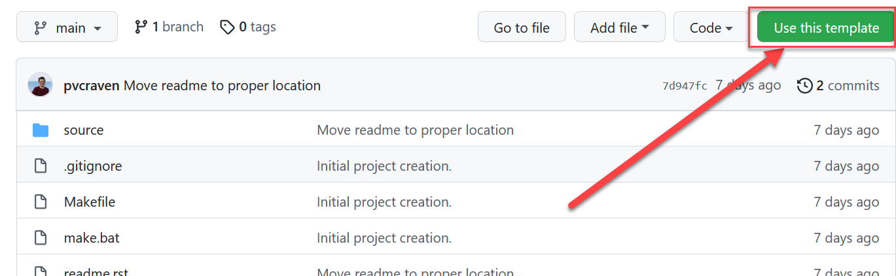

.. _sphinx_tutorial:

Sphinx Tutorial
===============

`Sphinx <http://www.sphinx-doc.org/>`_ is a static content generator. This
tutorial covers how to get Sphinx up and running.

Create From a Template
----------------------

First, we are going to get jump-started with a template.
Here is a link to that template:

https://github.com/pvcraven/sphinx_template

Click "Use This Template":

Next, give the project a name:

Once you've done that, go ahead and copy the link to clone your project:

Then, ``cd Desktop`` and ``git clone`` your project.

PyCharm Setup
-------------

Sphinx uses the computer language Python. The program PyCharm helps to develop
Python programs. While we aren't going to code in Python, we are going to run
the Sphinx tool, and PyCharm can make it easier for us.

The lab computers already have Python and PyCharm installed. If you want it
installed on your personal computer, see the instructor for how to do that.

Start up PyCharm. It will either open to a dialog with a button to open a
new project, or you can select File...Open Project.

You should get a dialog box asking to create a "virtual environment" to save
your Python setup. Go ahead and hit ok.

Navigating Your Project
-----------------------

On the left of your screen, PyCharm lists your project files. Double-click to
open them up.

You'll be editing the restructured text files ending in ``.rst``.
Navigate those files. The instructor will show you how the directories
and Table of Contents (TOC) work.

When you edit an RST file you might see a preview pane. This does not work
well and just confuses people. Turn it off.

Build Your Project
------------------

To convert your project from ``.rst`` to ``.html`` files, you need to "make"
the project.

1. Select the "terminal" tab
2. Type ``make html``
3. Confirm the build happened with no errors or warnings

After this, you should have a "build" directory with the ``.html`` files.
You can open the file in a browser by navigating to it, or using this
buried menu item:

Make Clean
----------

Occasionally the left navigation won't show correctly on all pages.
The ``make html`` file only updates files that have changed. But if
your change updated the navigation items, old files won't have their
navigation rebuilt. We can fix that by deleting all the files in the
build directory with the command ``make clean`` and then rebuilding
everything with ``make html``.

.. code-block:: text

   make clean
   make html

Visual Guides
-------------

Learn Restructured Text
-----------------------

Next, go through these commands on how to do basic RST items:

http://www.sphinx-doc.org/en/master/usage/restructuredtext/basics.html

