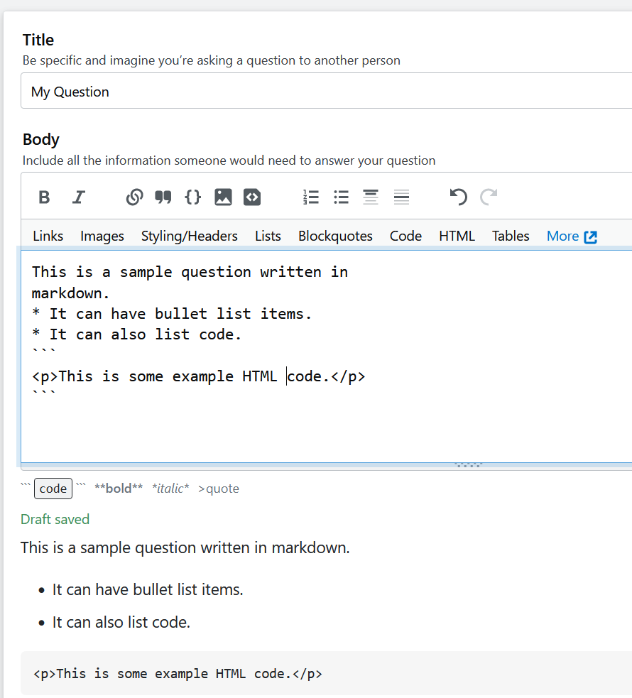
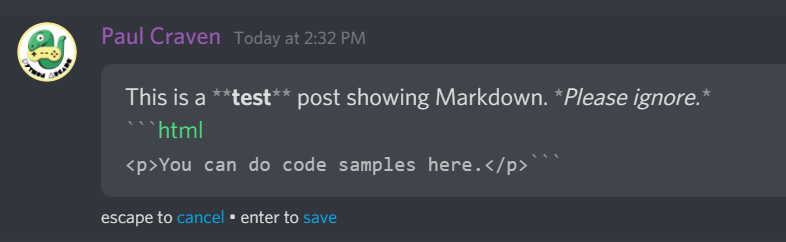
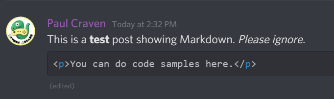

.. _static_content_generators:

Static Content Generators
=========================

So far we've talked about two ways of building websites:

* Coding them from scratch using HTML and CSS
* Using a Content Management System like WordPress

Coding a website from scratch makes it difficult to focus on the content,
rather than the code. It is also repetitive. A person can get tired of typing
``
`` all the time.

A CMS is a "heavy" solution. You've got a huge application written in PHP
with tons of plug-ins. The text editor makes weird HTML when you copy/paste
from MS Word. It is hard to deploy it across servers spread across the globe.
You have to worry about backing up a database. For many websites, WordPress
is overkill. Like commuting to work in a semi when you could just drive there
on a scooter.

Behold! There is a middle-ground. You can use a **static content generator**.
In fact, that is what I do for this website.

What is a Static Content Generator?
-----------------------------------

A static content generator uses simple plain-text source files to generate
a web-site's HTML and CSS for you. The generators usually use either the
**markdown** format or the **restructured text** format.

You might already be familiar with these formats. Web sites like Wikipedia, Reddit,
and Stack Overflow
allow users to use markdown to format their posts.

Static Content Generators usually work the following way:

1. You edit **source** text files in markdown (md) or restructured text (rst) format
2. You run the static generator tool
3. You now have HTML/CSS **output** files you can upload to your server

What Do Static Markup Languages Look Like?
------------------------------------------

A static content generator takes a markup language that is easy for a user
to type and turns it into HTML. So the input markup language might look like this:

.. code-block:: markdown

   Introduction to Markdown
   ========================

   This is a paragraph.

   This is another paragraph with a
   link to [Simpson College](https://simpson.edu).

   * This is a bullet list
   * And here is another item.

The tool turns markdown into HTML like this:

.. code-block:: html

   <h1>Introduction to Markdown</h1>

   
This is a paragraph.

   
This is another paragraph with a link
   to <a href="https://simpson.edu">Simpson College</a>.

   <ul>
     <li>This is a bullet list.</li>
     <li>And here is another item.</li>
   </ul>

The markdown language is easier to read and maintain than HTML. It doesn't require as
much technical skill to write. The output HTML is
cleaner and less prone to unexpected spacing and weirdness than a WYSIWIG editor.

Where are Markup Languages are Used?
------------------------------------

**This website**: This website is written in the markdown and generated with a static
content generator tool. You can see the source of this page right here:
https://raw.githubusercontent.com/pvcraven/web-development-class/master/source/semester_1/09_static/static_content_generators/static_content_generators.rst
In fact, any page you can go to the top-right, click "View Source" then finally
click "Raw" to view the source.

**Wikipedia**: Any Wikipedia page has an "edit" button. As long as you don't select the 'visial'
editor, you'll see the page in the markdown language. Some of Wikipedia's pages are kind of
complex though. See the `markdown page <https://en.wikipedia.org/wiki/Markdown>`_ along with
the `markdown source <https://en.wikipedia.org/w/index.php?title=Markdown&action=edit>`_.

**Stack Overflow**: The code behind stack overflow (and a lot of other similar websites)
allows people to post their questions in markdown:

**Discord**: Many chat tools like Discord allow a subset of Markdown that takes input like this:

And turns that to:

Version Control
---------------

Typically a developer will take the **source** files written in markdown
or restructured text and save them in a version control system like we have
already done using Git.

Using version control allows everyone to trace the history of the website, and
who made each change. There are also tools around how to request changes, and
how to approve changes.

When you run the static content tool, you **should not** include the result
files in your version control system. Only include the **source** files, not
the **result** files. As always though, there are some exceptions.

What Static Content Generators Are There?
-----------------------------------------

This website has a great listing of the top static content generators that
are available:

https://www.staticgen.com/

Unfortunately all of them have a bit of learning curve.

* `Jekyll <http://jekyllrb.com/>`_ is one of the most popular, but it is
  difficult to set up on Windows. It is easier to use on a Mac or Linux machine.
  GitHub has a way to integrate and automatically generate documentation with
  Jekyll, which is handy once it is set up.
* If you want to write a book, `GitBook <https://www.gitbook.com/>`_ is
  supposed to be a great tool.
* For this class, we will use `Sphinx <http://www.sphinx-doc.org/>`_.

Sphinx is the tool used to create documentation for the Python computer language,
and it is also the tool used to create the documentation for this class.

You can see what I typed in to generate any of the pages here by clicking on the
"Edit on GitHub" link at the top right. Then click on the "Raw" button which
will show you the raw text file.

Markup Languages
----------------

There are two main types of mark-up languages used with static content
generators. They are reasonably similar.

Markdown
^^^^^^^^

https://en.support.wordpress.com/markdown-quick-reference/

Markdown Syntax

Restructured Text
^^^^^^^^^^^^^^^^^

http://www.sphinx-doc.org/en/stable/rest.html

Supporting Websites
-------------------

There are some places that will host your static website for you.
They can also auto-update the website any time you push new content to
GitHub. A couple examples:

* GitHub: GitHub supports automatic creation of Jekyll websites.
* ReadTheDocs: This site will automatically create Sphinx websites if pointed
  to the GitHub project.
