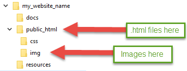
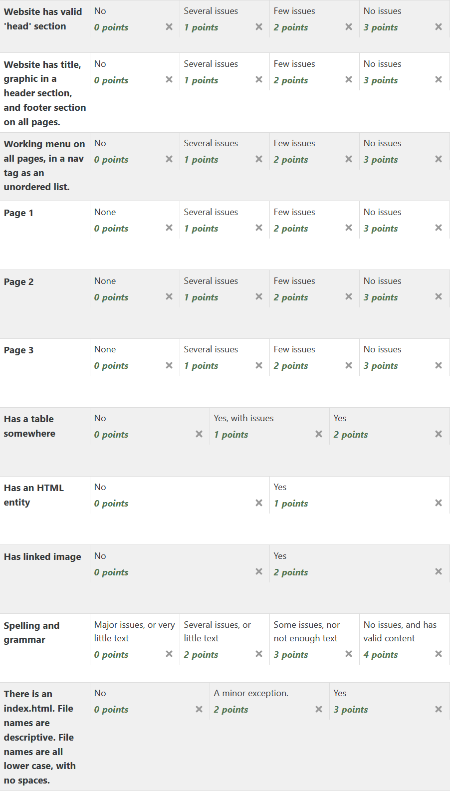

.. _assignment_01_basic_html:

Assignment 1 - Basic HTML
=========================

We will be working on building a website for a fictitious organization
throughout the semester. We will learn how to work on a website in groups.
This is the start of that website.

How to Work in Pairs
--------------------

A popular trend in programming is
`pair programming <https://en.wikipedia.org/wiki/Pair_programming>`_.
If done correctly, pair programming can:

* Improve code quality
* Improve job satisfaction
* Give programmers more opportunities to learn
* Build-in cross training so programmers can change jobs easier
* Build team dynamics

It is also possible to make pair programming a *bad* experience. Particularly
if the observer pulls out his or her phone. Keep your phone put away, and keep
on task while working on this assignment.

I will assign the pairs for this assignment. I will keep switching pairs, so you'll
get to work with several people in class.

When pair programming, you have a "driver" who is at the keyboard. You also
have a "navigator" or "observer." I like the work "navigator" better.
The "navigator" should be the one directing the coding. For example, if you
are driving, you have one person telling the driver to go left or right.
The driver worries about not hitting anyone.

Schedule
--------
* One person will "drive" and type on the computer for half the time.
  One person will direct. Each person should work to finish three pages. It is
  expected that some time will be spent outside of class to finish those pages.
  Do the hard parts first, and save the easy parts for outside of class.
* Spend about 15 minutes picking the topic, and figuring what pages
  you will build.
* Split the rest of the time for the day. One person navigates, one person
  drives. Half-way through, switch places.
* There may be ONE group of three. If you are in this group, please divide the time
  in thirds. Each person is still responsible for three pages.
* Later we will cover how to turn in the assignment.

**Remember:** The goal of this assignment is to learn. Most people get this, but
in the past I've had just a few students who "take over" a project and devalue
other's contributions. If you consider yourself an expert already, then take this
as an opportunity to learn how to help and instruct other people. It is a
"teach someone to fish" type of thing.

By yourself you can only get so much work done.
If you teach someone else how to work, then the two of you can get twice as
much done. Therefore if you already have some skills in technology, use
this as an opportunity to lean how to mentor and develop another person's
skills.

Website Subject
---------------

Pick a subject out of this list. I am open to ideas that are not on the list,
but please double-check that it will work ok.
The projects will be passed between groups, so keep
the subjects to ones that any student could work on.

* Selling BBQ sauce
* Local mountain bike club
* Local garden club
* Local business that teaches photography
* Local Italian restaurant
* Web page for a band that gets gigs, but isn't famous
* Website with recipes for families that want to eat healthy
* Cute/funny cat photos or videos (you will need to take them yourself)
* Information on the best mobile phone
* Local business that sells shoes
* Bed and breakfast
* DIY website
* Crafting website
* Info page for a fictitious city
* Page for a person running for state senate/congress/whatever
* Put your project idea up on the board. No duplicate project ideas.

All web pages must have text. Please create real, actual, content.
Text must be original and not copied.
Images should be original as well, with a few exceptions. If you want
an exception, please see me for information on how to cite and link it.
Images that you took yourself with a phone or camera are ok.

.. warning::

   Copying text or images from other websites without citation is plagiarism.

Required Components
-------------------

* You need to have three pages per person. Before starting, jot down the page
  names you'll have. Make sure each person knows who is responsible for which page.

  * Page names: All pages should end in ``.html``.
  * Page names should be all lower case.
  * Page names should not have spaces. You can use underscores instead.

    * Two Required pages

      * Main index page. The file name must be ``index.html``
      * About page. This might have things like who created the website, or
        info about your band, or your city, or company.

    * Optional pages. Must have at least four.

      * News page
      * Items for sale page
      * Hours, directions
      * Page with video. Videos should be original. Please don't use other
        people's videos. You can post on YouTube, Vimeo, etc. and link the video
        in.
      * Pages with info on a subject

* Every page should have:

  * An HTML comment at the top with who is primarily responsible for the page.
    The 'driver' in pair programming does
    the typing and will *not* be primarily responsible for that page.
    Each person should have at least three pages they are responsible for,
    and will be graded on.
    See :ref:`html-comments` as a reminder how to make comments.
  * A doctype stating this is HTML 5. See :ref:`html-doctype`.
  * An ``<html>`` tag around the entire document. See :ref:`html-tag`.
  * A ``<head>`` section with title and charset. See :ref:`head-tag`.
  * A ``<body>`` tag after the head that contains the main body of the document.
    See :ref:`body-tag`.

  * A ``<header>`` tag with:

      * Unordered list of all pages in the web site, that link to the web pages.
        The link will be the page name. For example: ``<a href="about.html">About</a>``
        Links must be relative. See :ref:`sample_html_doc` for how the list
        should look. It should be inside a ``<nav>`` tag just like the example.
        **Note:** This will look terrible, and you might be tempted to put it in a
        table. Don't. In the CSS assignment we will make it look
        like a menu bar.
      * The menu should appear on every page.
        Put the list at the top of the page because that's where the nav bar will go.
        Don't try to make it fancy or in a table.
        We will add formatting in a later assignment. The menu will be the same
        for every page, so once you have it, you can copy/paste it across.
      * Web site title and graphic. Put in its own ``<header>`` tag.
        For this an example of this
        and the footer see :ref:`sample_html_doc`.

  * Web site footer. Put in its own ``<footer>`` tag. What might
    go in the footer? Anything that goes at the bottom of the page. For example,
    the footer might have copyright information or contact information.
    Don't try to style the footer, we'll do that in Assignment 3.
    The footer should look something like this:

    .. code-block:: html

      <footer>
        Copyright 2021 by Pat
      </footer>

* Once you have this done on one page, you can save it. and use it as a template
  for the other pages.

* Additional required elements, required at least once for each person on
  the project:

  * Tags must be lower case
  * Headings. Those ``<h1>`` to ``<h6>`` tags. Put a heading before things that
    make sense to have a heading.
  * Paragraphs
  * Linked in images. You may not copy the image off the web. Sketch something
    in MS Paint, or Inkscape. Or take your own photo. It doesn't have to look good.
  * At least one table. You don't need a table in all the pages, but you need
    a table on at least one page you are responsible for.
    The table may look "squished." We'll show how to style the table later.
  * HTML entities. Toss at least a few on your pages. See :ref:`html-entities`.
  * At least 150 words per page.

Finally:

  * Validate your files! Use HTML Validator or the
    `W3C Online Validator <https://validator.w3.org/#validate_by_input>`_. Easy way
    to catch mistakes.
  * Check for spelling and grammar. It counts as part of the grade.

Directory Structure
-------------------

For more information about directories and links with the web, see the
:ref:`Directories` page.

For this assignment, create directories and set up your folders like this:

Turn in Assignment 1
--------------------

To turn in assignment 1, copy the GitHub address for your project into the submission
form on Scholar for assignment 1. This will require you to complete Assignment 2.

* Make sure you submit your files, and your files only.
* Make your your files (which files I should look at to give your grade)
  are identified by a comment.
* This is to be a serious website. Don't make it a joke. If someone hired you to create a website
  with this subject, do the best job that you can at it.
* Make sure you submit any images that go with your files.
* Make sure to add descriptive comments when submitting. (You can't edit them
  later, so make sure you get them right the first time.)
* Make sure your files have a comment with your name in them at the top.
* Make sure to avoid extra spaces around tags. Don't
  do ``<title> About Page </title>`` instead do ``<title>About Page</title>``
* Don't make your lines really long. If your paragraph is longer
  than 80 characters, use a return and break it up. Yes, the
  web page will ignore it, but it is hard to edit a file if
  your text extends way off the screen to the right.
* Include a character set in the ``<head>``.
* Your ``<title>`` should be descriptive. It might mirror the ``<h1>`` content.

* Copy the GitHub project URL
* Submit on Moodle
* Here's the rubric it will be graded on. Review.

