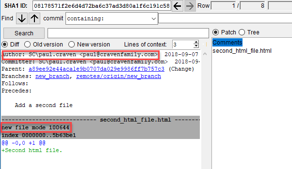
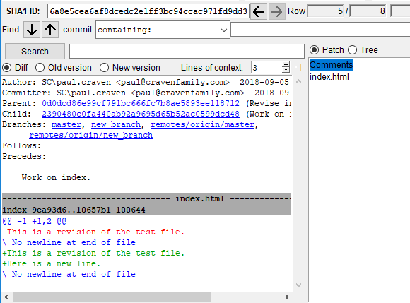
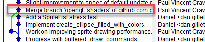
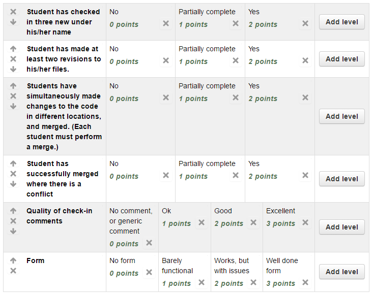

Assignment 2 - DVCS
===================

The goal of this assignment is to
gain experience working with a Distributed Version Control system.
We'll do this by turning in Assignment 1, and practicing how to
check in, update, pull, and merge changes.

This is the most complex assignment in the class
because tt is difficult
to write a tutorial for it with all the different possibilities of
what could go wrong, and even harder to lead 40 people through
it at the same time.

However, it is really *easy* to lead a group through it individually.
If you get stuck, make sure to find time to have the instructor lead
you through it. Even if it means you have to meet out of class.

One-on-one this is not difficult. Don't panic if it is confusing, just work
on the HTML part of Assignment 1 until you get a chance with the instructor to
step through this part.

Turn in Assignment 2
^^^^^^^^^^^^^^^^^^^^

1. Each person should be checking in at least three ``.html`` files.
   (From assignment one.) If your partner checked in *all* the files, then
   delete your three files. Commit the deletion. Then add your three files
   back in.

To grade, I'll be looking through your check-ins with ``gitk`` and that
you have added three new files. Make sure you can find this yourself. Here's an
example:

2. You should have a proper directory layout. (See :ref:`sample-directory-structure`.)
3. At least one image should be added and used in your project.
4. Each person should make at least two revisions to his/her own files.
   Here's an example of a revision. Red text was removed, green text was
   added.

5. Each commit should have a descriptive comment.

6.  Each person should do a "merge" where files have changed on the server, but
    in different spots. For example, in the image below both Paul and Daniel
    made changes based on the copy that was checked in with "Progress with buffered
    draw commands." The work was merged by Paul with "Merge branch" check-in.
    Because Paul did the check-in, he would be the one getting credit. Make sure
    each team member does a check in with a merge.

7. Each person should do at least one merge where there are file conflicts.
   Both of you start with the same updated copy. Then both make a different
   change to the same line. Try to commit, pull, and push. The last one
   will get an error like:

.. code-block:: text

    remote: Counting objects: 3, done.
    remote: Compressing objects: 100% (2/2), done.
    remote: Total 3 (delta 0), reused 0 (delta 0), pack-reused 0
    Unpacking objects: 100% (3/3), done.
    From github.com:pvcraven/name_of_my_project
       2390480..834cdc1  master     -> origin/master
    Auto-merging index.html
    CONFLICT (content): Merge conflict in index.html
    Automatic merge failed; fix conflicts and then commit the result.

The file will look something like:

.. code-block:: text

    This is a revision of the test file.
    <<<<<<< HEAD
    Here is a new line. Change by person 1.
    =======
    Here is a new line. Change by person 2.
    >>>>>>> 834cdc1cf52768ebea4396b6b1c94221f7985eb2

You can manually edit and fix the file. Or you can select which of the files to
take. Yours, or the other persons. See :ref:`git_merging`.

DON'T IGNORE THE CONFLICT! You must fix it before continuing. Otherwise you'll
just leave those weird ``<<<<<`` lines in your file.

When you check it in, please label it as a conflicting change so I can find
it and easily give you credit.

8. Paste the GitHub URL for the website and submit Assignment 2 on Scholar.

