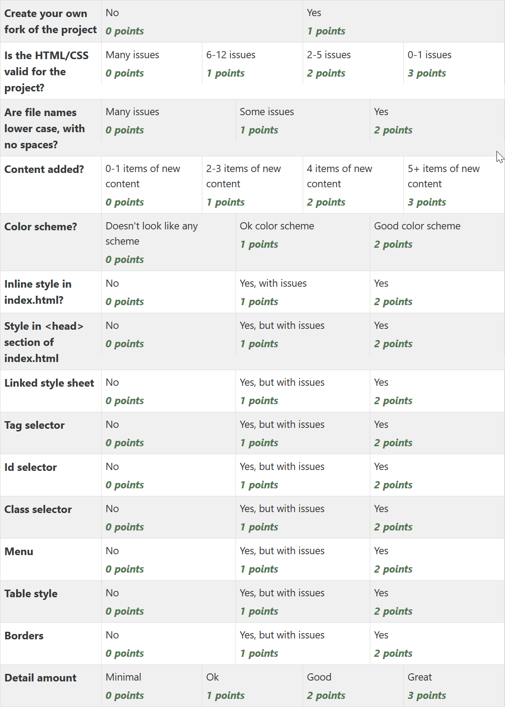

Assignment 3 - CSS
==================

In this assignment, each individual person will style one of the project websites
using CSS.

Required elements of the project
--------------------------------

* Create your own fork of the project

  * Find a different project out of the list in the assignment page.
  * Fork it using the "Fork" button on GitHub.
  * Clone the project onto your desktop using ``git clone <project url>``
  * You will be changing the files that are already there. Do NOT create your own folder with your
    own set of files. You can correct mistakenly named files. You can reorganize poorly organized
    files. But don't let there be two copies of the website in the project.
  * You can delete those comments saying who owns the file.

* Is the HTML/CSS Valid for the project?

  * Double-check the project for HTML and link errors using the HTML Validator,
    or the `W3 Validation Service <https://validator.w3.org/#validate_by_input>`_.
    Fix any issues. This is like real life, where you get stuck cleaning up other
    people's messes.

* Are file names lower case, with no spaces?

  * Make sure all the file names are lower case, and have no spaces.
  * If you have to rename files, make sure you update the menu so it still works.

* Content added?

  * Add a little bit more content to the site of your own creation. Seriously.
    You'll be graded on this. Add 5 or more items of new content. An item might
    be a new paragraph, a new image, or something similar.

* Select a color scheme for your website.

  * Use color theory and tools we talked about in class. Perhaps use a
    `color wheel <https://color.adobe.com/create/color-wheel>`_.
  * Perhaps search through Adobe's Kuler_.
  * Use these colors when selecting colors for borders and such in the next items.

* Inline style in index.html?

  * Go to your index.html file and apply one or more in-line styles as shown in
    :ref:`in-line-styles`.

* Style in ``<head>`` section of index.html?

  * Apply one or more styles in the ``<head>`` as shown in :ref:`internal-css`.

* Linked style sheet?

  * Apply a stylesheet that you've created as shown in :ref:`external-css`
    to every page.

* Create styles with a tag selector as shown in :ref:`tag-selector`.
* Create styles with an id selector as shown in :ref:`id-selector`.
  Feel free to update HTML with ids as needed.
* Create styles with a class selector as shown in :ref:`class-selector`.
* Borders

  * Add some borders around things

* Style the menu

  * See the step-by-step tutorial at
    `W3Schools CSS Navigation Bar tutorial <https://www.w3schools.com/css/css_navbar.asp>`_.
  * I particularly like the styles from the `Horizontal Nav Bar <https://www.w3schools.com/css/css_navbar_horizontal.asp>`_.

* Find the table in the website and style it.
  Look at the `W3Schools table tutorial <https://www.w3schools.com/css/css_table.asp>`_.

* Detail amount

  * Spend some time doing detail work. Make it look good.
  * Most people that get full points on this have at least 70 lines in their CSS
    file.

* Revalidate the HTML.
  Validate the CSS. You can do this on-line as well with the
  `W3 CSS validation service <https://jigsaw.w3.org/css-validator/#validate_by_input>`_.
* ``git add *``
* ``git commit -m "Update with CSS info"``
* ``git push``
* Submit the assignment in Scholar. Paste in the link to the GitHub web site for the project.

Common problems to avoid
------------------------

  * Blocks of text should black on white, or near-black and near-white.
    Maybe white on black. When reading text give your reader as much contrast as
    possible.
    Use color for highlights or titles.
  * Do not center blocks of text. That's very hard to read.

Rubric
------

.. _Kuler: https://color.adobe.com/explore/most-popular/?time=all
