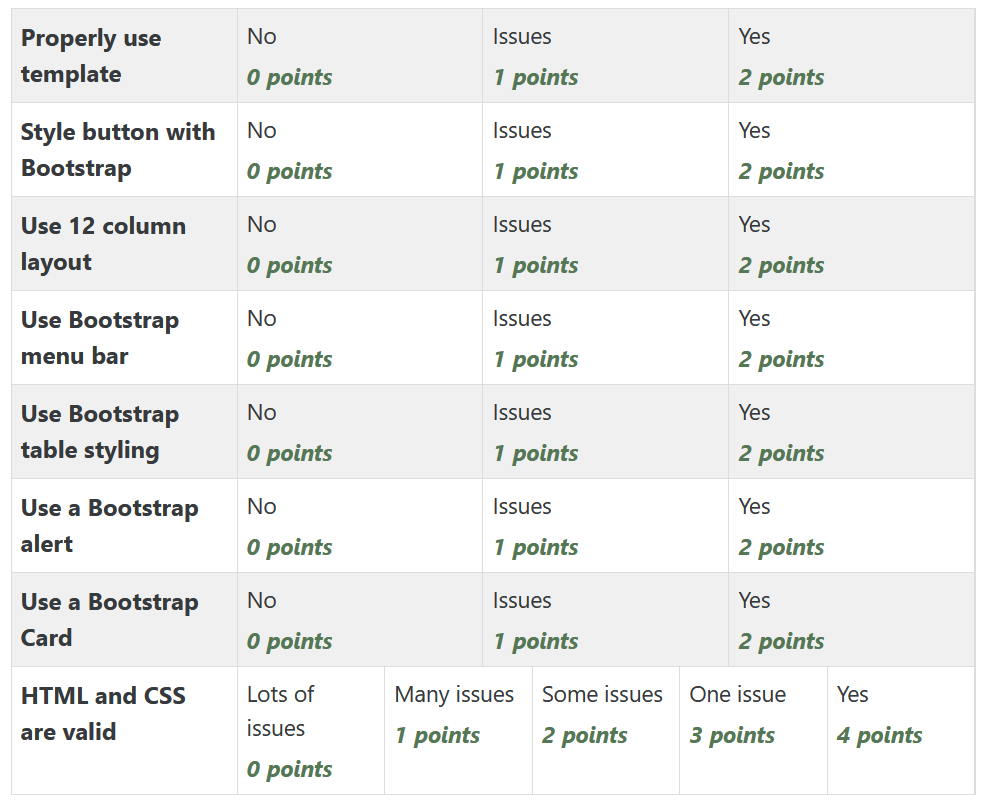

Assignment 4 - Bootstrap
========================

**Get set up:**

* Open the project you were assigned.
* Make sure you've got everything committed and pushed from the last assignment.
* Create a new branch of your project:

  * Branch your code with ``git checkout -b bootstrap``
  * Push your new branch ``git push -u origin bootstrap``

* Remove the CSS from the prior assignment.

**Cover the following things from the rubric:**

* Remove the CSS from the prior assignment.
* "Properly use template" Use the :ref:`bootstrap-template` tutorial to adapt
  all pages on the project to use Bootstrap. You will need to copy/paste out
  of the template into the pages to make sure that Bootstrap has been applied.
  **Also** make sure that the menu bar "hide" text on your page.
* "`Style buttons with Bootstrap <https://getbootstrap.com/docs/4.0/components/buttons/>`_"
  Style all the buttons (there has to be at
  least one) with Bootstrap. Leave no button unstyled. You can apply the
  button style type to more than just buttons, you can apply it to a link. So you
  can make a link into a button that leads you to a web page.
* "`Use Bootstrap menu bar <https://getbootstrap.com/docs/4.0/components/navbar/>`_"
  Put a Bootstrap menu bar on all your pages.
* "Use Bootstrap Table Styling" -
  The most basic thing you can do here is to make ``<table>`` into ``<table class="table">``
  to use basic Bootstrap styling.
  See the `Official Bootstrap Table Styling Guide <https://getbootstrap.com/docs/4.0/content/tables/>`_
  for examples on all the types of things you can do.
* "`Use a Bootstrap alert <https://getbootstrap.com/docs/4.0/components/alerts/>`_"
  Put at least one Bootstrap alert somewhere on your page.
* "`Use a Bootstrap Jumbotron <https://getbootstrap.com/docs/4.0/components/jumbotron/>`_"
  Properly use a Jumbotron at least once. Don't make
  the mistake of putting the whole page into the Jumbotron, just part of it.
* "Use 12 column layout"
  Pick at least page, and make it into a responsive multi-column
  layout using Bootstrap. Don't simply make a container with just one column, it
  is hard to get a sense of using the layout functions with such a simple example.
  Example 2 from :ref:`bootstrap-grid-tutorial` is good to look at. To really
  learn it, see `The Bootstrap Official Layout Docs <https://getbootstrap.com/docs/4.0/layout/overview/>`_.
* "HTML and CSS are valid" Use
  the `W3 HTML Validator <https://validator.w3.org/#validate_by_input>`_ to find and fix all errors.

.. note::

   A very common mistake is to not use the ``
``, or to
   not have the footer *inside* that container. Check your page to make sure it does
   not have text running to the
   edge of the screen.

Also make sure you don't have blocks of text on a colored background. That is
too hard to read.

