.. _assignment_finalize_site:

Assignment 5 - Finalize Site
============================

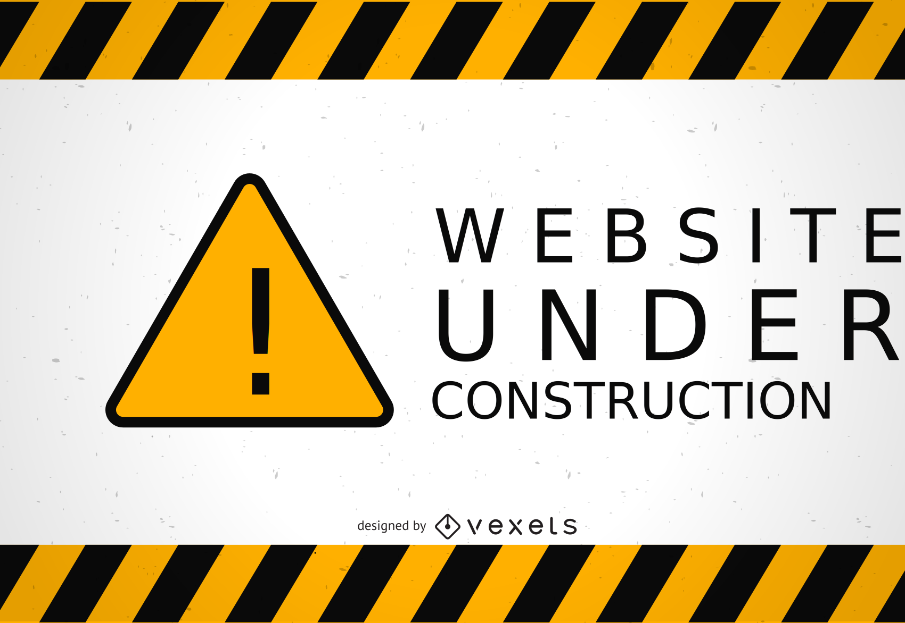

In this project, we are going to take a project from a prior year, and improve
on it.

The goals here:

* Practice teamwork
* Practice working with code that already exists
* Practice git
* Practice HTML/CSS/Bootstrap
* Reflect on teamwork

Building Your Team
------------------

You will be assigned a team of people. As part of this team you need to:

* First, everyone introduce themselves.
* Next, take turns talking a little about yourself:

  * Give a piece of trivia about yourself.
  * What are your strengths and weaknesses in working with a project like this?

Getting Set Up
--------------

* Your team will be working off this base project: https://github.com/pvcraven/hauntings
* Elect **one** person should 'fork' this project"

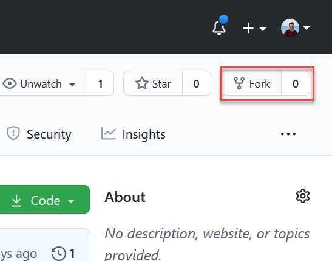

* That one person should use GitHub
  Settings...Manage Access...Invite a collaborator and send invites to the rest
  of the team.

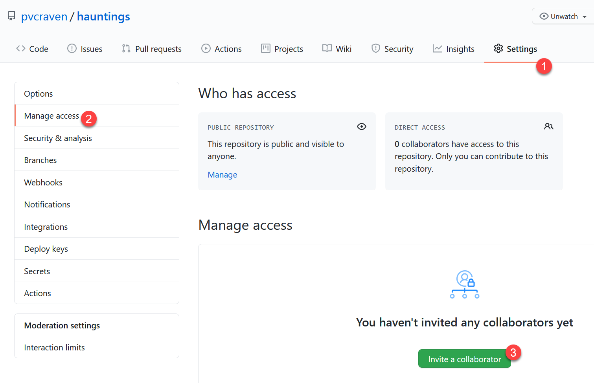

* Everyone should go a ``git clone`` of the project fork and bring it up on their computer.
  Make sure to clone *your* team's fork of the project. My id should not be
  part of the link.

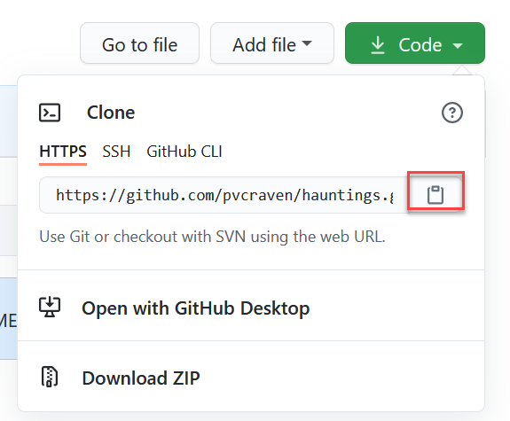

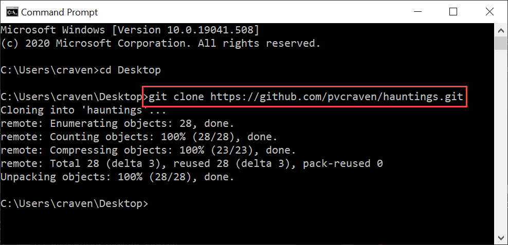

* Work together as a team to make sure everyone has this done. Verify it is
  working. Leave no person behind!
* If someone from your team is missing, have the project owner send them an e-mail
  asking for their GitHub ID, so they can be added.
* Take a look at the website in your browser.

.. _enabling-issues:

Enabling Issues
^^^^^^^^^^^^^^^

It appears that forked projects have 'issues' disabled by default. We want
to use this feature, so we need to enable it. The project owner needs to
do the following steps:

1. Select settings
2. Select options
3. Make sure the 'Issues' checkbox is checked.

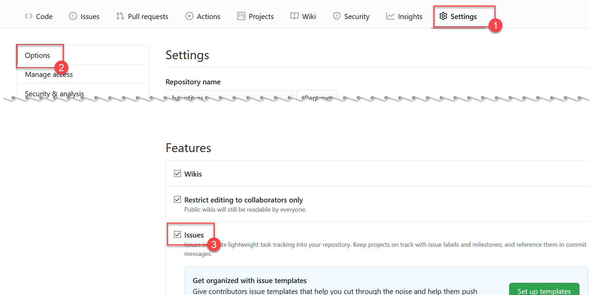

Brainstorming Improvements
--------------------------

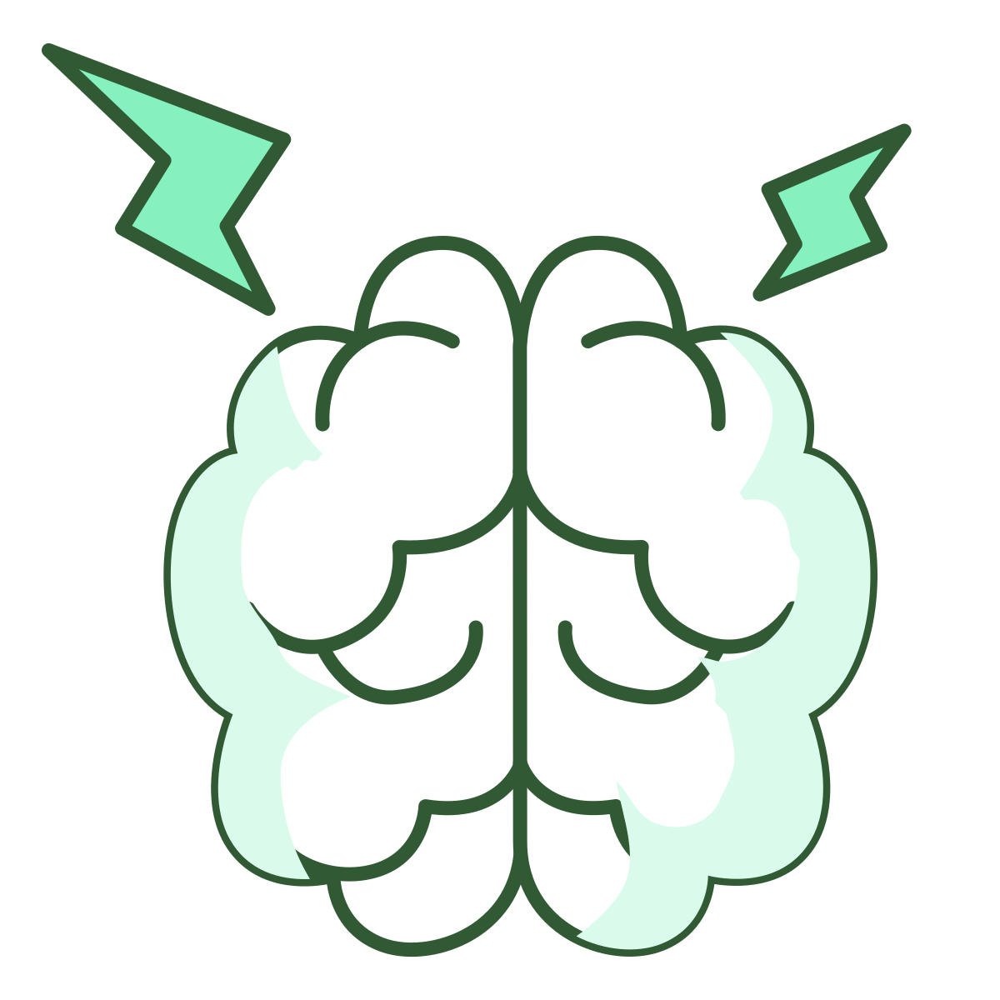

* **One person**, Go to GitHub. Click on the Projects tab for your project.
  Create a new project.

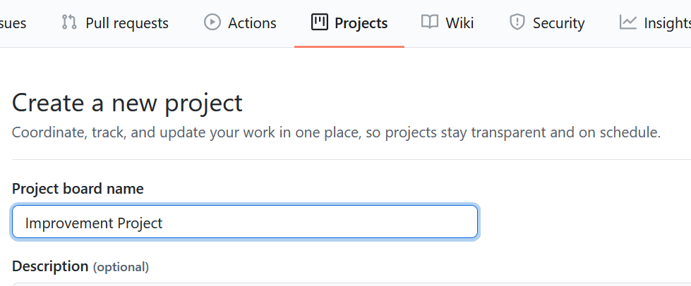

* Create columns for:

  * Ideas
  * To-Do
  * In Process
  * Done

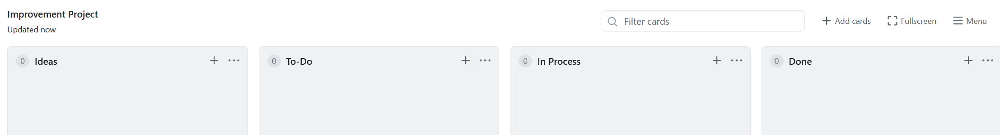

* **Everyone**, brainstorm things to add, update, fix with the project. At least
  three cards per person. Each person enter their own ideas.

Assigning Out Improvements
--------------------------

* As a team, pull out two cards for each person on your team, and move them
  from "Ideas" to "To-Do" list.
* Work to balance the conversation. Solicit input from people who aren't speaking.
* Convert each To-Do item to an Issue (click on three dots)

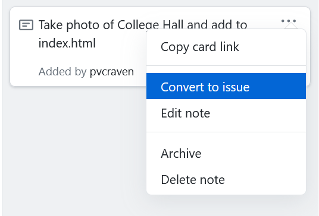

* Go to issues, assign two issues to each person. (Don't make them too difficult.)

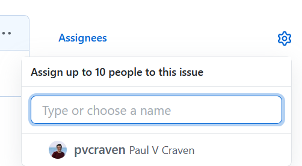

Do the Work
-----------

* Make sure to do a a``git pull`` before starting the work. It will make your life easier.
* Do the work
* Check into GitHub with quality comments in like:
  ``git commit -m "Issue #4. This should be a detailed explanation of what I did.".``
  If you include the issue number it will automatically link your change into the comments on that issue.
* Watch for conflicts if you need to ``pull`` before ``push``.

Follow-Up
---------

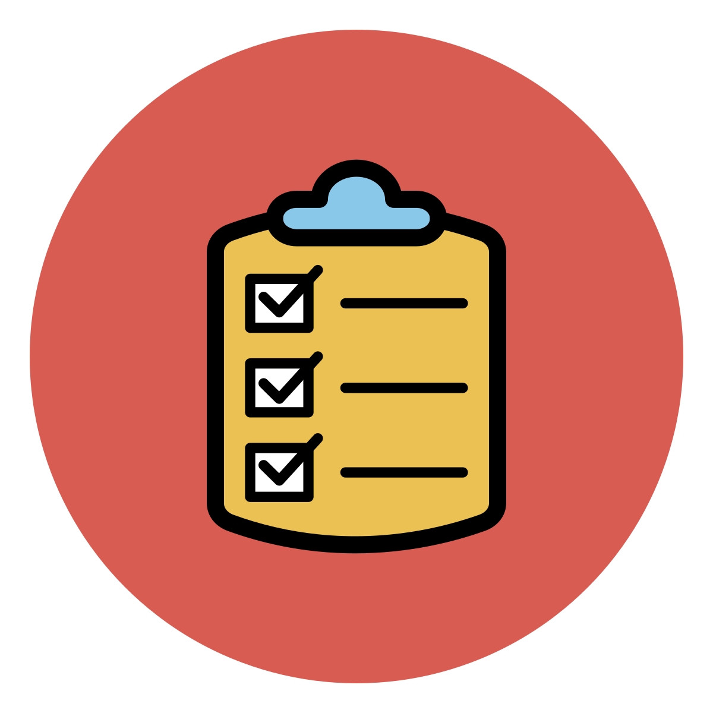

* In class the following week, meet and check progress. Update each issue with a status update.
  Close the issue when done, but only do this as a team when everyone agrees.
* Follow up to make sure those assignments were done.
* Feel free to set up a meeting time / text chat / discord / or something else to coordinate work through
* Get the work done by the due date.

Reflect on Teamwork
-------------------

Following this work, write up:

* Put name, date, title on top.
* Who was on your team?
* What project did you work on? (Paste in URL)
* Link at least two issues you worked on GitHub. Include the issue numbers,
  and maybe even the links.
* What strengths do you personally have when working in a group?
* How did you apply your strengths in collaborating on this project?
  List your strengths in working with the team, not the technical
  strengths of the code.
* What are your weaknesses when working in a group?
* How did they affect your work in collaborating on this website?
* Which of these methods (consensus, autocratic, democratic, delegation,
  consultive) did you apply to come to agreement?
* Did you have issues where everyone "didn't care" what the decision was?
  How did you come to a conclusion?

Note that a reasonable percent of your grade comes from your write-up. So
don't do lots of work on the project, but short-change your grade by barely
writing up anything. Check out the rubric. You'll likely need 500 words
(two pages, double-spaced) at least.

The last part of your grade will come from issues and code check-ins that are
tagged with your name on GitHub.

.. image:: rubric.png
    :width: 500px
    :align: center
    :alt: Rubric

