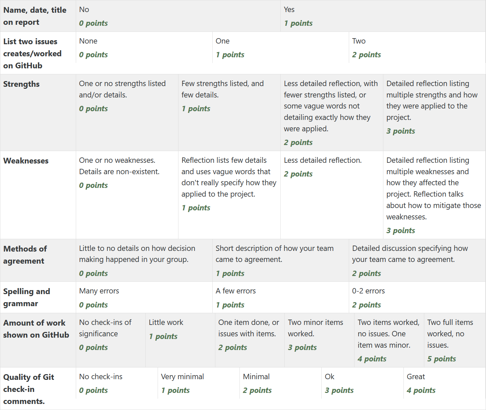

Assignment 5 - Finalize Site
============================

You will be assigned a team of people. As part of this team you need to:

* Select a project. It can be one you worked on before, or not.
* It is ok if someone else is working on the same project.
* Look at all branches of the project and select the best one to start with

  * ``git branch -a`` lists all branches
  * ``git checkout the_branch_you_want`` will check out a particular branch. Explore all of them.

* Create a branch of the project to finalize. Call it something like ``finalize_first1_first2``
* You can copy/paste material out of any other branch into your branch, even if you didn't create it.
* Assign everyone parts of the site to improve.
* Create GitHub issues for each thing you will improve.
* Follow up to make sure those assignments were done.
* Feel free to set up a meeting time / text chat / discord / or something else to coordinate work through
* Get the work done by Thursday.

Following this work (after Thursday), write up answers to these questions:

* Who was on your team?
* What project did you work on? (Paste in URL)
* Link at least one issue you created on GitHub
* Link at least one issue you closed on GitHub (can be same issue)

Also answer these questions, which will form the basis for part of your grade:

* What strengths do you personally have when working in a group?
* How did you apply your strengths in collaborating on this project?
  List your strengths in working with the team, not the technical
  strengths of the code.
* What are your weaknesses when working in a group?
* How did they affect your work in collaborating on this website?
* Which of these methods (consensus, autocratic, democratic, delegation,
  consultive) did you apply to come to agreement?
* Did you have issues where everyone "didn't care" what the decision was?
  How did you come to a conclusion?

Note that a reasonable percent of your grade comes from your write-up. So
don't do lots of work on the project, but short-change your grade by barely
writing up anything. Check out the rubric. You'll likely need 500 words at least.

The last part of your grade will come from issues and code check-ins that are
tagged with your name on GitHub.

