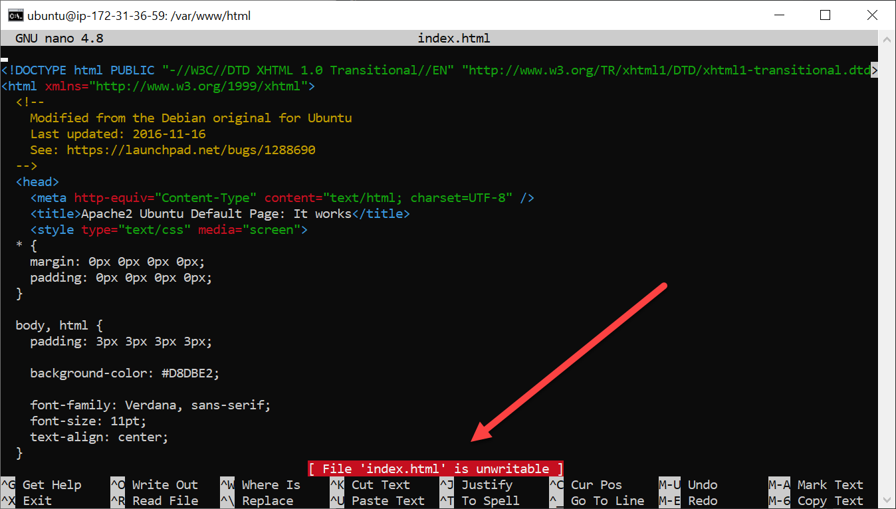

.. _assignment_aws_deploy:

Assignment 7 - AWS Deployment
=============================

Goal: Deploy your project onto your own server.

By this time, you should have:

* Understood what a web server does: :ref:`web-servers`
* Set up an AWS server via this tutorial: :ref:`aws_setup`
* Spent some time getting used to the command line: :ref:`command_line_tutorial`

Now, we are going to get a web server working and on-line via the tutorial below.

You will turn in:

* A link to your web site. It should be on an AWS server and probably starts
  with ``http://ec2-``

.. attention::

    This assignment is needed as a base for other assignments. Don't take a zero on this assignment.

Sometimes this assignment goes smoothly, and sometimes it doesn't. Plan to spend time working with the professor
outside of class to get the deployment working. Usually we can get this working from scratch in about twenty
minutes. Less, if you have part of it done. But you have to make the effort to do this.

Get Webserver Working
---------------------

First, we want to get all the software updates available for our computer before we start
installing anything new.

The program that does these updates is called ``apt-get``. Installing updates is a two step process:

* Check what updates exist: ``apt-get update``
* Install the updates: ``apt-get upgrade``

...but if you try that out, it doesn't work. You don't have permission to install the updates.
Have you ever tried to install software on Windows or a Mac and it asks for permission?
This is to keep malicious software (or users) from installing programs on your computer
we don't want. We have to give it permission to do so.

We do this with the "substitute user do" command. Basically, we are saying run this command as
administrator:

.. code-block:: text

    # Check for updates
    sudo apt-get update

    # Install updates
    sudo apt-get upgrade

Next, let's install a webserver. Specifically, Apache 2.
You can also do this using ``apt-get`` from the command-line.
In fact, this is one of the things I *love* about the command line. If you need 12 programs installed for
your server, you can just list out all 12 on this command line and it will install them for you. Super-easy.

.. code-block:: text

    # Install web server
    sudo apt-get install apache2

Now, try accessing web server. Paste your server's address in the web browser.
It should look something like:

http://ec2-52-39-56-197.us-west-2.compute.amazonaws.com/

...but not exactly that. Also, the 'quick link' on AWS will try to link ``https`` when we
only have ``http`` working.

Edit Web Page
-------------

Now, let's change the web pages. First, go to the directory that has the html files
and list them:

.. code-block:: text

    cd /
    ls
    cd var
    ls
    cd www
    ls
    cd html
    ls

You could combine those ``cd`` commands into one:

.. code-block:: text

    cd /var/www/html

Next, let's try editing the index page with nano:

.. code-block:: text

    nano index.html

Notice it says the file is 'unwritable'. You have no permission.

So use ``sudo`` to do command as an admin:

.. code-block:: text

    sudo nano index.html

* Lots of lines there. You can delete a line with ctrl-k
* Try typing something
* Hit ^o - Enter to save
* Create a base HTML page with your name

.. literalinclude:: minimal_html.html
    :linenos:
    :language: html

* Save and see if you can see the results in your browser.

This URL web page is one part of your assignment.

Upload and Download Files
-------------------------

* Type this on your computer (not your AWS computer) to download the index file:

.. code-block:: text

    scp -i mykey.pen ubuntu@ec2-52-39-56-197.us-west-2.compute.amazonaws.com:/var/www/html/index.html .

You can try (but not succeed) to upload the file from your computer to your AWS server:

.. code-block:: text

    scp -i mykey.pem index.html ubuntu@ec2-52-39-56-197.us-west-2.compute.amazonaws.com:/var/www/html/

Programs like MobaXTerm and FileZilla make file upload and download as easy
as drag-and-drop.

Fix File Permissions
--------------------

See who owns the files:

.. code-block:: text

    ls -la

Change to file owner from ``root`` to ``ubuntu`` which is the user we log in as:

.. code-block:: text

    sudo chown ubuntu:ubuntu index.html

You can upload the file, but not add new ones. Because the directory is owned by root still.
To fix:

.. code-block:: text

    cd ..
    sudo chown ubuntu:ubuntu root

Download from Git
-----------------

We could download our files direct from GIT. The ``wget`` command downloads
a web page as a file. GIT provides a direct download-link to a zip of
the project.

.. code-block:: text

    wget https://github.com/pvcraven/hauntings/archive/refs/heads/main.zip

Then unzip the files. You'll likely need to install the ``unzip`` command.

.. code-block:: text

    unzip main.zip

Then you can go to your website and add in the 'hauntings-main/public_html' directory.

Get Application Server Working
------------------------------

* Talk about 'application servers'
* Talk about php

Edit the file, add a link to test.php

Create a test.php file:

.. code-block:: html

    <h1>Web Page for (my name here)</h1>
    
Start

    

    <?php
    echo "Today is ";
    echo date("Y/m/d");
    echo ". ";
    echo "The time is ";
    echo date("h:i:sa");
    ?>
    
End

Run in browser. Use 'view source'

.. code-block:: text

    sudo apt-get install php

* Make sure everything works.
* Make sure your name is on the index.
* Copy the URL to your main page.
* Turn in for assignment 7