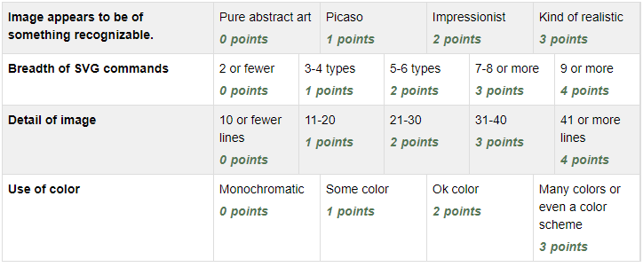

Assignment 11 - SVG
===================

Create an a web page with an embedded SVG drawing. The drawing must be:

* Generated by hand. Do **not** use Illustrator or Inkscape or similar.
* A cohesive image. Abstract circles and rectangles won't score well. A house
  is better.
* Use multiple types of SVG drawing commands.
  See `SVG Intro at W3Schools <https://www.w3schools.com/graphics/svg_intro.asp>`_
* Be detailed. A ten-line drawing won't go far in the detail. The rubric category
  for detail is only an estimate. 40 lines of code that only draw a grid of lines
  isn't very complex, despite hitting the line count. Also, I'm only looking
  at the number of lines for the image. Lines for the web page, blank lines,
  comments, don't count.
* Use color.

A common mistake people make when doing this assignment is to not realize you
put the ``<svg>`` around the *entire image*. So, as you are only creating one
image, you should only have one pair of SVG tags. You put all your drawing
commands in between those SVG tags.

Examples
--------

.. raw:: html

  

  <svg width="500" height="500">
  <!-- bow -->
  <g transform="rotate(330 50 20)">
    <ellipse cx="50" cy="40" rx="12" ry="30" stroke="black" stroke-width="1" fill="red"></ellipse>
  </g>
  <g transform="rotate(30 100 50)">
    <ellipse cx="90" cy="40" rx="12" ry="30" stroke="black" stroke-width="1" fill="red"></ellipse>
  </g>
  <circle cx="80" cy="50" r="5" stroke="black" stroke-width="1" fill="red"></circle><!-- arms -->
  <g transform="rotate(120 105 130)">
    <ellipse cx="100" cy="130" rx="10" ry="25" stroke="black" stroke-width="1" fill="#faebd7"></ellipse>
  </g>
  <g transform="rotate(60 70 70)">
    <ellipse cx="100" cy="130" rx="10" ry="25" stroke="black" stroke-width="1" fill="#faebd7"></ellipse>
  </g>
  <!-- dress -->
  <polygon points="55,105 85,105 120,180 30,180" style="fill:pink;stroke:black;stroke-width:2"></polygon>
  <polygon points="45,135 99,135 105,150 42,150" style="fill:black;stroke:black;stroke-width:2"></polygon>
  <g transform="rotate(358 70 80)">
   <!-- head and eyes -->
    <ellipse cx="70" cy="80" rx="40" ry="30" stroke="black" stroke-width="1" fill="#faebd7"></ellipse>
  </g>
  <circle cx="92" cy="75" r="15" stroke="black" stroke-width="1" fill="white"></circle>
  <circle cx="92" cy="75" r="12" fill="pink"></circle>
  <circle cx="92" cy="75" r="10" fill="black"></circle>
  <circle cx="92" cy="75" r="4" stroke="black" stroke-width="1" fill="white"></circle>
  <circle cx="50" cy="75" r="15" stroke="black" stroke-width="1" fill="white"></circle>
  <circle cx="50" cy="75" r="12" fill="pink"></circle>
  <circle cx="50" cy="75" r="10" fill="black"></circle>
  <circle cx="50" cy="75" r="4" stroke="black" stroke-width="1" fill="white"></circle>
  <!-- mouth -->
  <path d="M65,92 a1,1 0 0,0 10,0" stroke="black" fill="transparent"></path>
  <!-- shoes and legs -->
  <ellipse cx="57" cy="210" rx="10" ry="12" stroke="black" stroke-width="1" fill="black"></ellipse>
  <rect x="50" y="180" width="15" height="30" stroke="black" stroke-width="1" fill="#faebd7"></rect>
  <line x1="50" y1="202" x2="65" y2="202" style="stroke:rgb(0,0,0);stroke-width:2"></line>
  <ellipse cx="87.5" cy="210" rx="10" ry="12" stroke="black" stroke-width="1" fill="black"></ellipse>
  <rect x="80" y="180" width="15" height="30" stroke="black" stroke-width="1" fill="#faebd7"></rect>
  <line x1="80" y1="202" x2="95" y2="202" style="stroke:rgb(0,0,0);stroke-width:2"></line>
  <line x1="180" y1="37" x2="315" y2="37" style="stroke:pink;stroke-width:4"></line>
  <polyline points="180,37 203,47 225,37 250,47 270,37 293,47 315,37" style=
  "fill:transparent;stroke:red;stroke-width:2"></polyline>
  <text x="180" y="35" fill="#9f0129" class="my_style">
    Blossom
  </text>
  <text x="200" y="65" fill="#9f0129" class="style">
    Powerpuff Girl
  </text>

  </svg>

	<svg width="720" height="720">
		<defs>
			<radialGradient id="grad1" cx="95%" cy="50%" r="50%" fx="50%" fy="50%">
				<stop offset="0%" style="stop-color:rgb(255,5,5);stop-opacity:0" />
			     <stop offset="100%" style="stop-color:rgb(222,255,5);stop-opacity:1" />
			   </radialGradient>

			<filter id="f1" x="0" y="0" width="200%" height="200%">
		      <feOffset result="offOut" in="SourceGraphic" dx="15" dy="10" />
		      	<feGaussianBlur result="blurOut" in="offOut" stdDeviation="15" />
		      <feBlend in="SourceGraphic" in2="blurOut" mode="normal" />
		    </filter>

		    <linearGradient id="grad2" x1="0%" y1="0%" x2="100%" y2="0%">
		      <stop offset="0%" style="stop-color:rgb(0,0,255);stop-opacity:1" />
		      <stop offset="100%" style="stop-color:rgb(255,0,0);stop-opacity:1" />
		    </linearGradient>
		</defs>

		<!--Background Box-->
		<rect width="720" height="720" style="fill:rgb(0,0,0); stroke-width:3;stroke:rgb(0,0,0)"/>

		<!--Top half-->
		<!--Top Border-->
		<line stroke-linecap="round" stroke-width="2" stroke="red" x1="2" y1="20" x2="718" y2="20" />
		<path stroke-linecap="round" stroke-width="2" stroke="red" d="M718 20 L718 300 L620 300" />
		<path stroke-linecap="round" stroke-width="2" stroke="red" d="M2 20 L2 300 L100 300" />

		<!--Horizontal Dividing line-->
		<line stroke-linecap="round" stroke-width="2" stroke="red" x1="2" y1="340" x2="100" y2="340" />
		<line stroke-linecap="round" stroke-width="2" stroke="red" x1="620" y1="340" x2="718" y2="340" />

		<!--Bottom Border-->
		<path stroke-linecap="round" stroke-width="2" stroke="red" d="M2 340 L2 700 L718 700" />
		<line stroke-linecap="round" stroke-width="2" stroke="red" x1="718" y1="700" x2="718" y2="340" />

		<!--Top right corner-->
		<rect x="430" y="50" rx="10" ry="10" width="120" height="60" style="fill:none;stroke:red;stroke-width:3;" />
		<rect x="610" y="50" rx="10" ry="10" width="80" height="60" style="fill:none;stroke:red;stroke-width:3;" />
		<rect x="610" y="160" rx="10" ry="10" width="80" height="30" style="fill:none;stroke:red;stroke-width:3;" />
		<rect x="520" y="160" rx="10" ry="10" width="30" height="120" style="fill:black;stroke:red;stroke-width:3;" />

		<!--Top Left corner-->
		<rect x="180" y="50" rx="10" ry="10" width="120" height="60" style="fill:none;stroke:red;stroke-width:3;" />
		<rect x="30" y="50" rx="10" ry="10" width="80" height="60" style="fill:none;stroke:red;stroke-width:3;" />
		<rect x="30" y="160" rx="10" ry="10" width="80" height="30" style="fill:none;stroke:red;stroke-width:3;" />
		<rect x="180" y="160" rx="10" ry="10" width="30" height="120" style="fill:black;stroke:red;stroke-width:3;" />

		<!--Top mid block-->
		<rect x="350" y="160" rx="10" ry="10" width="30" height="120" style="fill:black;stroke:red;stroke-width:3;" />
		<rect x="270" y="160" rx="10" ry="10" width="180" height="30" style="fill:black;stroke:red;stroke-width:3;" />

		<!--Bottom Half-->
		<!--Left-->
		<rect x="230" y="500" rx="10" ry="10" width="260" height="30" style="fill:black;stroke:red;stroke-width:3;" />
		<rect x="40" y="440" rx="10" ry="10" width="120" height="30" style="fill:black;stroke:red;stroke-width:3;" />
		<rect x="40" y="610" rx="10" ry="10" width="120" height="30" style="fill:black;stroke:red;stroke-width:3;" />
		<rect x="40" y="380" rx="10" ry="10" width="30" height="260" style="fill:black;stroke:red;stroke-width:3;" />

		<!--Right-->
		<rect x="550" y="440" rx="10" ry="10" width="120" height="30" style="fill:black;stroke:red;stroke-width:3;" />
		<rect x="550" y="610" rx="10" ry="10" width="120" height="30" style="fill:black;stroke:red;stroke-width:3;" />
		<rect x="640" y="380" rx="10" ry="10" width="30" height="260" style="fill:black;stroke:red;stroke-width:3;" />

		<!--Middle-->
		<rect x="340" y="580" rx="10" ry="10" width="30" height="120" style="fill:black;stroke:red;stroke-width:3;" />

		<!--Enemies-->
		<polygon points="280,370 290,350 310,370 300,390 280,390 280,370 " style="fill:url(#grad2);stroke:blue;stroke-width:3;" />
		<ellipse cx="390" cy="380" rx="20" ry="30" style="fill:purple;stroke:red;stroke-width:3;" />

		<!--Pacman Look alike-->
		<circle cx="360" cy="460" r="30" fill="url(#grad1)" filter="url(#f1)" />

		<text x="2" y="718" fill="red">Score:000</text>
		<text x="660" y="718" fill="red">Lives:3</text>
		<!--Middle Box-->
		<polyline points="340,340 230,340 230,420 500,420 500,340 390,340" style="fill:none;stroke:red;stroke-width:3; /">

		<!--Mid Point-->
		<polyline points="350,20 350,76 360,80 370,76 370,20" style="fill:none;stroke:red;stroke-width:3;">

	</svg>

	<svg width="1000" height="1000">

	<!-- I use these types of commands: rect,circle,polygon,line,ellipse,text,path,polyline,radical gradiant shading (I couldnt find another "shape")
		<!--background-->
		 <rect x="0" y="0" width="1000" height="390" style="fill:rgb(137,209,241);" />
		 <rect x="0" y="390" width="1000" height="10" style="fill:rgb(56,164,76);" />
		 <circle cx="50" cy="50" r="60" stroke="None" stroke-width="4" fill="yellow" />

		<!--house-->
		 <rect x="200" y="200" width="200" height="200" style="fill:rgb(139,69,19);stroke-width:1;stroke:rgb(0,0,0)" />
		 <polygon points="300,50 400,200 200,200" style="fill:rgb(105,105,0)stroke:purple;stroke-width:1" />
		 <rect x="230" y="270" width="50" height="50" style="fill:rgb(255,255,255);stroke-width:3;stroke:rgb(0,0,0)" />
		 <line x1="255" y1="270" x2="255" y2="320" style="stroke:rgb(0,0,0);stroke-width:3" />
		 <line x1="230" y1="295" x2="280" y2="295" style="stroke:rgb(0,0,0);stroke-width:3" />
		 <rect x="300" y="250" width="80" height="150" style="fill:rgb(98,49,17);" />
		 <circle cx="315" cy="330" r="5" stroke="None" stroke-width="4" fill="black" />

		 <!--Person-->
		 <circle cx="500" cy="250" r="30" stroke="None" stroke-width="4" fill="white" />
		 <line x1="500" y1="280" x2="500" y2="350" style="stroke:rgb(0,0,0);stroke-width:3" />
		 <line x1="500" y1="350" x2="470" y2="400" style="stroke:rgb(0,0,0);stroke-width:3" />
		 <line x1="500" y1="350" x2="530" y2="400" style="stroke:rgb(0,0,0);stroke-width:3" />
		 <line x1="480" y1="310" x2="530" y2="310" style="stroke:rgb(0,0,0);stroke-width:3" />
		 <line x1="480" y1="310" x2="470" y2="300" style="stroke:rgb(0,0,0);stroke-width:3" />
		 <circle cx="470" cy="300" r="5" stroke="None" stroke-width="4" fill="yellow" />
		 <circle cx="487" cy="245" r="4" stroke="None" stroke-width="4" fill="black" />
		 <circle cx="510" cy="245" r="4" stroke="None" stroke-width="4" fill="black" />
		 <polyline points="485,255 490,265 510,265 515,255" style="fill:none;stroke:black;stroke-width:3" />

		 <!--dog-->
		 <circle cx="650" cy="330" r="20" stroke="None" stroke-width="4" style="fill:rgb(99,37,14)"/>
		 <ellipse cx="690" cy="350" rx="40" ry="20" style="fill:rgb(99,37,14);" />
		 <line x1="670" y1="365" x2="670" y2="400" style="stroke:rgb(0,0,0);stroke-width:4" />
		 <line x1="710" y1="365" x2="710" y2="400" style="stroke:rgb(0,0,0);stroke-width:4" />
		 <line x1="650" y1="335" x2="630" y2="335" style="stroke:rgb(0,0,0);stroke-width:3" />
		 <circle cx="645" cy="325" r="5" stroke="None" stroke-width="4" fill="black" />
		 <rect x="720" y="340" width="20" height="7" style="fill:rgb(99,37,14);" />
		 <text x="600" y="300" fill="black">BARK!</text>
		 <text x="625" y="280" fill="black">BARK!</text>

		 <!--dog house-->
		 <rect x="850" y="320" width="80" height="80" style="fill:rgb(139,69,19);stroke-width:1;stroke:rgb(0,0,0)" />
		 <path d="M850 320 L930 320 L890 275 Z" />
		 <rect x="860" y="340" width="60" height="60" style="fill:rgb(0,0,0);stroke-width:1;stroke:rgb(0,0,0)" />

		 <!--clouds-->
		 <defs>
			<radialGradient id="grad1" cx="50%" cy="50%" r="50%" fx="50%" fy="50%">
			  <stop offset="0%" style="stop-color:rgb(255,255,255);
			  stop-opacity:0" />
			  <stop offset="100%" style="stop-color:rgb(0,191,255);stop-opacity:1" />
			</radialGradient>
		</defs>
		<ellipse cx="500" cy="70" rx="85" ry="55" fill="url(#grad1)" />
		<ellipse cx="900" cy="70" rx="85" ry="55" fill="url(#grad1)" />
		<ellipse cx="700" cy="120" rx="85" ry="55" fill="url(#grad1)" />

	</svg>

    <svg width="600" height="500">
        <rect x="0" y="0" width="600" height="500" style="fill:rgb(153,204,255)" />
        <rect x="0" y="350" width="600" height="500" style="fill:rgb(51,255,51)" />
        <rect x="200" y="200" width="150" height="150" style="fill:rgb(102,51,0);stroke:rgb(0,0,0);stroke-width;2" />
        <rect x="210" y="225" width="100" height="30" style="fill:rgb(255,255,255);stroke:rgb(0,0,0);stroke-width;1" />
        <polygon points="275,70 353,200 197,200" style="fill:black;stroke:black;stroke-width;1" />
        <rect x="260" y="280" width="50" height="70" style="fill:rgb(51,25,0);stroke:rgb(0,0,0);stroke-width;1" />
        <circle cx="270" cy="315" r="5" stroke="black" stroke-width="1" fill="black" />
        <circle cx="400" cy="335" r="15" stroke="black" stroke-width="1" fill="rgb(153,204,255)" />
        <circle cx="445" cy="335" r="15" stroke="black" stroke-width="1" fill="rgb(153,204,255)" />
        <defs>
            <filter id="f1" x="0" y="0">
                <feGaussianBlur in="SourceGraphic" stdDeviation="15" />
            </filter>
        </defs>
        <circle cx="25" cy="25" r="40" fill="yellow" filter="url(#f1)" />
        <defs>
            <linearGradient id="grad1" x1="0%" y1="0%" x2="100%" y2="0%">
                <stop offset="0%" style="stop-color:rgb(255,255,0);stop-opacity:1" />
                <stop offset="100%" style="stop-color:rgb(255,0,0);stop-opacity:1" />
            </linearGradient>
        </defs>
        <defs>
            <filter id="f2" x="0" y="0" width="200%" height="200%">
               <feOffset result="offOut" in="SourceAlpha" dx="10" dy="5" />
               <feGaussianBlur result="blurOut" in="offOut" stdDeviation="10" />
               <feBlend in="SourceGraphic" in2="blurOut" mode="normal" />
            </filter>
        </defs>
        <circle cx="425" cy="395" r="20" fill="url(#grad1)" filter="url(#f2)" />
        <rect x="95" y="400" width="25" height="50" style="fill:rgb(102,51,0);stroke:rgb(0,0,0);stroke-width;2" />
        <path d="M110 210 L45 405 L175 405 Z" style="fill:rgb(10,92,10)" />
        <line x1="257" y1="415" x2="257" y2="435" style="stroke:rgb(0,0,0);stroke-width:2" />
        <rect x="235" y="400" width="45" height="25" style="fill:rgb(102,51,0);stroke:rgb(0,0,0);stroke-width;2" />
        
        <text x="237" y="415" fill="black" class="my_style">Welcome!</text>
        <line x1="310" y1="235" x2="210" y2="235" style="stroke:rgb(0,0,0);stroke-width:2" />
        <line x1="310" y1="245" x2="210" y2="245" style="stroke:rgb(0,0,0);stroke-width:2" />
        <line x1="230" y1="225" x2="230" y2="256" style="stroke:rgb(0,0,0);stroke-width:2" />
        <line x1="260" y1="225" x2="260" y2="256" style="stroke:rgb(0,0,0);stroke-width:2" />
        <line x1="290" y1="225" x2="290" y2="256" style="stroke:rgb(0,0,0);stroke-width:2" />
        <line x1="410" y1="310" x2="440" y2="310" style="stroke:rgb(0,0,0);stroke-width:2" />
        <line x1="445" y1="335" x2="440" y2="310" style="stroke:rgb(0,0,0);stroke-width:2" />
        <line x1="400" y1="335" x2="410" y2="310" style="stroke:rgb(0,0,0);stroke-width:2" />
        <line x1="405" y1="300" x2="420" y2="300" style="stroke:rgb(0,0,0);stroke-width:2" />
        <line x1="410" y1="310" x2="410" y2="300" style="stroke:rgb(0,0,0);stroke-width:2" />
        <line x1="440" y1="310" x2="440" y2="300" style="stroke:rgb(0,0,0);stroke-width:2" />
        <line x1="440" y1="300" x2="445" y2="297" style="stroke:rgb(0,0,0);stroke-width:2" />
    </svg>

    <svg width="700" height="700">

    <rect width="700" height="700" fill="tan"/>
    <rect width="700" height="350" fill="aliceblue"/>

    //cat

    //tail

  <g transform = "rotate(40 454 417)">
  <ellipse cx="450" cy="390" rx="8" ry="54"
  style="fill:gray;stroke:black;stroke-width:2" />
  </g>

     //body
        <g transform = "rotate(90 130 105)">
      <ellipse cx="400" cy="-165" rx="80" ry="50"
  style="fill:gray;stroke:black;stroke-width:2" />
 </g>

  //ears
  //left
  <polygon points="369,237 385,200 400,230" style="fill:gray;stroke:black;stroke-width:2" />
  //right
  <polygon points="403,237 419,200 434,243" style="fill:gray;stroke:black;stroke-width:2" />

   //head
      <circle cx="400" cy="265" r="40" stroke="black" stroke-width="2" fill="gray" />

   //eyes
   // left
    <circle cx="385" cy="255" r="10" stroke="black" stroke-width="2" fill="green" />

   //right
   <circle cx="415" cy="255" r="10" stroke="black" stroke-width="2" fill="green" />

   //left pupil
   <line x1="385" y1="251" x2="385" y2="259" style="stroke:rgb(0,0,0);stroke-width:3" />

   //right pupil
   <line x1="415" y1="251" x2="415" y2="259" style="stroke:rgb(0,0,0);stroke-width:3" />

   //nose
   <polygon points="395,268 400,278 405,268" style="fill:pink;stroke:black;stroke-width:2" />

   //mouth
   //line down
   <line x1="400" y1="278" x2="400" y2="286" style="stroke:rgb(0,0,0);stroke-width:1" />

   //smile
    <line x1="385" y1="286" x2="415" y2="286" style="stroke:rgb(0,0,0);stroke-width:1" />

  //paw
  //left
  <ellipse cx="365" cy="450" rx="24" ry="15"
  style="fill:gray;stroke:black;stroke-width:2" />

  //right
  //left
  <ellipse cx="435" cy="450" rx="24" ry="15"
  style="fill:gray;stroke:black;stroke-width:2" />

  //leg
  //left
  <line x1="389" y1="455" x2="389" y2="360" style="stroke:rgb(0,0,0);stroke-width:2" />
  //right
  <line x1="411" y1="455" x2="411" y2="360" style="stroke:rgb(0,0,0);stroke-width:2" />

  //bow
   //bottom left
  <g transform = "rotate(135 392 315)">
  <rect x="380" y="310" width="30" height="10" stroke="black" stroke-width="2" fill="crimson" />

  </g>
  //bottom right
  <g transform = "rotate(45 392 315)">
  <rect x="393" y="297" width="30" height="10" stroke="black" stroke-width="2" fill="crimson" />
  </g>
  //left side
  <g transform = "rotate(45 392 315)">
  <ellipse cx="380" cy="310" rx="17" ry="8"
  style="fill:crimson;stroke:black;stroke-width:2" />
  </g>
  //right side
  <g transform = "rotate(135 392 315)">
  <ellipse cx="370" cy="310" rx="17" ry="8"
  style="fill:crimson;stroke:black;stroke-width:2" />
  </g>

  //middle
  <circle cx="400" cy="310" r="8" stroke="black" stroke-width="2" fill="crimson" />

  //christmas tree
  //trunk
  <rect x="80" y="400" width="70" height="50" style="fill:rgb(139,69,19);stroke-width:2;stroke:rgb(0,0,0)" />
  //bottom layer
  <polygon points="0,420 120,290 240,420" style="fill:green;stroke:black;stroke-width:2" />
  //2 layer
  <polygon points="20,375 120,265 220,375" style="fill:green;stroke:black;stroke-width:2" />
  //3 layer
  <polygon points="40,330 120,220 200,330" style="fill:green;stroke:black;stroke-width:2" />
  //4 layer
  <polygon points="60,285 120,175 180,285" style="fill:green;stroke:black;stroke-width:2" />
  //top layer
  <polygon points="75,240 120,150 165,240" style="fill:green;stroke:black;stroke-width:2" />

  //star
  //center
  //bottom right
  <g transform = "rotate(45 123 117)">
  <rect x="133" y="130" width="12" height="12" stroke="black" stroke-width="0" fill="yellow" />
  </g>

  // top point
  <polygon points="116,134 121,114 126,134" style="fill:yellow;stroke:black;stroke-width:1" />

  //top right point
  <g transform = "rotate(45 120 110)">
  <polygon points="139,126 144,106 149,126" style="fill:yellow;stroke:black;stroke-width:1" />
  </g>

  //top left point
  <g transform = "rotate(315 120 110)">
  <polygon points="93,127 98,107 103,127" style="fill:yellow;stroke:black;stroke-width:1" />
  </g>
  //bottom right point
  <g transform = "rotate(135 120 110)">
  <polygon points="137,82 142,62 147,82" style="fill:yellow;stroke:black;stroke-width:1" />
  </g>
   //bottom left point
  <g transform = "rotate(225 120 110)">
  <polygon points="93,82 98,62 103,82" style="fill:yellow;stroke:black;stroke-width:1" />
  </g>

  //ornaments
  <circle cx="115" cy="190" r="7" stroke="black" stroke-width="1" fill="red" />
  <circle cx="137" cy="215" r="7" stroke="black" stroke-width="1" fill="blue" />
  <circle cx="107" cy="220" r="7" stroke="black" stroke-width="1" fill="yellow" />
  <circle cx="120" cy="255" r="7" stroke="black" stroke-width="1" fill="pink" />
  <circle cx="145" cy="265" r="7" stroke="black" stroke-width="1" fill="gold" />
  <circle cx="90" cy="268" r="7" stroke="black" stroke-width="1" fill="lime" />
  <circle cx="130" cy="298" r="7" stroke="black" stroke-width="1" fill="purple" />
  <circle cx="160" cy="316" r="7" stroke="black" stroke-width="1" fill="red" />
  <circle cx="70" cy="320" r="7" stroke="black" stroke-width="1" fill="pink" />
  <circle cx="105" cy="310" r="7" stroke="black" stroke-width="1" fill="orange" />
  <circle cx="140" cy="350" r="7" stroke="black" stroke-width="1" fill="gold" />
  <circle cx="175" cy="360" r="7" stroke="black" stroke-width="1" fill="lime" />
  <circle cx="105" cy="360" r="7" stroke="black" stroke-width="1" fill="blue" />
  <circle cx="65" cy="355" r="7" stroke="black" stroke-width="1" fill="red" />
  <circle cx="160" cy="390" r="7" stroke="black" stroke-width="1" fill="pink" />
  <circle cx="200" cy="405" r="7" stroke="black" stroke-width="1" fill="orange" />
  <circle cx="40" cy="400" r="7" stroke="black" stroke-width="1" fill="blue" />
    <circle cx="80" cy="390" r="7" stroke="black" stroke-width="1" fill="purple" />
      <circle cx="120" cy="402" r="7" stroke="black" stroke-width="1" fill="yellow" />

    </svg>
