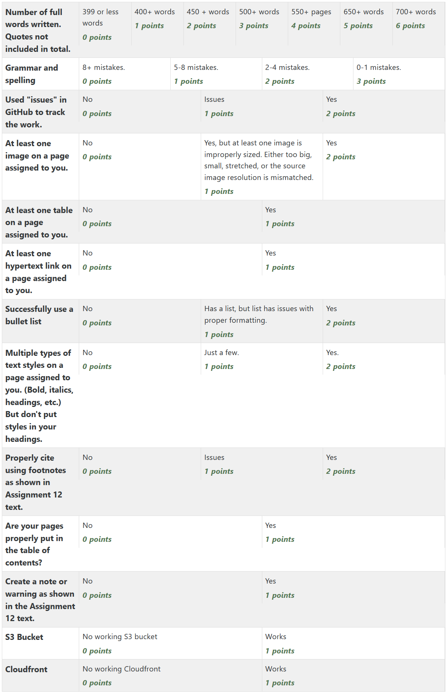

Assignment 12 - Static Content Generators
=========================================

This will be a group project. However, grades will be individual.

Restructured Text Reference: https://www.sphinx-doc.org/en/master/usage/restructuredtext/basics.html

Getting Started
---------------

Here are the steps to get started:

#. :ref:`install_python_and_sphinx`
#. Select a project
#. Notify the instructor and get invited to the project
#. Accept the invitation.
#. Use the "project" part of your GitHub project to brainstorm ideas
#. Select two pages to create
#. Clone the project
#. Make sure you can build the project
#. Write your pages (at least 300 words each)

Projects
--------

Video Game Reviews

* GitHub Website: https://github.com/pvcraven/2020-video-game-reviews
* Accept Invite: https://github.com/pvcraven/2020-video-game-reviews/invitations
* Clone on your computer: ``git clone https://github.com/pvcraven/2020-video-game-reviews.git``

Movie Reviews

* GitHub Website: https://github.com/pvcraven/2020-movie-reviews
* Accept Invite: https://github.com/pvcraven/2020-movie-reviews/invitations
* Clone on your computer: ``git clone https://github.com/pvcraven/2020-movie-reviews.git``

Destinations in and Around Indianola

* GitHub Website: https://github.com/pvcraven/2020-destinations
* Accept Invite: https://github.com/pvcraven/2020-destinations/invitations
* Clone on your computer: ``git clone https://github.com/pvcraven/2020-destinations.git``

Common Internet Scams

* GitHub Website: https://github.com/pvcraven/2020-scams
* Accept Invite: https://github.com/pvcraven/2020-scams/invitations
* Clone on your computer: ``git clone https://github.com/pvcraven/2020-scams.git``

Make The Web Pages
------------------

Create web pages that have:

* `Paragraphs <https://www.sphinx-doc.org/en/master/usage/restructuredtext/basics.html#paragraphs>`_. Don't give me a wall of text.
* `Headings <https://www.sphinx-doc.org/en/master/usage/restructuredtext/basics.html#sections>`_.
  Take a look at the outline generated when you create a document.
  Each page should have one, and only one, level one heading. A page that doesn't
  have any headings might not show up. A page with multiple top-level headings
  will have each top-level heading show up like they are different pages. Be
  very deliberate about your heading choices.
* `Images <https://www.sphinx-doc.org/en/master/usage/restructuredtext/basics.html#images>`_.
  and/or `figures <https://thomas-cokelaer.info/tutorials/sphinx/rest_syntax.html#images-and-figures>`_.
  Properly sized images. Do not squish a 4000 x 3000 pixel photo you took
  into a 400x300 spot. Change the image. You'll make a faster web page and save
  everyone money on bandwidth. Also, keep aspect ratios. Don't specify both
  width and height at a different ratio that stretches the image. I just specify
  width only and let the browser pick the right height.
* Cite an image that you use that is not your own. See :ref:`citations` below. Find the original
  source. Don't cite IMDB or Google Images for a movie poster, cite the studio
  that made it.
* `Tables <https://www.sphinx-doc.org/en/master/usage/restructuredtext/basics.html#tables>`_
* `Links outside the document <https://www.sphinx-doc.org/en/master/usage/restructuredtext/basics.html#hyperlinks>`_
* Links inside the document (references)
* Update the table of contents with your pages
* `Multiple types of in-line styles <https://www.sphinx-doc.org/en/master/usage/restructuredtext/basics.html#inline-markup>`_.
  But don't change the style in a heading!
* Don't copy/paste curly quotes from a word processor
  into your text. Use straight quotes.
* Name your pages and directories according to their content. This helps their
  ranking in Google, as well as helping you keep things straight.
  So, for example, ``xbox_360.rst`` is a much better name for a page about the
  XBox 360 than a page named ``page4.rst``.
* Try adding a `note or warnings <https://sublime-and-sphinx-guide.readthedocs.io/en/latest/notes_warnings.html>`_.
* When you've deployed to S3 and CloudFront, check and make sure your images
  work and your links. Amazon cares about the case of your file names, and if
  you've ignored my advice at making everything lower case, it may haunt you
  here.

Tip
~~~

Avoid using 'bold' on headings, as they are already styled. Don't do this:

.. code-block:: text

    **My Heading**
    --------------

.. _citations:

Citations
^^^^^^^^^

To cite an image or information from an external source, you may
use Restructured Text's
`footnote <http://www.sphinx-doc.org/en/master/usage/restructuredtext/basics.html#footnotes>`_.
Use the footnote directly in the text where the information comes from,
or as a caption an the image if you are using an image. For example:

   Inez Milholland [#f1]_

The code for this looks like:

.. code-block:: text

    .. figure:: milholland.jpg
       :width: 300px

       Inez Milholland [#f1]_

The rest of the text of your page would go here under your image.
Then finally at the end of the page,
you can list out your footnotes:

.. [#f1] "`Inez Milholland <http://vcencyclopedia.vassar.edu/alumni/inez-milholland.html>`_". Vassar College Encyclopedia. 2006. Retrieved 2012-07-21.

And the code for that looks like:

.. code-block:: text

    .. [#f1] "`Inez Milholland <http://vcencyclopedia.vassar.edu/alumni/inez-milholland.html>`_". Vassar College Encyclopedia. 2006. Retrieved 2012-07-21.

Alternatively, you can use
Restructured Text's
`references <http://www.sphinx-doc.org/en/master/usage/restructuredtext/roles.html#ref-role>`_
directive
to link a citation, and at the end of the document format the citation using
`APA style <https://pitt.libguides.com/c.php?g=12108&p=64730>`_.

Cite the *original* source. If you cite something like Google, Amazon, Wikipedia,
or IMDB I'll not give any points. These companies rarely create content. You might find the
image or information with their tools, but then use some detective work to find the
original source. For example, a movie poster might be on IMDB.com, but
the original source might really be Warner Brothers.

Also, you might find yourself wanting to list a website as a source. Remember that
the source isn't "wsj.com", the source is "Wall Street Journal." Sometimes the
"about" page has this information. If you can't figure out who the publisher is,
it probably isn't a good source.

If using an auto-citation formatter, beware of "n.p." for no publisher and "n.d." for
no date. If I see a publisher immediately followed by "n.p.", it indicates that not
much thought was put into the citation. If you can't figure out the entire date,
at least try to narrow it down to the month or year.

I don't want to see the text of a URL, but please do use a link to reference the original source
as shown in the example above.

Remember: A list of URLs is never ok for a bibliography.

Teamwork
--------

If no one else is taking a lead in the project, don't hesitate to step up and do
it yourself. If someone else is leading, step up and lead your own part of the
project.

It is not unusual for team members to fail and hold up their end of the project.
This is a great time to practice your ability to encourage others to engage.
Send people a reminder outside of class. But don't be a jerk about it, as we
never really know what is going on with someone else's life. Help pull someone
up. Never push someone down.

Get as much work done outside of class as you can. It is disrespectful to your
teammates if they come to class with a draft of their work, and you are busy
trying to just get started writing it.

Turn In
-------

Clearly label and turn in the following links.

By saying "Cloud/S3/Github URL" I mean that I prefer the cloud URL. If you
can't get that working give me the S3 URL. If you can't get that working, get
me the GitHub URL.

* Link to the GitHub project page.
  This should be the same for every person in the group.
* Link to each GitHub page that you created.
  Do not link pages that show someone else checking in this page.
  Please link to the source file, not the commit.
* GitHub URLs of GitHub issues you worked on.
* Cloud/S3/or GitHub URL of your page with a working image
* Cloud/S3/or GitHub URL of your page with a table
* Cloud/S3/or GitHub URL of your page with a link
* Cloud/S3/or GitHub URL of your page with a bullet list
* Cloud/S3/or GitHub URL of your page with a multiple styles
* Link to your group's S3 bucket website
* Link to your group's Cloud page

Rubric
------

.. warning::
    This rubric will be updated soon.

Important End of Term Reminder
==============================

After grades are posted for this class, remember to:

* Stop your EC2 web server. You can terminate it (make it go away) or just
  stop it.
* Remove your S3 bucket.
* Remove your CloudFront link.

Or, just terminate your account once everything is graded. Please don't terminate
it before I grade your projects.

This will help make sure that you don't get any unexpected fees charged to your
credit card.
