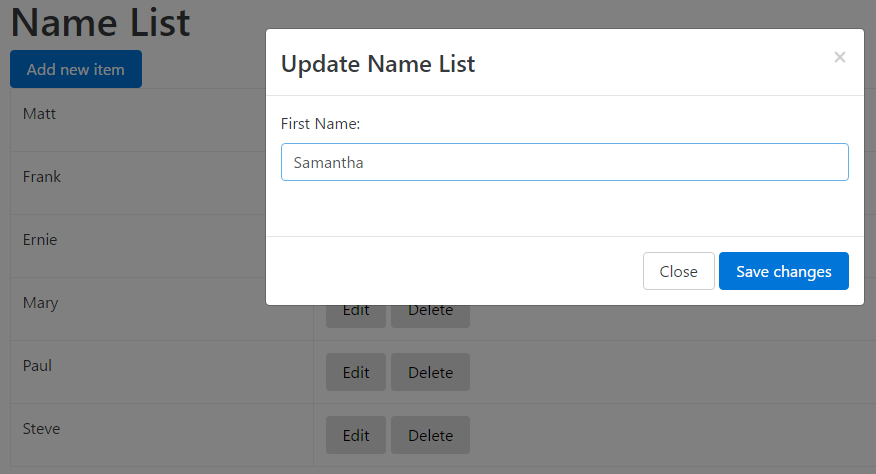
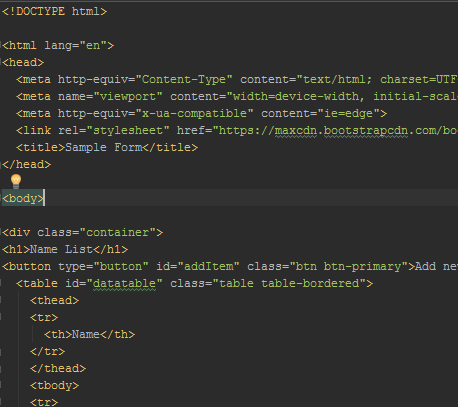
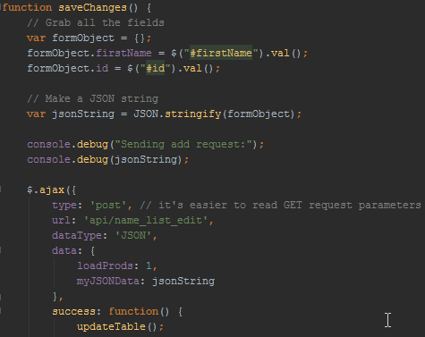
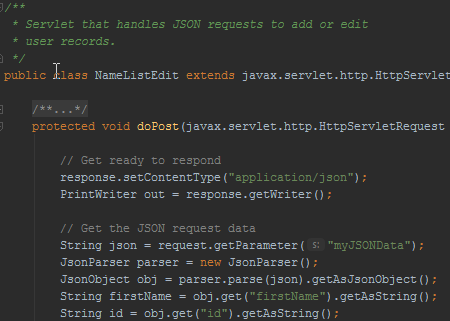
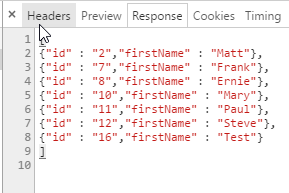
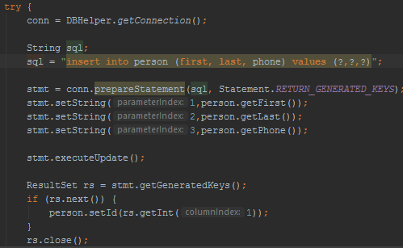
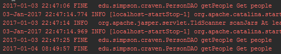
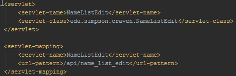

CRUD Application Overview
=========================

In the first semester of this course, we covered HTML and CSS. We covered
systems to manage the HTML and CSS (a Content Management
System and a Static Content Generator). In addition we covered version control
and systems management.

One bit of feedback I got on that course was that rather than learning one
technology, we kept learning lots of little technologies. Each of our
initial courses use just one technology (Java, Python, SQL, etc.)
Why do we keep skipping around to different technologies with the web?
Turns out, that's the mess that is web development.

Second semester will have even more technologies to learn.

Our first goal in this class is to learn how to create a modern web application
that can Create records, Read records, Update records, and Delete records. The
acronym for these types of applications is "CRUD," Create, Read, Update, Delete.
Great acronym, right?

Our second goal is to add login and session management to our application.

Let's take a quick overview of what technologies we'll need to learn to get
there so you can see how everything will fit together.

Content - HTML
--------------

The content of our website (the form fields, the text, the table for our
records, etc.) is stored in HTML. By this point, you should already be \
comfortable with HTML.

Look and Feel - CSS
-------------------

The positioning, style, and look are all covered by CSS. For the this CRUD
application we'll use Bootstrap, which will shorten our development time so
we don't have to write our own CSS.

We can do some pretty cool things with Bootstrap and CSS to make our application
look great. We'll use Bootstrap to format our table of records. We'll also
hide a pop up box that we'll have our form that we use to add and edit
records.

Front-End Logic - JavaScript
----------------------------

The front-end is everything that runs on the user's web browser. The back-end
is everything that runs on the web server the user connects to.

The front-end will gather up the form fields, and interact with the user by writing code
using the language called JavaScript. Confusingly, JavaScript is totally different than the
language called Java. JavaScript runs on the
user's machine by the user's web browser. (In addition to front-end, JavaScript
can run on the back-end by using projects like Node.js.)

Front-end JavaScript doesn't add or delete the records, because the records exist on the
back-end server and JavaScript runs on the user's front-end web browser. Totally
different computers. But JavaScript gets
things ready to send to the server and helps with the user interface (UI).

But JavaScript by itself is kind of a pain. We'll use several JavaScript
libraries, most notably jQuery. So we'll have libraries to learn. There are
some incredibly cool JavaScript libraries out there that do amazing things, way beyond
CRUD applications.

JavaScript was initially a hack, and it has gone way beyond anything its inventors
initially conceived of.

Back-End Logic - Java
---------------------

What holds all the business logic? What interfaces with the database? What
secures the website? What handles user sessions? The back-end code.

There are three main technologies you can pick for the back-end. The top two
are Java and .NET. Next in popularity is PHP. After those top three, there is
a long list of other technologies.

We'll use Java. The concepts between the technologies are the same, so if you learn to do
things the Java way, there's no reason you can't learn .NET or a different
back-end tool. (Although Node.js is very different than the other technologies.)

On the back-end we use a web server. You've likely already worked with a web
server called Apache in your projects. Web servers serve up static (unchanging)
files.

For data that is dynamic and changes, we use an *application server*. An application
server is takes web requests, and figures out what code to pass the request to.
It will then take the codes output, and send it back to the client computer's web
browser.

Application servers can serve static files too. But they usually aren't as
fast at doing that as a web server. The definitely aren't as fast as serving from
a distributed cloud platform. So usually we separate static and dynamic content.

To use Java as a back-end language,
work with a Java Application Server called Tomcat. Tomcat
initially handles the web requests and passes them to little mini Java programs
called *servlets* which we will write.

Front-End / Back-End Glue - JSON
--------------------------------

The "modern" way to package up data and requests for the back-end is to have
JavaScript create a request in a JSON format and send it to the back-end. The
back-end will process it, and send a JSON formatted request back.

There is a totally different "classic" way of doing things. When you fill
out a form, hit submit, and then get a new page back, you are typically doing
things the "classic" way without JSON. It isn't as good as doing things with
JSON, but you'll run into a lot of older code and older programmers who still
write things this way.

Back-End / Database Glue - SQL
------------------------------

Database interaction is done using SQL. By the time you take this class, you
should have already taken a class on SQL. We need to learn how to put data
into SQL statements with Java, how to get it out, and how to manage connections
to a database when multiple people are accessing it at the same time.

We do this by creating "Data Access Objects" (DAO) that can take a simple class like
"Person" and save it in a table database table called "Person".

This DAO code is so common that there are many tools to help automate its
creation. To begin with, we'll create it by hand. Automatically generated code
tends to be slower, and the setup is complex. For small projects it is often
easier to hand-code it.

Data Validation - Regular Expressions
-------------------------------------

How do you know that the user entered a valid name? A valid phone number?
We do data validation with regular expressions. Few things in the computer
science world are as useful and as indecipherable as regular expressions.

For example, to match a U.S. phone number, we might use: ``^[1-9]\d{2}-\d{3}-\d{4}$``

Data Handling - Encoding
------------------------

When we move data into and out of different formats, we need to be careful about
"special" characters. For example, when we print a double quote in Python (or
many other languages) we have to escape it with a backslash. For example::

	print("Bob says \"Hi!\"")

We need to learn how to do this when using the following:

* HTML
* JSON
* SQL
* URL

Yes, and each of those encode special characters differently. In addition, we
need to learn how to encode files with:

* File encoding UTF-8
* Base64 encoding
* MIME encoding

Version Management - Git and more
---------------------------------

Version management, managing issues, working with multiple developers, all of
this is done with version management tools. We've done this using Git, GitHub,
and SourceTree.

Logging - JULI
--------------

Have you ever debugged an application by using ``print`` statements? Where
you print out variable values, and just a "hi, I got to this point in the
program"?

This is a great way to debug. Particularly which a server environment
where you might not be watching the user, but want to know what happened.
But with a server we need something better than print statements. We need
the ability to send alerts. Turn off errors. Save things in files. List the
line number of the log message. List the user that was logged in. We can do
this with a logging framework. We'll use ``java.util.logging``, or JULI for short.

Testing - JUnit
---------------

With this many parts, it is easy to break something. Most modern web applications
use a testing framework. Every time you check in new code, the tests automatically
run. They make sure the application still works. If something breaks we know
right away.

Writing tests with code is also a philosophy that can lead to more solid code.
Rather than just assume that a user will enter a name like ``Paul`` we can
write tests to give the correct response for an empty name, a name like
``@#$()#$@()*``, or a name that's 5,000 characters long. Writing tests forces
us to do more than just code for the "happy-path."

Configuration - XML and Property Files
--------------------------------------

How do we map a call to ``/api/add_person`` to a class called
``edu.simpson.myapp.AddPersonServlet``? How do we specify the database,
database user, and password? We need property files and XML files to list
these.

Packaging and Deployment - WAR, EAR, Maven
------------------------------------------

Wow. That's a lot of files and a lot of parts. How do we put all of these
parts together? We can put those parts into a zipped up file called a WAR
file, or EAR file. We can use our IDE to create these, or a better tool like
Maven.

Development Environment - IntelliJ
----------------------------------

How do we quickly assemble all these parts, build them, and test them? We'll
use a development environment. In this case, we'll use IntelliJ. Eclipse is also
popular, and Microsoft has a very good development environment for .NET apps.

Some people prefer not using an IDE. With the right setup of build tools,
you can develop fast and not worry about options that are buried in the UI of a
IDE.

Summary
-------

From top to bottom we have:

* Web Browser (Chrome)
* HTML
* CSS
* JavaScript
* JSON
* Java Application Server (Tomcat)
* Java Servlets
* Java Data Access Objects (DAO)
* SQL
* Database (MySQL)

To manage this, we have an IDE, configuration files, and more.