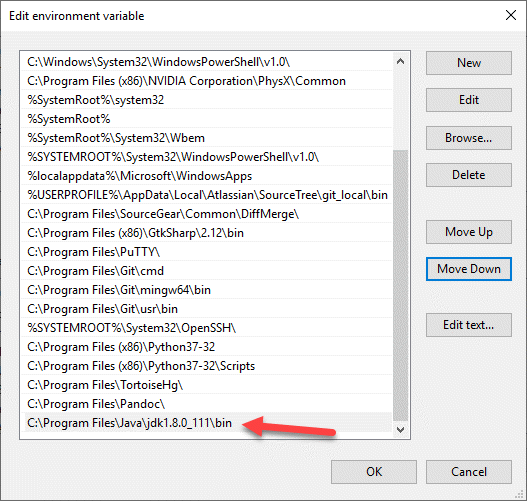
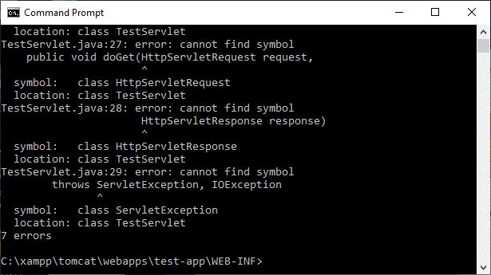
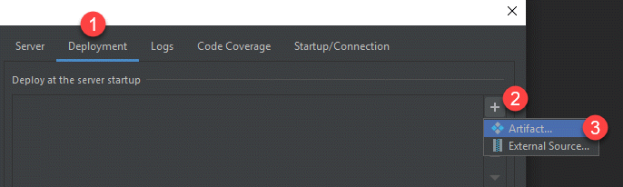
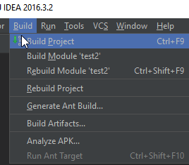

.. _java-environment-tutorial:

Local Java Servlet Development Environment Setup
================================================

Install Java
------------

Download and install Java_. You want to download the "Standard Edition" (SE).
There is also a "Java Runtime Environment" (JRE). This doesn't let you compile
``.java`` files to ``.class``. So don't download that one. The SE will install
both a Java Development Kit (JDK) and a Java Runtime Environment (JRE). We
really only care about the JDK.

.. note::
    If you already have Java installed, it may be in a path that looks something
    like:
    ``C:\Program Files\Java\jdk1.8.0_111``

.. _Java: http://www.oracle.com/technetwork/java/javase/downloads/jdk8-downloads-2133151.html

Install XAMPP
-------------

Download and install XAMPP_ for Windows, Mac, or Linux.
XAMPP includes several programs, along with an easy-to-use control panel.
XAMPP has our MySQL database and Tomcat program. We probably won't use Apache
like we did last semester.

.. note::
    If you are using a lab computer, XAMPP is already installed in
    ``C:\xampp``

.. _XAMPP: https://www.apachefriends.org/index.html

Get a Sample Tomcat Application Working
---------------------------------------

We will normally create and run our application from inside an IDE which will make
development a lot easier that what we are about to go through below.

**But** you should run through this tutorial and be aware of the
nuts and bolts on how deploying and application works.
Otherwise, when things break, you don't have the skills to fix it.

Get the server running
^^^^^^^^^^^^^^^^^^^^^^

Open up the XAMPP control panel and start Tomcat. It takes a while to start.
There's a background window called ``catalina_start.bat`` you can watch if you
get bored.

Then go to the following
address to see if it works::

    http://localhost:8080

Note that Tomcat serves from port 8080 instead of the default web port of 80.
This keeps it from getting confused with Apache. There's a lot more I could
say about  this, but for now, just remember to go to ``http://localhost:8080``
instead of ``http://localhost``.

You should see something like this:

.. image:: tomcat_running.png
    :width: 400px

Serving static files
^^^^^^^^^^^^^^^^^^^^

* Ok, if it is running, let's create an app. Create a new directory under the
  ``webapps`` folder in Tomcat. Depending on where you installed XAMPP, you might
  find it in ``C:\xampp\tomcat\webapps``.
  Keep the directory name lower case and don't use spaces. Like
  ``test-app``.

* Create a test html file in that folder. I created ``webapps\test-app\test.html``
* Enter some HTML, or just something like ``Hi There`` so you know it is working.
* Go to ``http://localhost:8080/test-app/test.html`` and you should be able to
  see the static file you created. This is where your static images, css, and
  other files that don't change go.

Creating a "Hello World" servlet
^^^^^^^^^^^^^^^^^^^^^^^^^^^^^^^^

* Create a ``WEB-INF`` folder in the ``test-app`` folder. Case matters.
* Create a ``classes`` folder in the ``WEB-INF`` folder.
* Inside the ``WEB-INF`` folder make your Servlet.
  Call the file ``TestServlet.java``.
  Don't put it in  the
  ``classes`` folder, but in the ``WEB-INF`` folder. Here's a sample:

.. literalinclude:: TestServlet.java
    :linenos:
    :language: java

* Great. We've put in the code for the servlet, but we haven't told the computer
  what URL maps to what Java Servlet class. To do this,
  inside the ``WEB-INF`` folder create a file named ``web.xml``. Inside of
  ``web.xml`` put the following:

.. literalinclude:: web.xml
    :linenos:
    :language: xml

* Compile the code. You'll probably need something like ``javac TestServlet.java``

* Wait! It can't compile because the computer doesn't know the command ``javac``.
  You have Java installed. Why can't it find it? Because it isn't in the "path."
  The "path" is a list of directories that Windows (or Linux or Mac)
  checks when you type in a command.

* #1 Open a file browser and find where ``javac.exe`` is. For me it was in
  ``C:\Program Files\Java\jdk1.8.0_111\bin``. You may have something different.
  Search and be intelligent about it. Copy the path.
* #2 Open up a file browser, and right-click on "This PC" and select
  "Properties".
* #3 Select "Advanced System Settings".
* #4 Select "Environment Variables".
* #5 Select "Path".
* #6 Select "Edit".
* #7 Add the path we just copied to the end.

* Open a **new** command prompt. The old one still has the old settings.
  Try ``javac TestServlet.java`` again:

* Wait! You need to include a library to compile it. You'll need something like
  ``javac -classpath ..\..\..\lib\servlet-api.jar TestServlet.java``
* Well, darn. It created ``TestServlet.class`` in the current folder. Not the
  ``classes`` subfolder. That won't work. Move the file into that folder.
* Go to XAMPP and stop/start Tomcat
* Try your servlet: ``http://localhost:8080/test-app/test``

Install IntelliJ
----------------

Ok! That was *too much work*. Let's deploy our web applications using an IDE.

Download and install IntelliJ_. If you are on-campus, you can get a faster
download an not kill our outside connection for everyone by downloading from
here:

http://cs.simpson.edu/ideaIU-2018.3.3.exe

(You may get a warning on the download.)

The free version does NOT have the tools we need.
You can get a `student license`_ with an e-mail that ends in ``.edu``.
Please do this.

The default tools are ok when installing.

.. _IntelliJ: https://www.jetbrains.com/idea/#chooseYourEdition
.. _student license: https://www.jetbrains.com/student/

Make a Java Servlet Project
---------------------------

Now you have Java, and an Integrated Development Environment (IDE) installed.
Let's use the IDE to set up our first web project. Select these options. If
you do not have these options, you might have the free community edition. You
need to get the other edition.

.. image:: new_project.png
    :width: 600px
    :align: center

Next, give the project a name. I chose ``CIS 320 First Project``:

.. image:: new_project_name.png

This might open to a confusingly blank window. Hit Alt-1 to open the project view
and explore the project template. You can hit Alt-1 again to hide the window.
Useful when you want more screen real-estate.

.. image:: project_view.png
    :width: 600px
    :align: center

Great, we have a project. How do we see the result? We need to set up Tomcat
to run when we hit the 'run' button. Go ahead and select run:

See that we need to set up a configuration first:

.. image:: run2.png
    :width: 150px
    :align: center

Then go ahead and create a "Tomcat" configuration for "local" and point it to the Tomcat
directory you just installed. Probably something like ``C:\xampp\tomcat``.

.. image:: tomcat_configuration.png
    :width: 600px
    :align: center

Wait! We're not done. One more tab. This should tell us to deploy an "artifact."
An artifact is something created by the build process. It isn't as fun as
artifacts in Indiana Jones. The "WAR" file is a zipped up file (you can unzip
it using a zip program) that has all the static files, images, and classes for
your web application. This one zipped file is easier to manage than all those
different files.

.. note::

	Ok, ``.java``  files compile from Java source code to ``.class`` files that
	can be run. One file per class. To make management easier, we zip this
	``.class`` files into ``.jar`` files. A compiled code library is in a ``.jar``.
	Because web sites can have web pages, multiple libraries, images, and other
	fun stuff, we take all those and zip them into a Web Application Archive, a
	``.war`` file. Oh hey! What
	if we want a collection of web apps together? We take those ``.war`` files and
	zip/package them into an "Enterprise Archive." We call that a ``.ear`` file.

Notice that while you can "Apply" the changes, you can't "Run" your application.
We need to build it, and point it to the page we want to load.

So, build the application:

Then select our ``index.jsp`` page and run the application:

.. image:: run3.png
    :width: 600px
    :align: center

If nothing happens, look for an error at the bottom. This means Tomcat is already
running from XAMPP. So shutdown Tomcat from XAMPP so IntelliJ can run it instead.

What you are supposed to see is our web page. But what you probably see in
reality is a 404 File Not Found error. Frustrating. And why? It isn't easy
to find out. But a search on Google and/or Stack Overflow will lead us to the
answer. It is because of the *Application Context*.

The application context allows us to have several apps, and use a different
directory for start-up. You can type in this box and change it. But the start-up
page on the other tab should have a directory that matches:

.. image:: app_context_2.png

Make sure to apply your changes. And you should apply them when the app isn't
running. Also, it is easy to have multiple configurations. Each time your right-click
on a file to run it you get a new configuration. Get out of that habit and use
the pull-down and start menu instead.

If you have any configurations like ``index.jsp (1)`` go into the configuration
editor and get rid of them.

If you get it working we see our super-exciting web page:

.. image:: run4.png
    :width: 400px
    :align: center

Ok, maybe not that exciting. I don't know why their default page is so
boring. Let's edit the ``index.jsp`` code:

.. literalinclude:: sample.jsp
    :linenos:
    :language: jsp

Go ahead and give it a try. JSPs create mini-servlets for us. We won't use
JSPs too much, we'll be creating the servlets ourselves.
