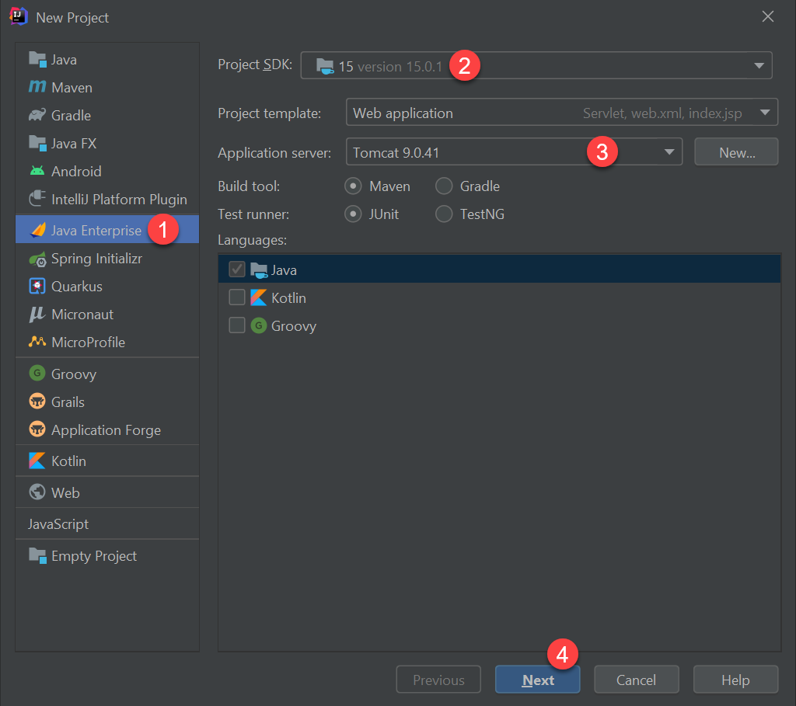
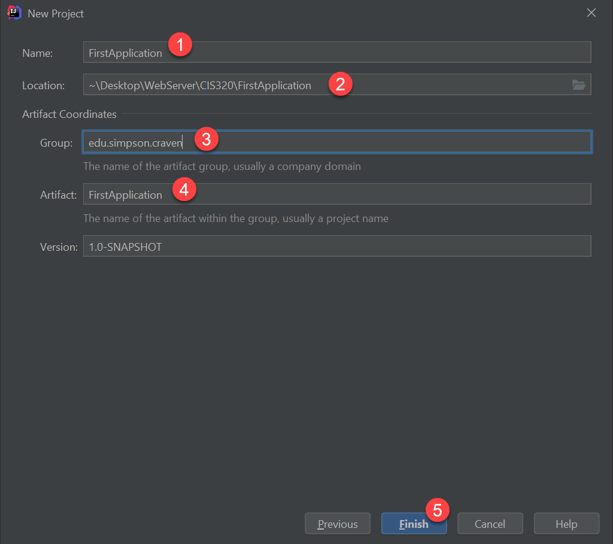
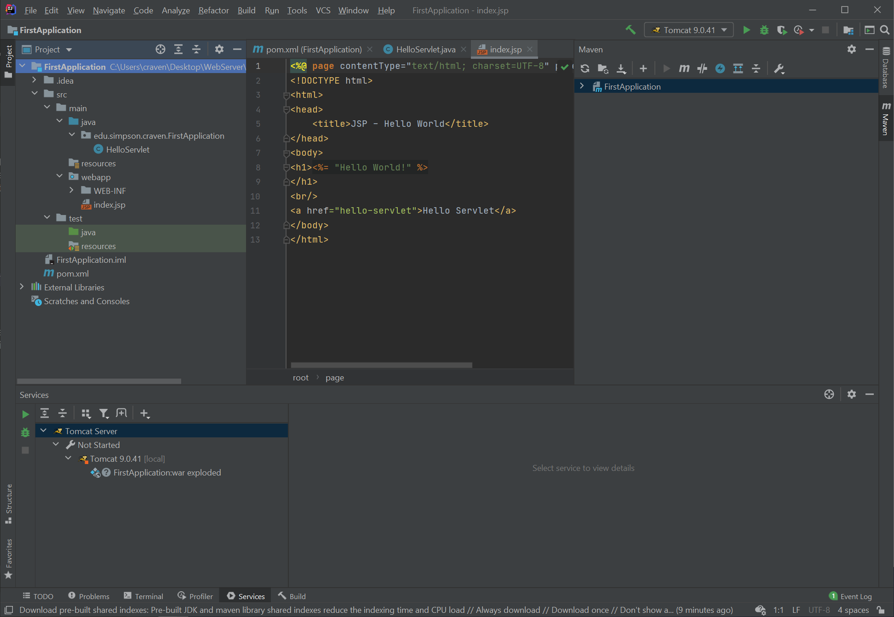

.. _java-environment-tutorial:

Local Java Servlet Development Environment Setup
================================================

Our goal here is to get a development environment set up to create web
applications.

Step 1: Install Java
--------------------

First, we need to download and install Java. The Java distributions are confusing.
There are:

* Java Software Development Kits (SDK) that allow you to write in Java and run
  Java programs. This is called "Java Standard Edition (SE)". We want this.
* Java Runtime Environments (JRE) Lets you run Java programs, but not write them.
  We don't want this.

Next, there are:

* Commercially supported versions of Java. While you can down them for free,
  you legally have to purchase a license from Oracle for their use. You can get
  support contracts from Oracle, and they'll support the product. We are broke
  students, we don't want this.
* Open-source Java. Built off Oracle's Java, this is free open-source Java. We
  want this.

Java comes in a lot of versions. Right now, I can easily download versions 7
through 16. Each version might have changes that require you to update your code.
For example, version 8 might change how a function works compared to version 7.
Within each of those versions, there are bug-fix releases. So version 7.0.2 should
run all the same code 7.0.1 does, but with less bugs.

Version 16 is currently (2021) in pre-release, so we are going to use version
15. Download the open source version of it from here:

https://jdk.java.net/15/

Create a directory called ``CIS320`` (no spaces) where we'll put our class files.
Then unzip Java, and you should have a directory like ``jdk-15.0.1`` or similar.

Step 2: Install Tomcat
----------------------

Next, we need a Java program that will run as an **application server**. We'll
plug our own Java code into this application server.

There are a lot of Java application servers out there. We'll be using a free
and open source one called **Tomcat**. Download it from here:

https://tomcat.apache.org/download-90.cgi

Unzip it, and place it in the ``CIS320`` directory we created earlier. You
should now have two directories, one for Tomcat, and one for the JDK.

Step 3: Install IntelliJ
------------------------

Next, we need an IDE. We'll use IntelliJ.
Download and install IntelliJ from JetBrains from here:

https://www.jetbrains.com/idea/download/

I suggest downloading the 'ultimate' version, and get a student license from
here:

https://www.jetbrains.com/community/education/#students

.. note::

   If you skip getting the student license, in 30 days you won't be able to work
   and more.

The default tools are ok when installing.

Step 4: Make a Java Servlet Project
-----------------------------------

Now you have Java, and an Integrated Development Environment (IDE) installed.
Let's use the IDE to set up our first web project. Select these options. If
you do not have these options, you might have the free community edition. You
need to get the other edition.

You'll need to point to the project SDK (the Java directory) and to the
Application server (Tomcat directory).

Select the framework:

Next, give the project a name. I chose ``FirstApplication``. Put it
into the CIS320 directory, and a subdirectory with the same name. Also,
we'll select the Java package. I used ``edu.simpson.craven``, I suggest the
same but with your name.

This might open to a confusingly blank window. Hit Alt-1 to open the project view
and explore the project template. You can hit Alt-1 again to hide the window.
Useful when you want more screen real-estate.

Great, we have a project. How do we see the result? We need to set up Tomcat
to run when we hit the 'run' button. Go ahead and select run:

.. image:: run1.png
    :width: 300px
    :align: center

It can take a while to build and set everything up.
When the app runs, it should run and bring up a "Hello World!" page.

If you get a 'port is already in use' error, you might need to restart your
computer before it works.

