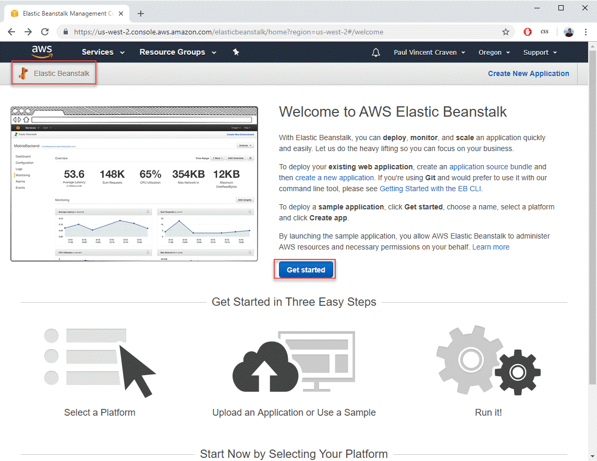
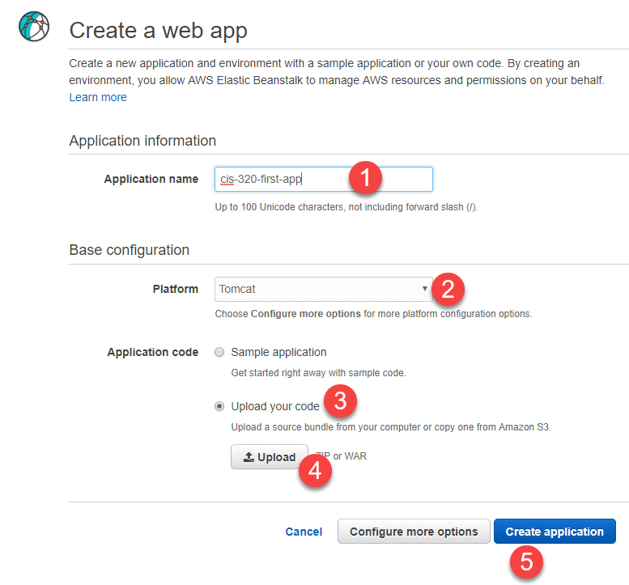
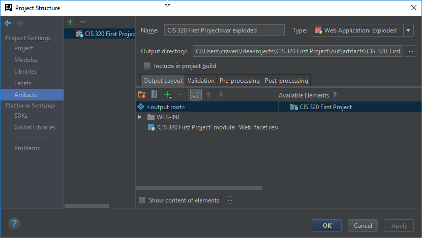
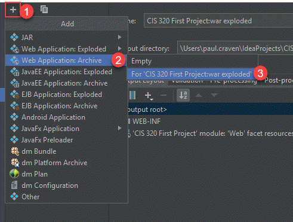
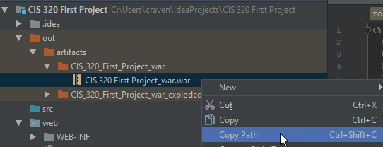
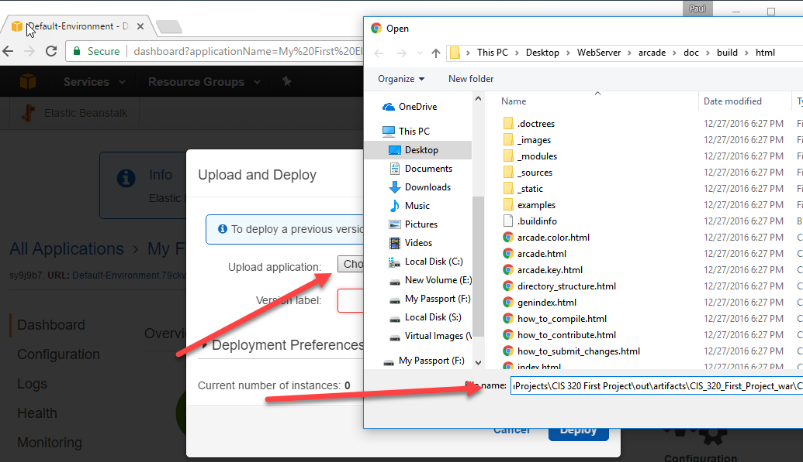
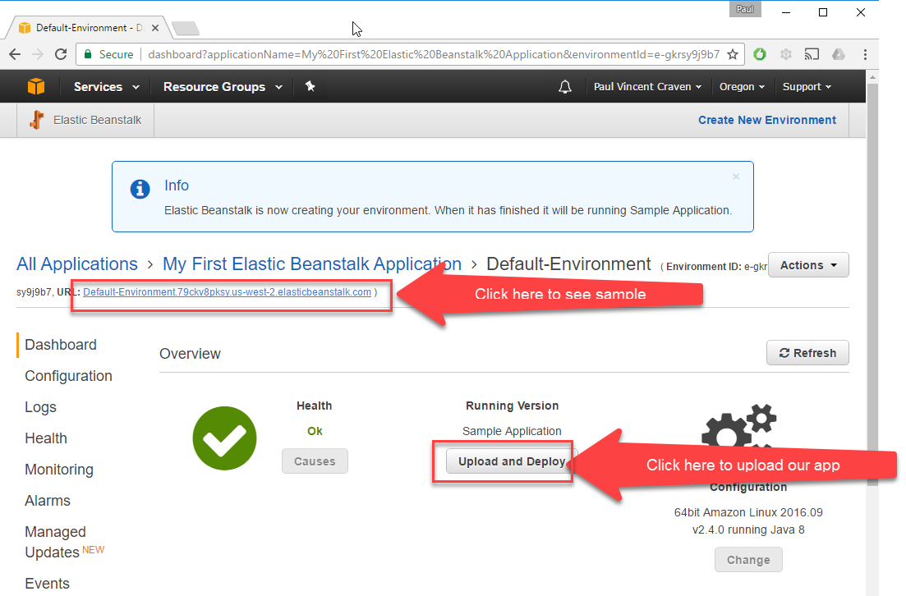

.. _java-remote-environment-tutorial:

Remote Java Servlet Development Environment Setup
=================================================

There are many ways to manage a deployment of your application to the production
environment. I could probably base an entire semester class on how to do this,
and still not cover everything.

This way of doing things seemed reasonably straight-forward to get started
with.

To begin with log into the `AWS Console`_. Then go to the "Elastic Beanstalk"
panel. Select "Get Started".

.. note::
  Elastic Beanstalk Service (EBS) allows you to deploy applications like servlets
  (and other types)
  to an environment that will automatically scale up or down based
  on load. Also, you don't have to maintain a full virtual machine, which is
  great.

The next screen should look like this. Fill out the fields as indicated.

Oh wait! What about Step 4? It wants us to upload a ZIP or WAR file?

But we haven't yet created a deployment file to upload! How do we do that? We
need to learn how to "Make WAR." This isn't a class for hippies.

Go back to IntelliJ and open up the "Project Structure" dialog. You can do
this quickly by hitting Ctrl-Alt-Shift-S. (Yes, that's four keys at once.)

Then add have IntelliJ make a WAR file:

Then select:

* Build menu
* Build Artifacts
* CIS 320 First Project:war (Do not select the exploded version. We don't want
  that kind of WAR. It doesn't explode until we hit the server.)
* At this point, it will look like nothing happened. However you should be able
  to see it in your "out" folder.
* Find the WAR file. Now we need to get on the "WAR Path." (The puns just write
  themselves!)

After that, deploy our file. Click choose file, and paste in the war path.

There you go! The computer will take some time getting everything set up. It can
be fun watching it work. Or you can poke around on your phone instead. Whatever.

.. image:: waiting.png
   :width: 75%

Once deployed, you'll see a screen like the following:

By clicking on the somewhat hidden URL pointed to by Item 1, you can go see your
app working. You can update the app by uploading a new WAR file with the
Upload and Deploy button.

.. _AWS Console: http://console.aws.amazon.com
