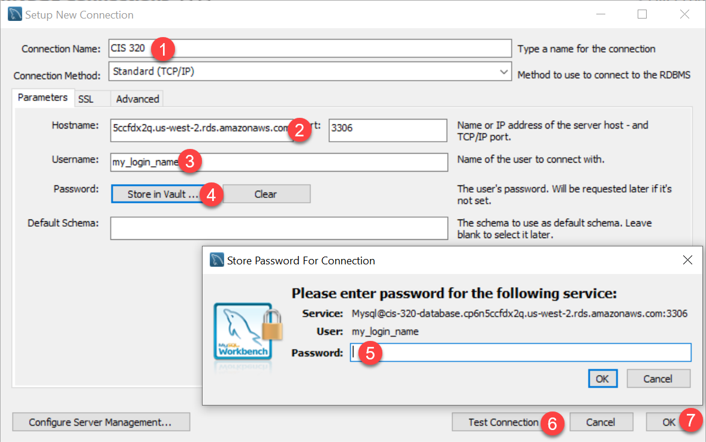

.. _setup-amazon-db:

Setup Amazon Database
=====================

Ok, here's a set of screen shots on how to set up a database to use.

Create the Amazon Database Instance
-----------------------------------

Go into the RDS section of AWS.

.. figure:: rds.png

    Go into the RDS section of AWS

Launch a DB instance.

.. figure:: launch_instance.png

    Launch a DB instance.

Select your engine. We'll use the standard creation, MySQL (not Aurora) and
select only free-tier options. (Important!)

.. figure:: select_engine.png

    Select your engine.

Set the instance specifications. Change the default username to something different
to make the login harder to guess. You can use letters and underscores for
the name, no dashes. Store username and password OUTSIDE your github
folder. Password should be 20-25 random letters and numbers. Avoid special symbols.
Use something like https://passwordsgenerator.net/

.. figure:: instance_specifications.png

    Set the instance specifications.

.. important:: Use a Strong Password! Don't store it in GitHub!

    There will people trying to guess the password of your database. Create a
    long random password and make it secure!!! Also, don't re-use a password
    you've got somewhere else. Because we'll be putting the password in an
    insecure location.

    **Also:** We will be storing the passwords in an XML file. If you use special symbols
    like &, <, and >, then you'll have to encode those in your XML file. I'd
    recommend just not using those symbols.

Next up, set up the connectivity. Ideally we'd only access the database through
our app server for extra security. We're not going to do that, and open it up
so we can access it remotely.

    Set the connectivity.

Then you'll get a screen where you can create the database. Afterwards, wait
for it to be created:

    Waiting for the database to be created.

...and wait. And wait.
Finally, after it is created, you'll be able to get your database server name:

    Get the address for our new DB server.

ALSO, if
you move what computer you access the DB from (or what NAT you go through) you
won't be able to connect. The firewall won't allow a connection at all. You'll
need to go modify your security connections and allow your IP to have an "inbound"
connection.

    This will only allow your current address to connect.

Administer Database
-------------------

Ok. Now we have a database. But no way to administer the database. You know,
create tables, see what's in it, run ad-hoc SQL.

We are going to
connect via `MySQL Workbench`_. You can download it from the site or go to
Scholar and download from the link on resources.
The site is a bit confusing. Download the 64-bit version, and don't bother to
register.

.. _MySQL Workbench: https://www.mysql.com/products/workbench/

Open up a new connection by using the non-intuitive button:

    Add connection in workbench

Set it up like the screen below. Also hit "Test Connection". Save the password
in the password vault so you don't have to keep redoing it.

    Setup connection in workbench

After that, run some SQL to create our database:

.. code-block:: sql

    create database cis320;

Do this by typing in the commands from the window, then hitting the lighting
bolt to run. Like the image below:

.. image:: type_commands.png

Next, tell it you want to use the database you created:

.. code-block:: sql

    use cis320;

Now, create our table plus a couple records:

.. code-block:: sql

    CREATE TABLE `cis320`.`person` (
      `id` INT NOT NULL AUTO_INCREMENT,
      `first` VARCHAR(45) NULL,
      `last` VARCHAR(45) NULL,
      `email` VARCHAR(255) NULL,
      `phone` VARCHAR(15) NULL,
      `birthday` DATE NULL,
      PRIMARY KEY (`id`));

    INSERT INTO `cis320`.`person` (`first`, `last`, `email`, `phone`, `birthday`) VALUES ('Paul', 'Craven', 'paul.craven@simpson.edu', '5159611834', '1954-01-02');
    INSERT INTO `cis320`.`person` (`first`, `last`, `email`, `phone`, `birthday`) VALUES ('Sam', 'Simpson', 'sam@simpson.edu', '5159611212', '1903-01-01');

Try inserting your own records. You can view the records by:

.. code-block:: sql

    select * from `cis320`.`person`;

Yay! We are done with that setup. Next chapter we'll learn how to do DB
connections in Java and pull this data out.
