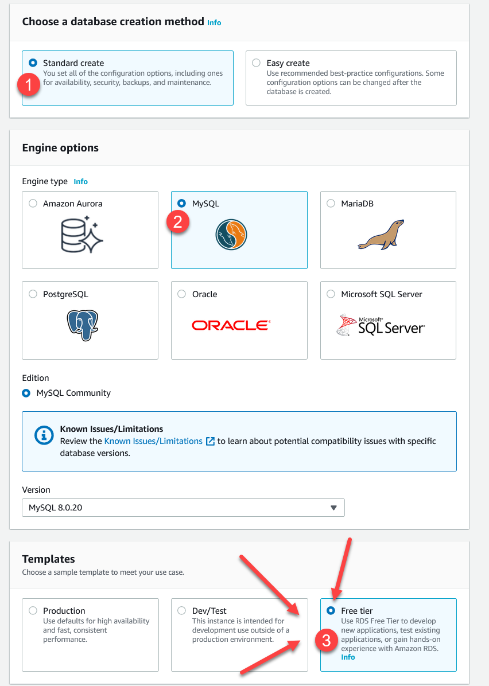
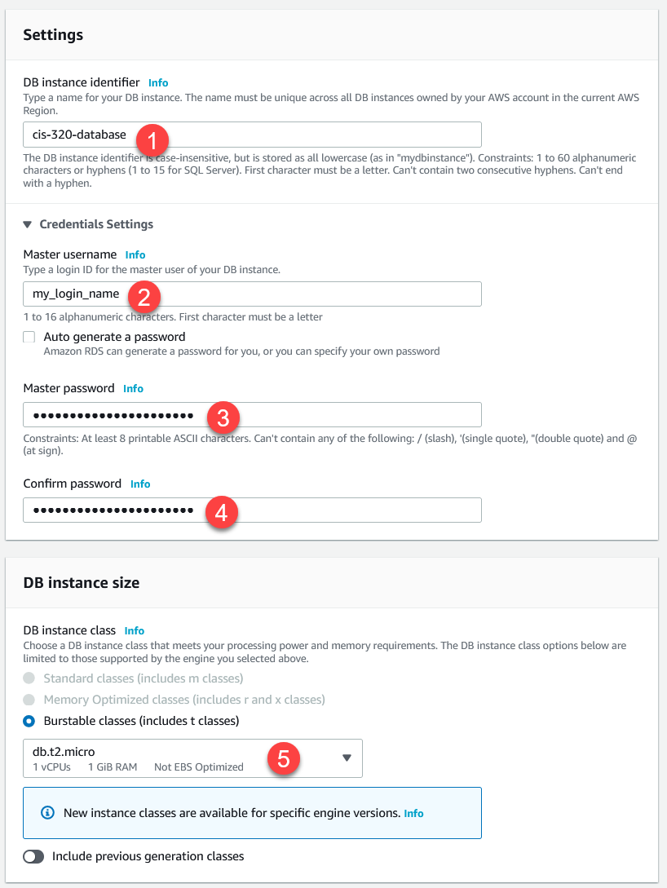
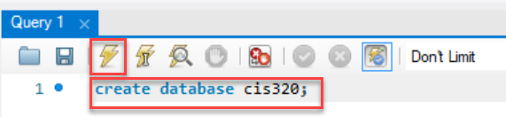

.. _setup-amazon-db:

Setup Amazon Database
=====================

Ok, here's a set of screen shots on how to set up a database to use.

Create the Amazon Database Instance
-----------------------------------

Go into the RDS section of AWS.

.. figure:: rds.png

    Go into the RDS section of AWS

Launch a DB instance. NOT aurora.

    Launch a DB instance.

Select your engine.

    Select your engine.

Select MySQL as the engine. Also select 'free' so you can try to get by
on no/little money.

Set the instance specifications like this:

    Set the instance specifications.

.. important:: Use a Strong Password!

    There will people trying to guess the password of your database. Create a
    long random password and make it secure!!! Also, don't re-use a password
    you've got somewhere else. Because we'll be putting the password in an
    insecure location.

    **Also:** We will be storing the passwords in an XML file. If you use special symbols
    like &, <, and >, then you'll have to encode those in your XML file. I'd
    recommend just not using those symbols.

For "Configure Advanced Settings" keep the default settings.

Then you'll get a screen where you can create the database. Afterwards, wait
for it to be created:

.. figure:: creating.png

    Waiting for the database to be created.

After it is created, you'll be able to get your database server name.

ALSO, if
you move what computer you access the DB from (or what NAT you go through) you
won't be able to connect. The firewall won't allow a connection at all. You'll
need to go modify your security connections and allow your IP to have an "inbound"
connection.

.. figure:: connectivity.png

    Set the username and password.

Administer Database
-------------------

Ok. Now we have a database. But no way to administer the database. You know,
create tables, see what's in it, run ad-hoc SQL.

We are going to
connect via `MySQL Workbench`_. It requires registration and it is a pain
to find the download link. Go to Scholar and download from the link I have
at the top of that page so you don't have to go through that pain.

.. _MySQL Workbench: https://www.mysql.com/products/workbench/

Open up a new connection by using the non-intuitive button:

.. figure:: add_sql_connection.png

    Add connection in workbench

Set it up like the screen below. Also hit "Test Connection". Save the password
in the password vault so you don't have to keep redoing it.

.. figure:: setup_connection.png

    Setup connection in workbench

After that, run some SQL to create our database:

.. code-block:: sql

    create database cis320;

Do this by typing in the commands from the window, then hitting the lighting
bolt to run. Like the image below:

Next, tell it you want to use the database you created:

.. code-block:: sql

    use database cis320;

Now, create our table plus a couple records:

.. code-block:: sql

    CREATE TABLE `cis320`.`person` (
      `id` INT NOT NULL AUTO_INCREMENT,
      `first` VARCHAR(45) NULL,
      `last` VARCHAR(45) NULL,
      `email` VARCHAR(255) NULL,
      `phone` VARCHAR(15) NULL,
      `birthday` DATE NULL,
      PRIMARY KEY (`id`));

    INSERT INTO `cis320`.`person` (`first`, `last`, `email`, `phone`, `birthday`) VALUES ('Paul', 'Craven', 'paul@simpson.edu', '5159611834', '1954-01-02');
    INSERT INTO `cis320`.`person` (`first`, `last`, `email`, `phone`, `birthday`) VALUES ('Sam', 'Simpson', 'sam@simpson.edu', '5159611212', '1903-01-01');

Yay! We are done with that setup. Next, time to learn how to do DB
connections in Java.
