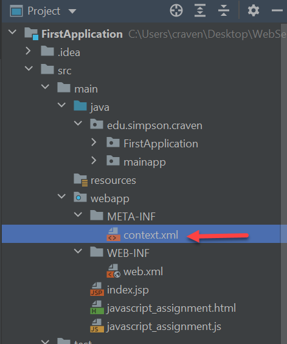
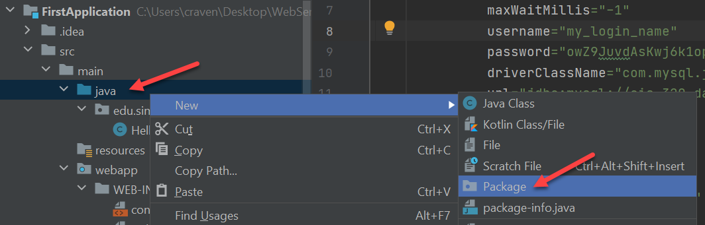
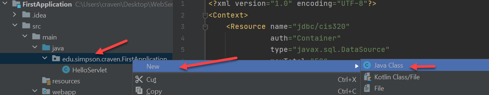
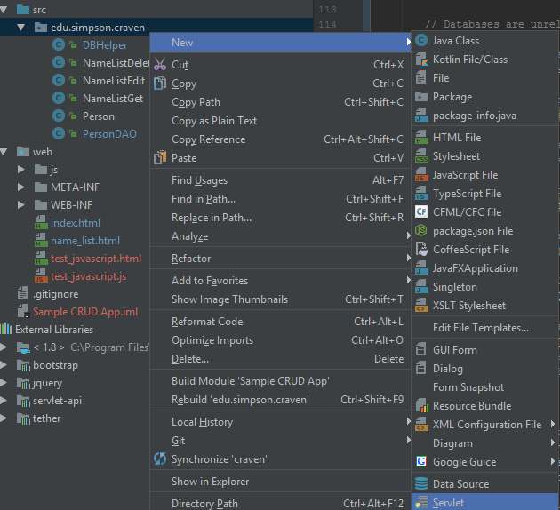

.. _manage-connections:

Managing Database Connections
=============================

Ok! How do we specify, connect, and query the database?

Overview: Usually takes three classes per table where we are doing a simple
CRUD app.

* Business Object: Simple Java class that mirrors the table. One private
  variable for each field. Getters and setters for each variable. We just
  use this to store the data. I usually match the name, so if you have "car"
  table I call this object "Car".
* Data Access Object: A class that will use SQL to access the database. I
  usually match each table with a DAO. So for the "car" table I'd create a
  class called CarDAO. Then you'd have static methods like ``getCar``,
  ``updateCar``, ``deleteCar``, etc.
* Servlet: A servlet to interface the web with your DAO. You might have one
  servlet control multiple DAO functions, or create multiple servlets, for each
  DAO function.

Specifying the DB Connection Pool
---------------------------------

Now, we need to set up the the connection. We don't want to hard-code the
connection information into our code. That would make updates too difficult, and
how would you have a different database for production, testing, and your
development? To (partially) solve this, we keep the information in a separate
text file.

In addition to the ``WEB-INF`` folder, we need a directory called
``META-INF`` stored ad the same level.
Connection information is stored in
a file called ``META-INF/context.xml``.

    How the directory tree should look

Here is an example of what it should look like. Update the file below with your
server name and password. For example, my url looks like:

``url="jdbc:mysql://cis320.cp6n5ccfdx2q.us-west-2.rds.amazonaws.com:3306/cis320"``

.. code-block:: xml
   :caption: META-INF/context.xml which MUST go in .gitignore
   :linenos:

    <?xml version="1.0" encoding="UTF-8"?>
    <Context>
        <Resource name="jdbc/cis320"
                  auth="Container"
                  type="javax.sql.DataSource"
                  maxTotal="50"
                  maxWaitMillis="-1"
                  username="cis320"
                  password="PUT_PASSWORD_HERE"
                  driverClassName="com.mysql.jdbc.Driver"
                  url="jdbc:mysql://PUT_SERVER_NAME_HERE:3306/cis320"
                  maxActive="15"
                  maxIdle="3"
                  testOnBorrow="true"
                  removeAbandoned="true"
                  removeAbandonedTimeout="55"
                  validationQuery="SELECT 1"
                  validationInterval="34000"
                  timeBetweenEvictionRunsMillis="34000"
                  minEvictableIdleTimeMillis="55000"
                  factory="org.apache.tomcat.jdbc.pool.DataSourceFactory"
        />
        <ResourceLink name="jdbc/cis320"
                      global="jdbc/cis320"
                      type="javax.sql.DataSource" />
    </Context>

WAIT! This has our DB password in it. And server. We NEVER check this into a
version control system. You have to add this to ``.gitignore``. If you fail
to do this, then you've compromised every individual in your database and perhaps
grabbed headline news. No pressure.

You probably need this in the ``.gitignore``:

``web/META-INF/context.xml``

*Before* you commit, you can do a ``git status -u`` and make sure that the
``context.xml`` nor ``META-INF`` directory is set as untracked (which would
be picked up and added if you did a ``git add *``). If you fail to
get this part right, you'll need to re-do a lot of things. And possibly
expose your customer info.

Tomcat has built in classes to manage a `connection pool`_. It takes a long
time to build a connection, so we reuse connections to the database between web
requests. Tomcat looks for this specific file in this specific directory
when it starts up. If it exists, it will read
``context.xml`` file and set up that pool.

.. _connection pool: https://en.wikipedia.org/wiki/Connection_pool

Connecting to the Database
--------------------------

The basic code to create a database connection in Java, using a connection pool,
looks like this. (Don't type in any code yet, we need to set up your project first.)

.. code-block:: java

    import java.sql.Connection;
    import javax.sql.DataSource;
    import javax.naming.Context;
    import javax.naming.InitialContext;

    // .. etc ..

    // Create a context. Uses context.xml
    Context initContext = new InitialContext();

    // Select which context to lookup.
    Context envContext = (Context) initContext.lookup("java:/comp/env");

    // Grab a source of database connection. Note how this matches the name
    // field in context.xml.
    DataSource ds = (DataSource) envContext.lookup("jdbc/cis320");

    // Hey, now we've got a datasource for connections. Let's get a connection.
    Connection conn = ds.getConnection();

What Java classes are we using here?

* InitialContext - Used to get information from our ``context.xml`` file. Comes from
  the javax.naming package.
* Context - This is a base class for InitialContext. It is just a more general
  version of the ``InitalContext`` class.
* DataSource - This class manages our database connections. We get database
  connections from this class.
* Connection - This class holds the information about our database connection.

So, ``InitialContext``/``Context`` is used to figure out our ``DataSource``,
password, and other items in ``context.xml``. We get connections from the
``DataSource``, and the connection itself is managed by ``Connection``.

I hate putting in all that code when I want a database connection. Plus what if
I change a name? I don't want to go through my entire program replacing
"jdbc/cis320" with something new. So I typically put this in a helper class
that looks like: (Don't type this in yet.)

.. literalinclude:: DBHelper.java
    :linenos:
    :language: java
    :caption: DBHelper.java

Then in the code I can just do:

.. code-block:: java

    conn = DBHelper.getConnection();

Oh wait! This might have something you don't know, or forgot.

Normally, when I call a method on a class, I have to have an instance, right?
I can't do this:

.. code-block:: java

    Dog.bark();

I can't do the code above, because what dog do I want to have bark? I have
to create an *instance*. Like the following:

.. code-block:: java

    spot = Dog();
    fluffy = Dog();

    spot.sit();
    fluffy.bark();

Great, that makes sense. I need to associate a method with what object it is
operating on. But not all functions should have an object. What about sine
and cosine function? We don't want to do this:

.. code-block:: java

    my_math = Math();
    answer = my_math.sin(angle);

That code's just dumb. What is the point of ``my_math``? Conceptually there is
no object. Why can't I just do:

.. code-block:: java

    answer = sin(angle);

I can't, because everything has to be in a class. To make a middle-ground, Java
and other languages have *static methods*. Methods that don't use instance
variables, and can be called just like a function. A function where you don't
need to create an instance first:

.. code-block:: java

    answer = Math.sin(angle);

How do you create such a method? Use the ``static`` keyword.

.. code-block:: java

    public static double sin(double angle) {

Querying the Database
---------------------

Typically, I created a "Data Access Object". Static methods for each action
(Static - no need to create an instance of the object.) For example, here
is a the ``PersonDAO`` class that gets a list of people: (Don't type in yet.)

.. literalinclude:: PersonDAO.java
    :linenos:
    :language: java
    :caption: PersonDAO.java

Writing the Servlet
-------------------

Here's a code sample for a servlet that chucks the list of people out over
JSON. I only print ``firstName`` and ``id``, the other fields you can fill in: (Don't type in yet.)

.. literalinclude:: NameListGet.java
    :linenos:
    :language: java
    :caption: NameListGet.java

Setting Up The Project
----------------------

Ok! You want to create these classes. How?

Creating a Package
^^^^^^^^^^^^^^^^^^

To start with, we normally put Java files into a package. Yes, Java
doesn't *force* you to put classes in a package.
With smaller assignments there isn't a reason to. But there's nothing small
about web development, so we need to use packages.

All our source goes into the ``src`` folder. So right-click on the ``src``
folder and create a new package.

Packages normally have a broad-to-specific format. Here are a couple examples:

* ``edu.simpson.computerscience.datastructures.linkedlistproject``
* ``com.wellsfargo.mortgage.coreproject.userinterface``

Get the idea? This will define a folder structure for our files. So class files
have to go in the following directories:

* ``edu/simpson/computerscience/datastructures/linkedlistproject``
* ``com/wellsfargo/mortgage/coreproject/userinterface``

Simple and effective. When you create a package, you are just creating a
set of directories.

Creating a Class
^^^^^^^^^^^^^^^^

Once you have a package, create a new Java class. Right-click on the package
and select a new Java class.

If your class is called ``DBHelper``, then it *must* go into a file called
``DBHelper.java``. If you rename the class, you have to rename the file.

Furthermore, if ``DBHelper`` is in a package called
``edu.simpson.computerscience.webdevelopment`` it must be stored in a
directory path of:
``edu/simpson/computerscience/webdevelopment``.

Creating a Servlet
^^^^^^^^^^^^^^^^^^

Ok, we can create servlets the same way:

You will also need to map the servlet to a URL. This maps
``edu.simpson.webdevelopment.NameListGet`` to
``/api/name_list_get``.

.. code-block:: xml
   :caption: Servlet Mapping in web.xml

    <?xml version="1.0" encoding="UTF-8"?>
    <web-app xmlns="http://xmlns.jcp.org/xml/ns/javaee"
             xmlns:xsi="http://www.w3.org/2001/XMLSchema-instance"
             xsi:schemaLocation="http://xmlns.jcp.org/xml/ns/javaee http://xmlns.jcp.org/xml/ns/javaee/web-app_3_1.xsd"
             version="3.1">

        <servlet>
            <servlet-name>NameListGet</servlet-name>
            <servlet-class>edu.simpson.webdevelopment.NameListGet</servlet-class>
        </servlet>

        <servlet-mapping>
            <servlet-name>NameListGet</servlet-name>
            <url-pattern>/api/name_list_get</url-pattern>
        </servlet-mapping>

    </web-app>

The servlet itself will look like:

.. code-block:: Java
   :caption: Hello World Servlet
   :linenos:

    package edu.simpson.craven;

    import java.io.IOException;
    import java.io.PrintWriter;

    public class NameListGet extends javax.servlet.http.HttpServlet {
        protected void doPost(javax.servlet.http.HttpServletRequest request, javax.servlet.http.HttpServletResponse response) throws javax.servlet.ServletException, IOException {
        }

        protected void doGet(javax.servlet.http.HttpServletRequest request, javax.servlet.http.HttpServletResponse response) throws javax.servlet.ServletException, IOException {
            // Type of output (HTML, JSON, image, whatever
            response.setContentType("text/plain");
            // Get an object that can write to the network
            PrintWriter out = response.getWriter();
            // Write to the network
            out.print("Hello");
        }
    }

Eventually, we will evolve this servlet to send JSON formatted data.
Here's an example of manually creating the JSON format:

.. code-block:: Java
   :caption: Sample JSON Java Servlet
   :linenos:

    package edu.simpson.craven;

    import javax.servlet.ServletException;
    import javax.servlet.annotation.WebServlet;
    import javax.servlet.http.HttpServlet;
    import javax.servlet.http.HttpServletRequest;
    import javax.servlet.http.HttpServletResponse;
    import java.io.IOException;
    import java.io.PrintWriter;
    import java.util.List;

    @WebServlet(name = "NameListGet")
    public class NameListGet extends HttpServlet {

        protected void doGet(HttpServletRequest request, HttpServletResponse response) throws ServletException, IOException {

            response.setContentType("application/json");
            PrintWriter out = response.getWriter();

            // Replace the line below with your database code that will
            // write out your JSON file.
            out.print("{ \"Field\":\"Value\"}");

        }
    }

Creating a JSON object manually can be a pain. Particularly with putting
the commas in the right spot. You can use the `Google GSON library` to do it for
you. I have a link to download the 'jar' file at the top of our Scholar website.
Put the 'jar' file in the ``WEB-INF/lib`` folder for it to work.

.. _Google GSON library: https://github.com/google/gson

.. code-block:: Java

   import com.google.gson.Gson;

   // Blah, blah

   Gson gson = new Gson();

   // serializes target to Json
   String json = gson.toJson(myObject);

So, a full servlet example to get started (again):

.. literalinclude:: NameListGet.java
    :linenos:
    :language: java
    :caption: NameListGet.java

List Records Lab
----------------

Now that you have an idea what to do, complete :ref:`list_records`.
