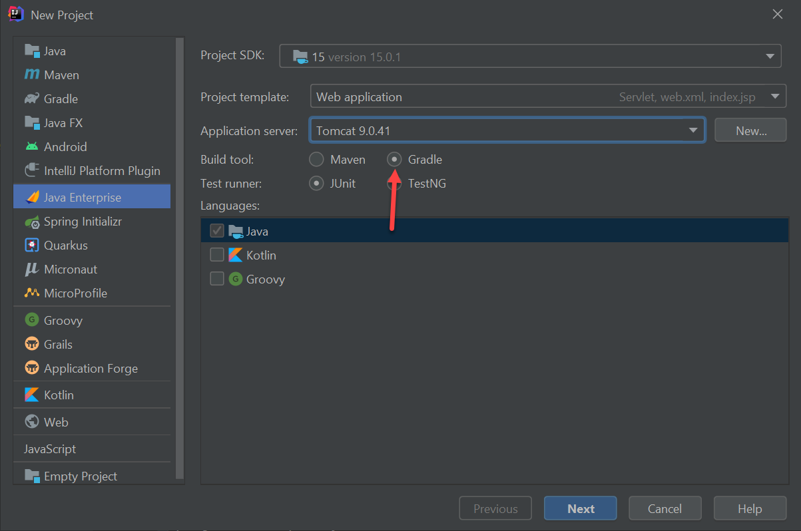
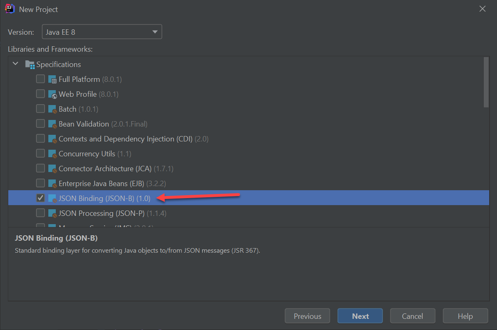
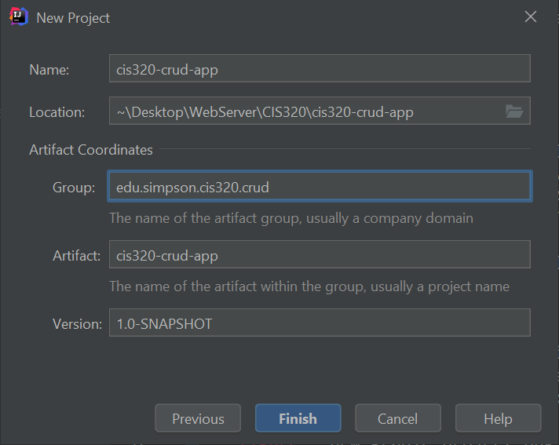

.. _manage-connections:

Query the Database and Output JSON
==================================

How do we specify, connect, and query the database? Then convert that data to
a JSON string to send?

To do this we'll need to:

* Use the :ref:`gradle2` to help build the project and manage libraries.
* Get some :ref:`helper-libraries` for JSON and database connections
  so we don't write everything from scratch.
* Create a configuration file to specify our :ref:`db-info`.
* Create a class that will use that file to get a :ref:`dbhelper`.
* Create a Java object to hold our data. :ref:`business-objects`
* Create a database access object (DAO) to retrieve information from the database and
  populate our Java object. :ref:`dao_object`
* :ref:`write-the-servlet` that uses all these items to output our data in JSON format
  over the web.

.. _gradle2:

Gradle Build Tool
-----------------

Any large project involving multiple files needs some way to specify how it will
be built. Starting around 2000, Java projects started using a scripting tool called
`Ant <https://ant.apache.org/>`_. A few years later, a tool called
`Maven <https://maven.apache.org/>`_ was built using Ant, that helped standardize
how apps were built.
Ant and Maven are still popular, although another tool called
`Gradle <https://gradle.org/>`_
is gaining in popularity.

For this next project, we'll be using Gradle.
By default, IntelliJ will set up new projects in Maven. We'll create a new
project and specify Gradle instead:

   Creating a new gradle project

We will also use a library to bind our Java object to JSON. We can check that
on the next screen:

Then finally create the app with your own name and package:

Finally, you'll need to create a new GitHub project for this, and set up
a Git repository. Just like any other project, we don't want to check in
every file, so create a ``.gitignore`` file in the root of the project and add
these to filter things out:

.. code-block:: text
   :caption: `.gitignore` file

   /.gradle/
   /.idea/
   /build/
   /src/main/webapp/META-INF/context.xml
   .DS_Store

.. _helper-libraries:

Helper Libraries
----------------

In our Gradle project, you'll find a file named ``build.gradle``. It specifies
all the libraries we'll use in our project. We don't have to find or download
the libraries, Gradle will take care of this for us. We just tell Gradle
what libraries we need. In our case, we'll use JSON-Bind for creating
JSON notation, and MySQL-Connector for hooking up to the database.

Update ``build.gradle`` to have this for a dependency section:

.. code-block:: text

   dependencies {
       implementation('javax.json.bind:javax.json.bind-api:1.0')
       implementation('org.glassfish:jakarta.json:1.1.5')
       implementation('org.eclipse:yasson:1.0.3')
       compileOnly('javax.servlet:javax.servlet-api:4.0.1')
       implementation('mysql:mysql-connector-java:8.0.23')

       testImplementation("org.junit.jupiter:junit-jupiter-api:${junitVersion}")
       testRuntimeOnly("org.junit.jupiter:junit-jupiter-engine:${junitVersion}")
   }

.. _db-info:

DB Connection Pool Information
------------------------------

Now, we need to set up the the connection. We don't want to hard-code the
connection information into our code. That would make updates too difficult, and
how would you have a different database for production, testing, and your
development? To (partially) solve this, we keep the information in a separate
text file.

In addition to the ``WEB-INF`` folder, we need a directory called
``META-INF`` stored ad the same level.
Connection information is stored in
a file called ``META-INF/context.xml``.

.. figure:: directory_setup.png
    :width: 50%

    How the directory tree should look

Here is an example of what it should look like. Update the file below with your
server name and password. For example, my url looks like:

``url="jdbc:mysql://cis320.cp6n5ccfdx2q.us-west-2.rds.amazonaws.com:3306/cis320"``

.. code-block:: xml
   :caption: META-INF/context.xml which MUST go in .gitignore
   :linenos:
   :emphasize-lines: 9, 11

    <?xml version="1.0" encoding="UTF-8"?>
    <Context>
        <Resource name="jdbc/cis320"
                  auth="Container"
                  type="javax.sql.DataSource"
                  maxTotal="50"
                  maxWaitMillis="-1"
                  username="cis320"
                  password="PUT_PASSWORD_HERE"
                  driverClassName="com.mysql.cj.jdbc.Driver"
                  url="jdbc:mysql://PUT_SERVER_NAME_HERE:3306/cis320"
                  maxActive="15"
                  maxIdle="3"
                  testOnBorrow="true"
                  removeAbandoned="true"
                  removeAbandonedTimeout="55"
                  validationQuery="SELECT 1"
                  validationInterval="34000"
                  timeBetweenEvictionRunsMillis="34000"
                  minEvictableIdleTimeMillis="55000"
                  factory="org.apache.tomcat.jdbc.pool.DataSourceFactory"
        />
        <ResourceLink name="jdbc/cis320"
                      global="jdbc/cis320"
                      type="javax.sql.DataSource" />
    </Context>

WAIT! This has our DB password in it. And server. We NEVER check this into a
version control system. You have to add this to ``.gitignore``. If you fail
to do this, then you've compromised every individual in your database and perhaps
grabbed headline news. No pressure.

You probably need this in the ``.gitignore``:

``src/main/webapp/META-INF/context.xml``

*Before* you commit, you can do a ``git status -u`` and make sure that the
``context.xml`` nor ``META-INF`` directory is set as untracked (which would
be picked up and added if you did a ``git add -A``). If you fail to
get this part right, you'll need to re-do a lot of things. And possibly
expose your customer info.

Tomcat has built in classes to manage a `connection pool`_. It takes a long
time to build a connection, so we reuse connections to the database between web
requests. Tomcat looks for this specific file in this specific directory
when it starts up. If it exists, it will read
``context.xml`` file and set up that pool.

.. _connection pool: https://en.wikipedia.org/wiki/Connection_pool

.. _dbhelper:

Connecting to the Database
--------------------------

We need to create a class that will manage our database connections.

Creating a Class
^^^^^^^^^^^^^^^^

It is easy to create a new Java class inside a package. Right-click on the package
and select a new Java class.

.. image:: new_class.png

If your class is called ``DBHelper``, then it *must* go into a file called
``DBHelper.java``. If you rename the class, you have to rename the file.

Furthermore, if ``DBHelper`` is in a package called
``edu.simpson.computerscience.webdevelopment`` it must be stored in a
directory path of:
``edu/simpson/computerscience/webdevelopment``.
The IDE will take care of the file naming and directory structure for
you.

Understanding DB Connection Code
^^^^^^^^^^^^^^^^^^^^^^^^^^^^^^^^

The basic code to create a database connection in Java, using a connection pool,
looks like this. (Don't type in any code yet, we need to set up your project first.)

.. code-block:: java

    import java.sql.Connection;
    import javax.sql.DataSource;
    import javax.naming.Context;
    import javax.naming.InitialContext;

    // .. etc ..

    // Create a context. Uses context.xml
    Context initContext = new InitialContext();

    // Select which context to lookup.
    Context envContext = (Context) initContext.lookup("java:/comp/env");

    // Grab a source of database connection. Note how this matches the name
    // field in context.xml.
    DataSource ds = (DataSource) envContext.lookup("jdbc/cis320");

    // Hey, now we've got a datasource for connections. Let's get a connection.
    Connection conn = ds.getConnection();

What Java classes are we using here?

* InitialContext - Used to get information from our ``context.xml`` file. Comes from
  the javax.naming package.
* Context - This is a base class for InitialContext. It is just a more general
  version of the ``InitalContext`` class.
* DataSource - This class manages our database connections. We get database
  connections from this class.
* Connection - This class holds the information about our database connection.

So, ``InitialContext``/``Context`` is used to figure out our ``DataSource``,
password, and other items in ``context.xml``. We get connections from the
``DataSource``, and the connection itself is managed by ``Connection``.

The DBHelper Class
^^^^^^^^^^^^^^^^^^

I hate putting in all that code when I want a database connection. Plus what if
I change a name? I don't want to go through my entire program replacing
"jdbc/cis320" with something new. So I typically put this in a helper class
that looks like:

.. _db-helper:

.. literalinclude:: DBHelper.java
    :linenos:
    :language: java
    :caption: DBHelper.java

Then in the code I can just do:

.. code-block:: java

    conn = DBHelper.getConnection();

Refresher on Static Classes
^^^^^^^^^^^^^^^^^^^^^^^^^^^

Oh wait! This might have something you don't know, or forgot.

Normally, when I call a method on a class, I have to have an instance, right?
I can't do this:

.. code-block:: java

    Dog.bark();

I can't do the code above, because what dog do I want to have bark? I have
to create an *instance*. Like the following:

.. code-block:: java

    spot = Dog();
    fluffy = Dog();

    spot.sit();
    fluffy.bark();

Great, that makes sense. I need to associate a method with what object it is
operating on. But not all functions should have an object. What about sine
and cosine function? We don't want to do this:

.. code-block:: java

    my_math = Math();
    answer = my_math.sin(angle);

That code's just dumb. What is the point of ``my_math``? Conceptually there is
no object. Why can't I just do:

.. code-block:: java

    answer = sin(angle);

I can't, because everything has to be in a class. To make a middle-ground, Java
and other languages have *static methods*. Methods that don't use instance
variables, and can be called just like a function. A function where you don't
need to create an instance first:

.. code-block:: java

    answer = Math.sin(angle);

How do you create such a method? Use the ``static`` keyword.

.. code-block:: java

    public static double sin(double angle) {

.. _business-objects:

Business Objects
----------------

You'll need a simple Java class with getters and setters to represent objects
in your program. Often each object represents a row on the table, and
each field is a column in that table.

Here's a ``Person`` class to get started with:

.. code-block:: java

   public class Person {

       private int id;
       private String first;
       private String last;
       private String phone;
       private String birthday;

       public int getId() {return id; }
       public void setId(int id) { this.id = id; }

       public String getFirst() { return first; }
       public void setFirst(String first) { this.first = first; }

       /* Add additional getters and setters for each field.
          Just follow the same pattern. */
   }

.. _dao_object:

Querying the Database
---------------------

Typically, I create a "Data Access Object". This object has
static methods for each action, and each action is a query or update I
want to run on the database.
(Remember, static - no need to create an instance of the object.)
For example, here
is a the ``PersonDAO`` class that gets a list of people:

.. _person-dao:

.. literalinclude:: PersonDAO.java
    :linenos:
    :language: java
    :caption: PersonDAO.java
    :emphasize-lines: 41, 66

.. _write-the-servlet:

Write the Servlet
-----------------

Then we need to create a new servlet. The servlet will output tie everything
together. Query the database, output the JSON result.

.. _create_servlet:

Creating a Servlet
^^^^^^^^^^^^^^^^^^

We can create servlets similar to the way we create classes:

.. image:: new_servlet.png

We want to update the application so that the URL is ``/api/name_list_get``
and print a simple Hello to see if it works.

The servlet itself will look like:

.. code-block:: Java
   :caption: Hello World Servlet
   :linenos:
   :emphasize-lines: 12, 24

   package edu.simpson.cis320.crud.cis320_crud_app;

   import javax.servlet.*;
   import javax.servlet.http.*;
   import javax.servlet.annotation.*;
   import java.io.IOException;
   import java.io.PrintWriter;
   import java.util.logging.Level;
   import java.util.logging.Logger;

   @WebServlet(name = "NameListGetServlet", value = "/api/name_list_get")
   public class NameListGetServlet extends HttpServlet {
       @Override
       protected void doGet(HttpServletRequest request, HttpServletResponse response) throws ServletException, IOException {

           // Type of output (HTML, JSON, image, whatever
           response.setContentType("text/plain");

           // Get an object that can write to the network
           PrintWriter out = response.getWriter();

           // Write to the network
           out.print("Hello");
       }
   }

Try the servlet out. You'll need to manually change ``index.jsp`` to
``/api/name_list_get``.

Debug Logging
^^^^^^^^^^^^^

Let's add a "logger" that will output to our log file and help us debug later:

.. code-block:: Java

   package edu.simpson.cis320.crud.cis320_crud_app;

   import javax.json.bind.Jsonb;
   import javax.json.bind.JsonbBuilder;
   import javax.servlet.*;
   import javax.servlet.http.*;
   import javax.servlet.annotation.*;
   import java.io.IOException;
   import java.io.PrintWriter;
   import java.util.List;
   import java.util.logging.Level;
   import java.util.logging.Logger;

   @WebServlet(name = "NameListGetServlet", value = "/api/name_list_get")
   public class NameListGetServlet extends HttpServlet {
       private final static Logger log = Logger.getLogger(PersonDAO.class.getName());

       @Override
       protected void doGet(HttpServletRequest request, HttpServletResponse response) throws ServletException, IOException {
           log.log(Level.FINE, "Get people servlet");

           // Get setup up to output JSON text
           response.setContentType("text/plain");
           PrintWriter out = response.getWriter();

           // Write out that string
           out.println("Hello");
       }
   }

If that works ok, try getting a list of people from the DAO:

.. code-block:: Java

     // Use our DAO to get a list of people
     List <Person> peopleList = PersonDAO.getPeople();

     // Write out that string
     out.println("Hello, got " + peopleList.size() + " records.");

If that works, we need to convert that list to JSON format. We change the
content type of our output to ``application/json`` and then use a class
called ``JsonbBuilder`` to make our JSON string.

.. code-block:: Java

     // Get setup up to output JSON text
     response.setContentType("application/json");
     PrintWriter out = response.getWriter();

     // Use our DAO to get a list of people
     List <Person> peopleList = PersonDAO.getPeople();

     Jsonb jsonb = JsonbBuilder.create();
     String jsonString = jsonb.toJson(peopleList);

     // Write out that string
     out.println(jsonString);

Out final program looks like:

.. _name-list-get-servlet:

.. literalinclude:: NameListGetServlet.java
    :linenos:
    :language: java
    :caption: NameListGetServlet.java

List Records Lab
----------------

Once through this, complete :ref:`list_records`.
