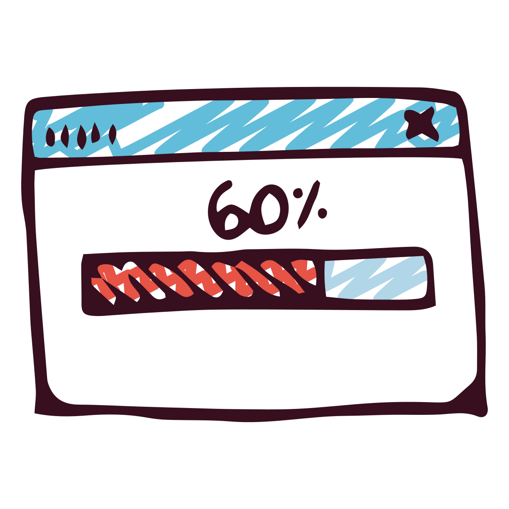
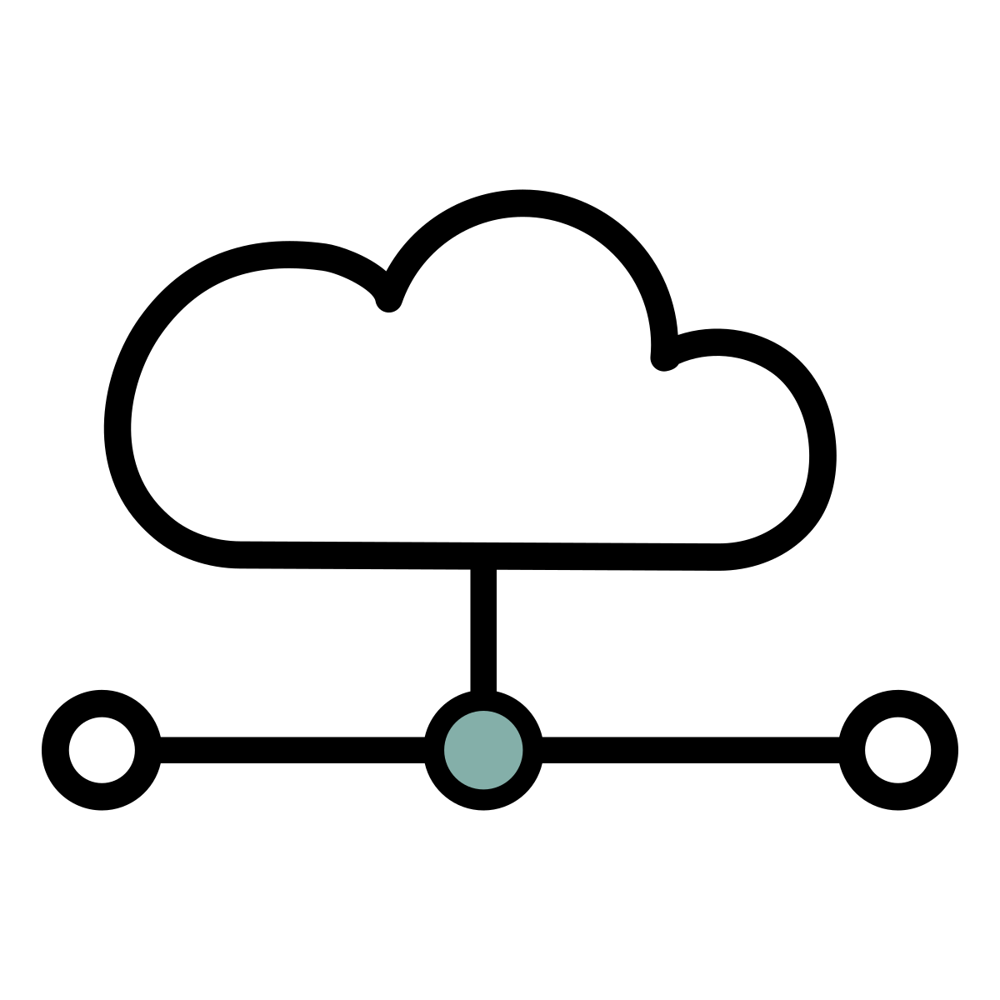

.. _make-json-calls:

Making JSON Calls Over AJAX
===========================

Great! We have as servlet that makes JSON-formatted text. How do we get that
and put it in a web page?

We are going to make an AJAX call. Kind of.
AJAX means Asynchronous JavaScript And XML. Except we aren't using XML, because
that's out of style. We are using JSON. But we still call it AJAX anyway.

In simple terms, our JavaScript is going to make a web request. Usually we
make a web request by typing a URL into the browser, right? Then we get a
new page. Here, the JavaScript will make the request and just get JSON. Then
the JavaScript updates the page.

What is Asynchronous?
---------------------

So what is "Asynchronous" thing? How does that change the equation?
The opposite of "asynchronous" is "synchronous." That's what we are used to
with old-school synchronous coding:

1. Make a request
2. Wait for the response
3. Process the result

But that's **not** how we program now for the web.
Who wants to wait? Not me! This isn't the doctor's office. Instead we'll make the
call like this:

1. Make a request, and tell the computer what to do when it is done.
2. Carry on without waiting.

We'll do this by using function pointers again, just like we did to hook an
action to a button on our web page.

Make an Asynchronous Call
-------------------------

To make asynchronous calls easier, we are going to use jQuery again. It is
possible to do it without jQuery, but with a bit more code.

Remember with jQuery how everything is contained in its big class called
``$``? There's a static method in there called ``getJSON`` which will go
and get our JSON data.

The asynchronous part? We'll give ``getJSON`` a function to call when it is
done. We do that by giving it a function pointer. Remember, don't call the
function, just use the function name:

.. code-block:: javascript
    :linenos:
    :caption: Right and wrong way to do a callback.

    // Totally wrong. Don't call the function:
    $.getJSON(url, null, my_callback());

    // Correct, pass as a function pointer:
    $.getJSON(url, null, my_callback);

So our full JavaScript will look like this:

.. code-block:: javascript
    :linenos:
    :caption: Full callback example

    // Define a function that will automatically be called when
    // our request is done.
    function my_callback(json_result) {
        console.log("Done");
    }

    // Define a URL
    var url = "api/name_list_get";

    // Start a web call. Specify:
    // URL
    // Data to pass (nothing in this case)
    // Function to call when we are done
    $.getJSON(url, null, my_callback);

    // Any code after this runs IMMEDIATELY and we
    // do not wait for the JSON call to complete!

A frequent mistake when learning to code asynchronously is to assume after
you call ``getJSON`` that you have, in fact, got the JSON. This is not the
case. The computer will not wait for that call to complete. You must put
any code you want executed after the call to in the callback.

You can read about this by looking at the getJSON_ API
documentation.

.. _getJSON: http://api.jquery.com/jquery.getjson/

Eventually, defining functions and coming up with new function names all the
time can be repetitive. We can shorted an simplify our code using
**anonymous functions**. A function *without a name*. We do this by defining
the function right in the function call itself! It makes for some whacky
looking code if you aren't used to it:

.. code-block:: javascript
    :linenos:
    :caption: Callback using an "anonymous" function

    // Define a URL
    var url = "api/name_list_get";

    // Start a web call. Specify:
    // URL
    // Data to pass (nothing in this case)
    // Function to call when we are done
    $.getJSON(url, null, function(json_result) {
            console.log("Done");
        }
    );

Processing JSON Results
-----------------------

Great! How do we do something with the result? In the first parameter for our
function we get the object as a result. In the prior examples I named it
``json_result``. For a simple object, you can just pull out each field
using the dot operator, like ``json_result.my_field``.

In our example case from the prior chapter, we are returning a list of objects,
not just one. To loop through each object, we'll need a ``for`` loop:

.. code-block:: javascript
    :linenos:
    :caption: Iterating through a result-list

    let url = "api/name_list_get";

    $.getJSON(url, null, function(json_result) {
            // json_result is an object. You can set a breakpoint, or print
            // it to see the fields. Specifically, it is an array of objects.
            // Here we loop the array and print the first name.
            for (let i = 0; i < json_result.length; i++) {
                // Print the first name
                console.log(json_result[i].first);
            }
            console.log("Done");
        }
    );

Running through this example with a debugger and inspecting the variables is
very educational. Make sure your instructor shows you how to do this.

You can expand this example by replacing the ``console.log`` and instead manipulating
the HTML of your document. For example, adding rows to a table.

Security Alert - Encoding Results
---------------------------------

You might be tempted to add data that comes back from JSON using
a command like this:

.. code-block:: javascript

              $('#mytable tbody').append('<tr><td>'
                +json_result[i].first
                +'</td><td>'
                +json_result[i].last
                +'</td></tr>');

Danger! Danger! In this case you are TRUSTING the data. What if
someone's first name entry was:

.. code-block:: html

   

This won't show that data, it will pop up a script! Any JavaScript can
then be run on a user's browser. That is NO GOOD AT ALL.

We need to change the special characters like < and > and & to
HTML entities. We can create function to do that, then run our
data through it:

.. code-block:: JavaScript

    function htmlSafe(data) {
        return data.replace(/&/g, "&amp;").replace(/>/g, "&gt;").replace(/</g, "&lt;");
    }

There's some other encoding that's happening behind the scenes for us when we
send the JSON data. What if our data has a " in it? Thankfully our library is
auto handling that:

.. code-block:: JSON
    :linenos:
    :emphasize-lines: 24

    [
       {
          "email":"paul@simpson.edu",
          "first":"Paul",
          "id":1,
          "last":"Craven",
          "phone":"5159611834"
       },
       {
          "email":"sam@simpson.edu",
          "first":"Sam",
          "id":2,
          "last":"Simpson",
          "phone":"5159611212"
       },
       {
          "email":"",
          "first":"Bob",
          "id":3,
          "last":"Smith",
          "phone":"5155555555"
       },
       {
          "email":"\" \" ' ' ' \" : < < > > ` ",
          "first":"Jane",
          "id":4,
          "last":"Smith",
          "phone":"5155555555"
       }
    ]

Next Steps
----------
Now, it is time for you to work on the next assignment. Work on :ref:`list-records-final`.