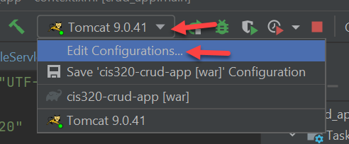

Example Build Process of a Modern Application
=============================================

"Continuous Integration" is a term for a project that:

* Detects when someone checks in new code
* Checks out that code and builds it
* Runs tests on that build
* E-mails if it fails
* Auto-deploys to a test environment if it passes

If we fail tests, we know exactly what build it failed on, and who checked
in that code.

Automated Builds
----------------

A common problem with app development is making sure *anyone* can build the
project successfully. It is too easy to only have one person be able to build
the project because of some file exists on her computer, but not in source
control.

For our project, let's use a free Continuous-Integration service called AppVeyor:

https://www.appveyor.com/

First, we need to add a file to your program that tells AppVeyor how to build
our project. The "in-style" way to do configuration files like this is by
using "YAML Ain't Markup Language" (.yaml)

.. code-block:: yaml
    :caption: appveyor.yml

    # Auto-pull the branch and label to use as the version
    version: "{branch} {build}"

    # How detailed do we want the build record to be
    build:
      verbosity: detailed

    # Command to build the project
    build_script:
      - ./gradlew build

    # Cache holds files used to speed up later builds so we don't have to
    # re-download them.
    cache:
      - .gradle

    # What JAVA to build with
    environment:
      matrix:
        - JAVA_HOME: C:\Program Files (x86)\Java\jdk1.8.0

    # What/where is the resulting WAR file
    artifacts:
      - path: build/libs/*.war
        name: MyWarFile

You can log in with GitHub. Then add your project.

Once added, the project should build:

   Successful AppVeyor Build

If successfully built, you can download the WAR file:

.. figure:: appveyor3.png

   Download war file as 'artifact' from build

Using Environment Variables
---------------------------

Problem is, we can't use that WAR file because it doesn't have ``META-INF/context.xml``.
No way to make a database connection without that info!
How can we securely manage that information so we have a user name, password,
and connection stream without checking it in anywhere?

To do that, we can use **environment variables**. Let's change our
``context.xml`` to
use environment variables for sensitive fields. Next, we'll set the variables
both in our local
environment, and our Amazon environment.

Step 1 - Update context.xml
^^^^^^^^^^^^^^^^^^^^^^^^^^^

Update ``context.xml`` to use environment variables instead of hard-coded
values for user, password, and JDBC connection string:

.. code-block:: xml
    :caption: Updated context.xml lines
    :emphasize-lines:  11-13

    <?xml version="1.0" encoding="UTF-8"?>
    <Context>
        <Resource name="jdbc/cis320"
                  auth="Container"
                  type="javax.sql.DataSource"
                  maxTotal="50"
                  maxActive="15"
                  maxIdle="10"
                  maxWaitMillis="-1"
                  driverClassName="com.mysql.cj.jdbc.Driver"
                  username="${user}"
                  password="${password}"
                  url="${jdbc}"
                  testOnBorrow="true"
                  removeAbandoned="true"
                  removeAbandonedTimeout="55"
                  validationQuery="SELECT 1"
                  validationInterval="34000"
                  timeBetweenEvictionRunsMillis="34000"
                  minEvictableIdleTimeMillis="55000"
                  factory="org.apache.tomcat.jdbc.pool.DataSourceFactory"
        />
        <ResourceLink name="jdbc/cis320"
                      global="jdbc/cis320"
                      type="javax.sql.DataSource" />
    </Context>

Step 2 - Update your local Tomcat
^^^^^^^^^^^^^^^^^^^^^^^^^^^^^^^^^

In IntelliJ, click on the 'down' arrow next to your Tomcat configuration and
select 'Edit':

Next, update the "VM Options."

Java specifies environment variables with the ``-D`` option. So it our
specification might look like:

.. code-block:: text

    -Duser=my_login_name -Dpassword=passwordhere -Djdbc=jdbc:mysql://cis-320-database.cp6n5ccfdx2q.us-west-2.rds.amazonaws.com:3306/cis320

Test, and make sure everything still works.
Then remove ``context.xml`` from your ``.gitignore`` and add it to Git.
Push to GitHub, and grab the WAR file from AppVeyor after it builds.

Step 3 - Update Amazon
^^^^^^^^^^^^^^^^^^^^^^

Environment variables are buried and hard to find.

* Select "Elastic Beanstalk".
* Select "Environments"
* Select your environment
* Select "Configuration" from the left menu
* Under "software" select "edit"

* Scroll way down to "Environment properties"
* Plug in your values

Gradlew
-------

If your ``gradlew.bat`` file is empty like mine was, here's what's supposed to be in it.

.. code-block:: bat
    :caption: gradlew.bat

    @rem
    @rem Copyright 2015 the original author or authors.
    @rem
    @rem Licensed under the Apache License, Version 2.0 (the "License");
    @rem you may not use this file except in compliance with the License.
    @rem You may obtain a copy of the License at
    @rem
    @rem      https://www.apache.org/licenses/LICENSE-2.0
    @rem
    @rem Unless required by applicable law or agreed to in writing, software
    @rem distributed under the License is distributed on an "AS IS" BASIS,
    @rem WITHOUT WARRANTIES OR CONDITIONS OF ANY KIND, either express or implied.
    @rem See the License for the specific language governing permissions and
    @rem limitations under the License.
    @rem

    @if "%DEBUG%" == "" @echo off
    @rem ##########################################################################
    @rem
    @rem  Gradle startup script for Windows
    @rem
    @rem ##########################################################################

    @rem Set local scope for the variables with windows NT shell
    if "%OS%"=="Windows_NT" setlocal

    set DIRNAME=%~dp0
    if "%DIRNAME%" == "" set DIRNAME=.
    set APP_BASE_NAME=%~n0
    set APP_HOME=%DIRNAME%

    @rem Resolve any "." and ".." in APP_HOME to make it shorter.
    for %%i in ("%APP_HOME%") do set APP_HOME=%%~fi

    @rem Add default JVM options here. You can also use JAVA_OPTS and GRADLE_OPTS to pass JVM options to this script.
    set DEFAULT_JVM_OPTS="-Xmx64m" "-Xms64m"

    @rem Find java.exe
    if defined JAVA_HOME goto findJavaFromJavaHome

    set JAVA_EXE=java.exe
    %JAVA_EXE% -version >NUL 2>&1
    if "%ERRORLEVEL%" == "0" goto execute

    echo.
    echo ERROR: JAVA_HOME is not set and no 'java' command could be found in your PATH.
    echo.
    echo Please set the JAVA_HOME variable in your environment to match the
    echo location of your Java installation.

    goto fail

    :findJavaFromJavaHome
    set JAVA_HOME=%JAVA_HOME:"=%
    set JAVA_EXE=%JAVA_HOME%/bin/java.exe

    if exist "%JAVA_EXE%" goto execute

    echo.
    echo ERROR: JAVA_HOME is set to an invalid directory: %JAVA_HOME%
    echo.
    echo Please set the JAVA_HOME variable in your environment to match the
    echo location of your Java installation.

    goto fail

    :execute
    @rem Setup the command line

    set CLASSPATH=%APP_HOME%\gradle\wrapper\gradle-wrapper.jar

    @rem Execute Gradle
    "%JAVA_EXE%" %DEFAULT_JVM_OPTS% %JAVA_OPTS% %GRADLE_OPTS% "-Dorg.gradle.appname=%APP_BASE_NAME%" -classpath "%CLASSPATH%" org.gradle.wrapper.GradleWrapperMain %*

    :end
    @rem End local scope for the variables with windows NT shell
    if "%ERRORLEVEL%"=="0" goto mainEnd

    :fail
    rem Set variable GRADLE_EXIT_CONSOLE if you need the _script_ return code instead of
    rem the _cmd.exe /c_ return code!
    if  not "" == "%GRADLE_EXIT_CONSOLE%" exit 1
    exit /b 1

    :mainEnd
    if "%OS%"=="Windows_NT" endlocal

    :omega
