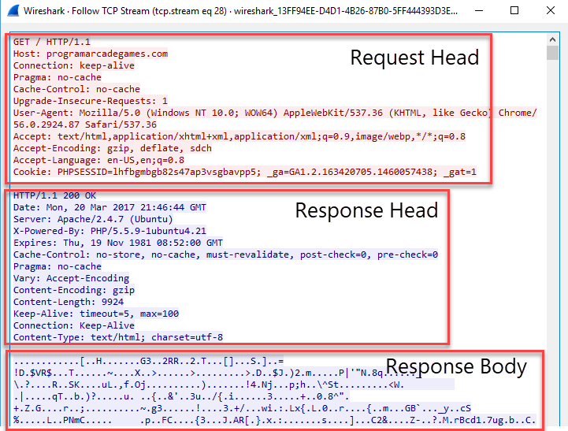
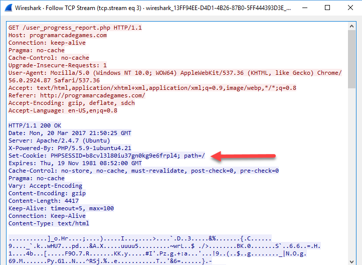
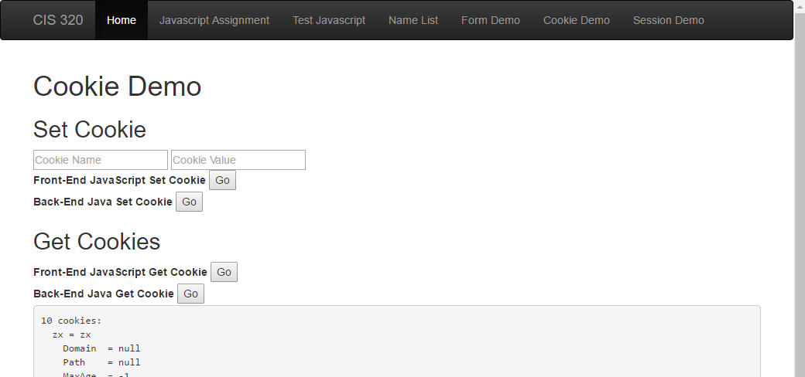

Cookies
=======

You make have heard about cookies and web pages. What is a cookie, and what
is it used for?

A cookie allows us to track a user from one web page request to the other.
Do people log into your web site? Do you keep information on a per-user
basis? You need cookies!

A cookie allows us to store a simple key/value pair. We can "set" the value.
Each web request made by the user's computer afterwards will contain the key
and the value.

We could set a cookie like this:

``useraccount = paul_craven``

But that would be a *terrible* idea. Why? Cookies can be changed by the
client. All a user would need to do is change the cookie and then they'd be
someone else.

What is usually done?

``session_id = 2304some_really_long_random_string2034902``

We create a session id. This session id is a long randomized string that would be
statistically impossible to guess. Then, on the web server (either in memory or
in a database) we store a table that has session id, a key, and a value.

It is important that if we use a session id, we also use https for our
communications. That will help prevent a person from "sniffing" the session
id and pretending to be a different person.

How do you look at cookies from the browser
-------------------------------------------

* Chrome: F12, find "Application" tab. Look on left side for cookies.
* Edge: F12, find "Debugger" tab. Look on left side for cookies.

How are cookies really set and transmitted?
-------------------------------------------

Remember how HTML has a "head" section? Confusingly, so does HTTP.
So if we use HTTP to transfer HTML, the HTTP has a head, and the HTML has
a head. They are totally different things.

Cookies are set and passed back in the HEAD section of HTTP. See below
for a trace of setting a cookie:

See below for a trace of getting a cookie back:

Cookie Demo
-----------

We want to show how to read and set cookies two different ways.

* With JavaScript on the front-end.
* With Java on the back-end.

Cookies In Javascript
~~~~~~~~~~~~~~~~~~~~~

Here's a screen shot of our end application.

Here is the HTML. Nothing really special here.

.. literalinclude:: cookie_demo.html
    :linenos:
    :language: html
    :caption: cookie_demo.html

You can read about getting and setting cookies more with
`W3Schools JavaScript Cookie Page <https://www.w3schools.com/js/js_cookies.asp>`_.

Here is our example JavaScript

.. literalinclude:: cookie_demo.js
    :linenos:
    :language: JavaScript
    :caption: cookie_demo.js

Try it! Click `here <../../_static/cookie_demo.html>`_.

Cookies in Java
~~~~~~~~~~~~~~~

.. literalinclude:: GetCookiesServlet.java
    :linenos:
    :language: Java
    :caption: GetCookieServlet.java

.. literalinclude:: SetCookieServlet.java
    :linenos:
    :language: Java
    :caption: SetCookieServlet.java

Cookie Limits
-------------

Cookies (both keys and values) are limited to about
4000 bytes. This limit is TOTAL per domain. So if
you have two cookies, together they can't have
more than 4000 bytes. For more information see
`cookie limits`_.

.. _cookie limits: http://stackoverflow.com/questions/640938/what-is-the-maximum-size-of-a-web-browsers-cookies-key
